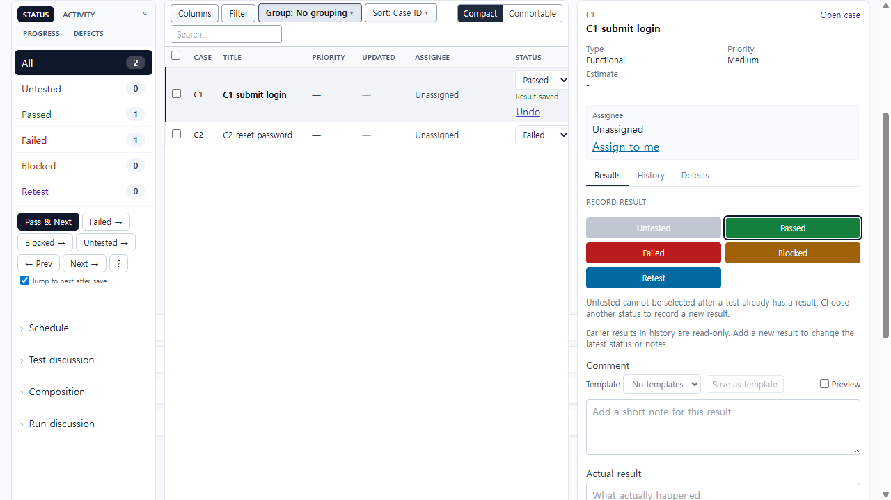
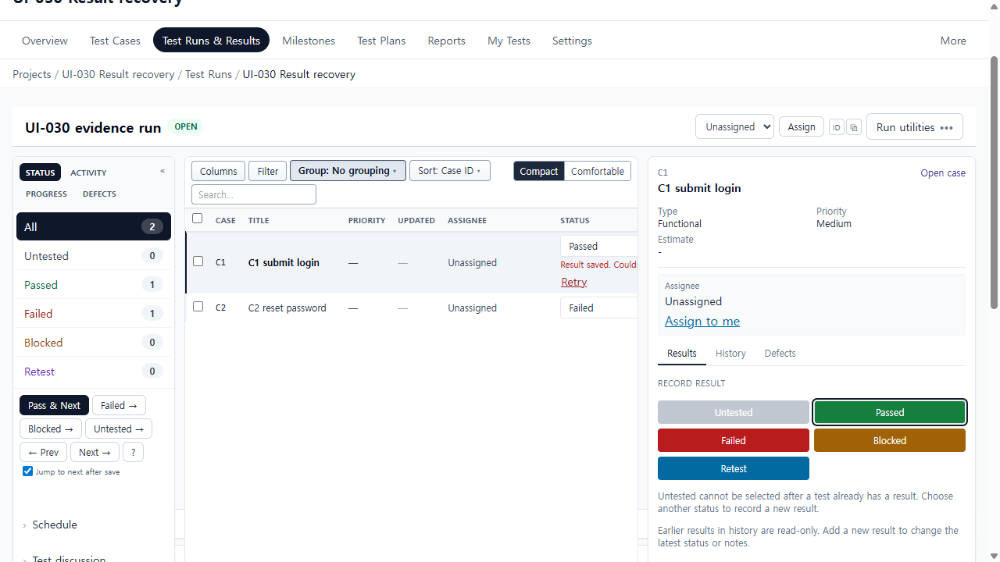
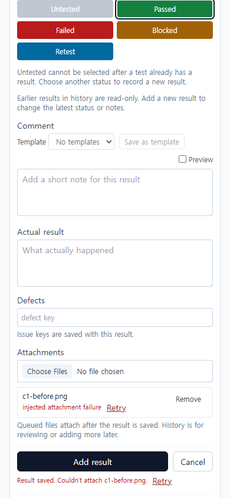
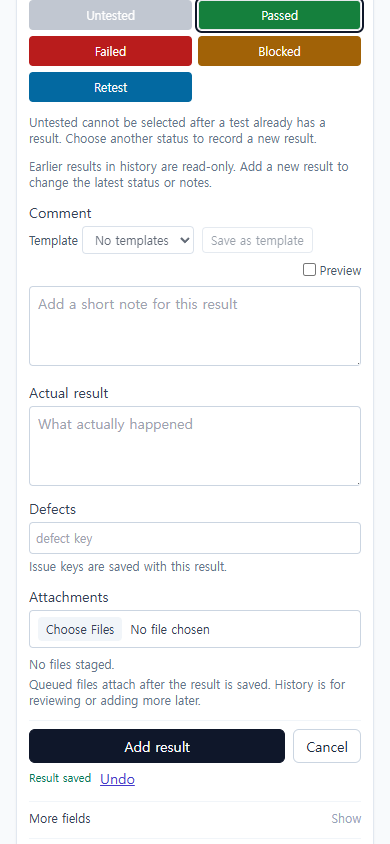

# UI-030 — Bind result recovery to the owning test and result

Completed: 2026-09-19

## Result

- Result save recovery is owned by the submitting test and operation. A failed attachment on test A cannot be consumed by a save on test B.
- Partial success copy is **Result saved. Couldn't attach {file}. Retry**. Attachment-only retry is used only when the same test still owns a failed result, fields are unchanged, and remaining files are still staged. Changed status/comment creates a new result.
- Remove and Cancel discard the retry payload. Successful files are not reuploaded. Late completion is gated by `operationId` so it cannot overwrite another test's feedback.

## Verification

- Fixture: in-memory API on `localhost:4000`, Vite `http://localhost:5173`, project **UI-030 Result recovery**, run **UI-030 evidence run**, C1 (`testId=1`) / C2 (`testId=2`), login `admin@example.com`. Attachment failure injected on `POST /api/results/:id/attachments`.
- C2 created result 3 then attachment failed; C1 created result 4 (and later result 5) on `/api/results/4|5/attachments`, not on C2's result 3. C2 Retry after navigation attached `c2-fail.png` to result 3 only (no new `POST /api/results`).
- Two-file / one-fail, retry-after-nav, Remove `c1.png` → composer **Result saved** / no reattach, Cancel `c1-before.png` → Retry became **Undo** and **No files staged**, edited fields after partial success, and late completion are covered by `resultSaveLifecycle.test.ts` plus the live C1/C2 request IDs above.
- Composer/row copy: **Result saved. Couldn't attach c1-before.png. Retry**. File row: **injected attachment failure** + named **Retry** / **Remove c1-before.png**. `data-result-recovery="attachment"` `data-result-recovery-id="5"`. SaveFeedback `role="alert"`. Retry button focused; Enter via `browser_press_key` did not activate (Electron focus routing), so Retry was confirmed by click.
- Desktop 1280×720: `scrollWidth` 1265px. Mobile 390×844: `scrollWidth` 390px, no page overflow. Recovery stays in the existing composer/row.
- `npx.cmd vitest run src/features/runs/utils/resultSaveLifecycle.test.ts src/features/runs/utils/resultSaveFeedback.test.ts` (23 passed)
- `npm.cmd run lint -w apps/web`
- `npm.cmd run build -w apps/web`

## Screenshot review

