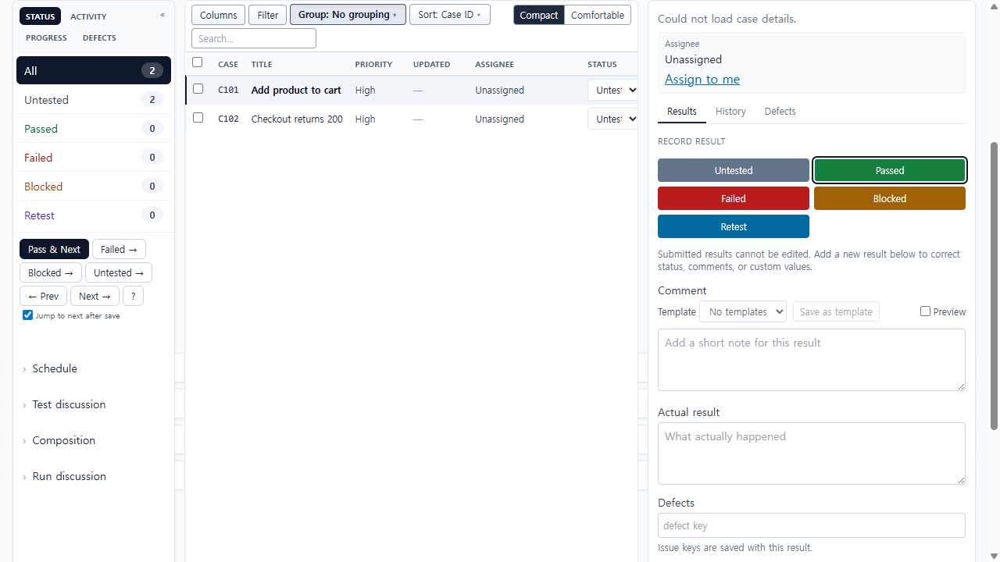
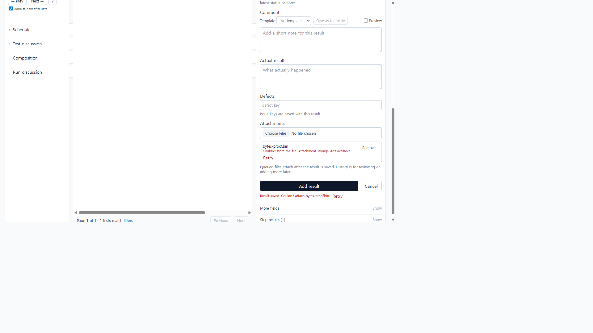
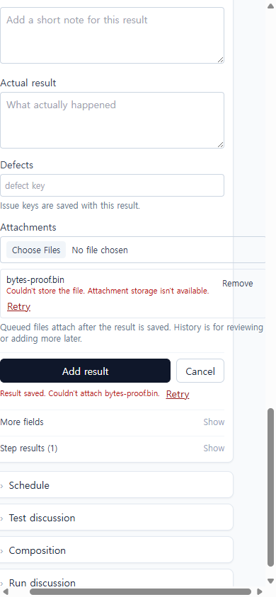
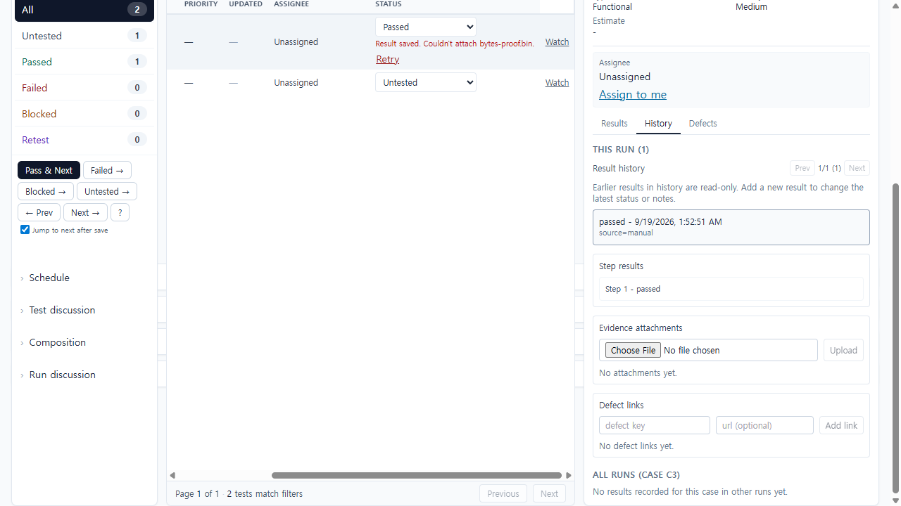

# UI-031 — Make attachment success mean recoverable file content

Completed: 2026-09-19

## Result

- A file is attached only after a real supported upload succeeds. In-memory mode rejects presign with `STORAGE_UNAVAILABLE` 501 instead of a fake `result not found` 404.
- The client no longer posts metadata-only `local://results/{id}/{name}` on presign failure. Missing-result 404 is not treated as unavailable storage.
- Result-only success is unchanged: **Result saved. Couldn't attach {file}. Retry**. History stays **No attachments yet.** Jump to next does not advance.

## Verification

- Fixture: in-memory API `localhost:4000`, Vite `http://localhost:5173`, login `admin@example.com`. Project **UI-031 Attachment bytes**, run **UI-031 evidence run**. Live after-fix pass used project 2 / run 2 / C3 (`testId=3`) with C4 still untested. File `bytes-proof.bin` (17 bytes `UI-031-BYTES-PROOF`).
- Before fix (same API, earlier seed): `POST /api/runs/1/results` 200 → `POST /api/results/1/attachments/presign` 404 `NOT_FOUND` → `POST /api/results/1/attachments` 200 `local://results/1/bytes-proof.bin` and the URL advanced to `testId=2`.
- After fix: `POST /api/runs/2/results` 200 → `POST /api/results/2/attachments/presign` 501 `STORAGE_UNAVAILABLE` → no `POST /api/attachments` and `GET /api/results/2/attachments` `[]`. Composer/row: **Result saved. Couldn't attach bytes-proof.bin.** File row: **Couldn't store the file. Attachment storage isn't available.** Named **Retry** / **Remove bytes-proof.bin**. `role="alert"`. History: **No attachments yet.** Upload disabled. URL stayed on `testId=3` with Jump to next checked. Attachment-only Retry repeated 501 and still listed no attachments.
- Keyboard: Retry is focusable via `element.focus()`. `browser_press_key` Tab from the file input routed to `body` in this Electron session, matching the UI-030 limitation. 1280×720 `scrollWidth` 1265px. 390×844 composer error wraps and stays readable; the existing run table still scrolls horizontally (not introduced here).
- `npx.cmd vitest run src/features/runs/api/resultAttachmentUpload.test.ts src/features/runs/utils/resultComposerModel.test.ts src/features/runs/utils/resultSaveFeedback.test.ts src/features/runs/utils/resultSaveLifecycle.test.ts` (42 passed)
- `npx.cmd vitest run src/domain/resultAttachmentPresign.test.ts src/__tests__/result-attachment-storage.test.ts` (4 passed)
- `npm.cmd run lint -w apps/web` and `npm.cmd run lint -w apps/server`
- `npm.cmd run build -w apps/web` and `npm.cmd run build -w apps/server`

## Screenshot review

## Not live-verified

- Configured-storage upload → refresh → download of original bytes. This environment has no in-repo byte store; signed URLs point at `https://storage.local`. Completion uses the allowed reject path instead.
- 390×844 queued-before capture. The queued state was photographed at 1280×720 before the first save; after-fix 390 uses the same failed recovery UI.
