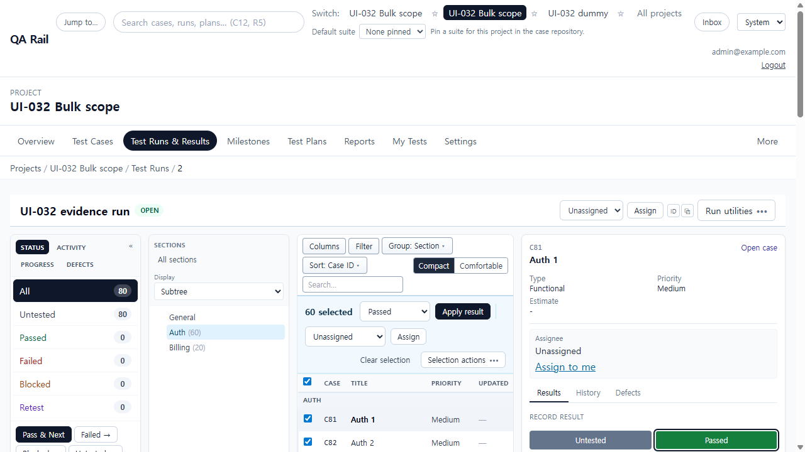
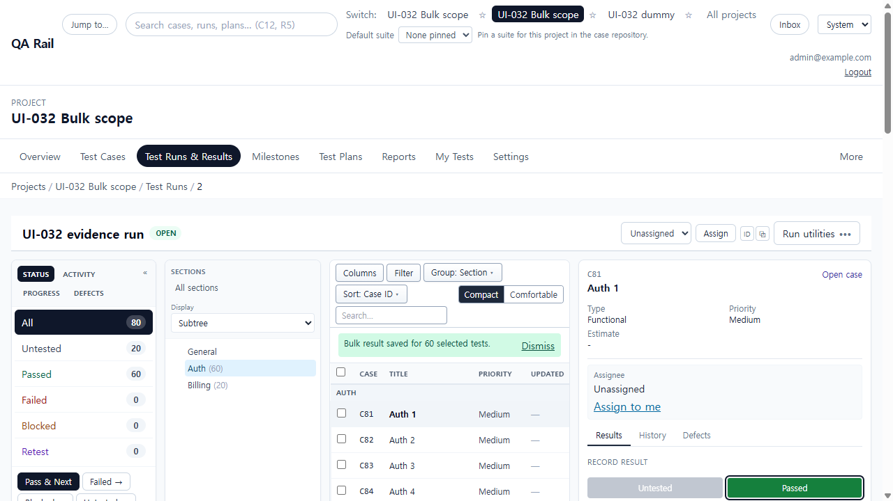
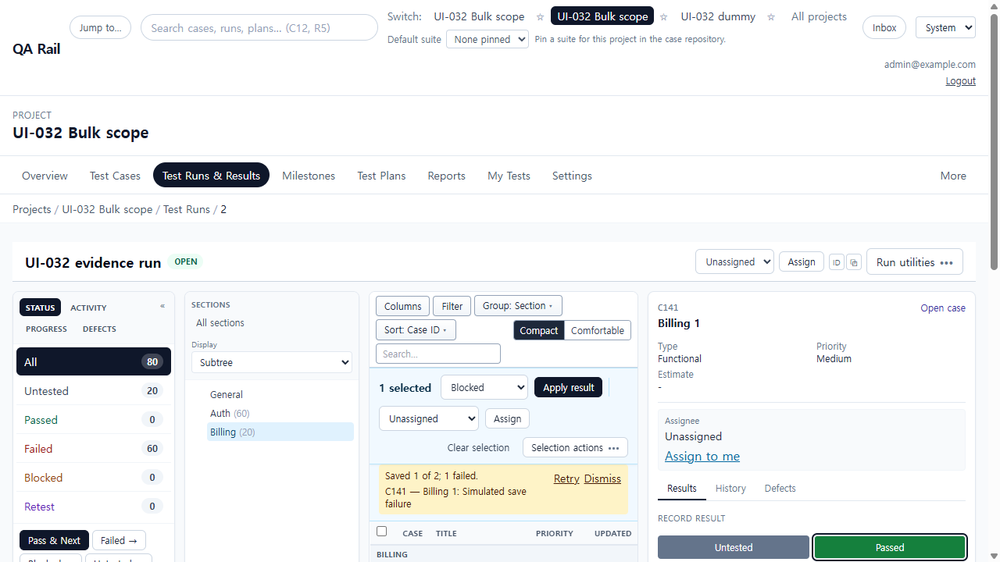
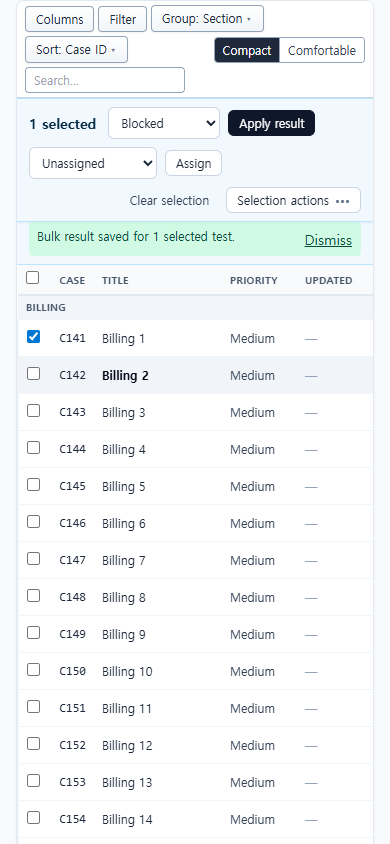

# UI-032 — Keep Run bulk actions identical to the visible selection scope

Completed: 2026-09-19

## Result

- Bulk submit uses one explicit target set from the visible selection. Missing IDs are not dropped silently; grouped rows are merged into the lookup; select-all uses the same grouped/section plan as the table.
- Selected count and local save copy name the same tests that were posted. Section changes clear the bulk selection so sibling tests cannot ride along.
- Partial bulk failure names the failed tests and keeps Retry on a stored snapshot after navigating to another test.

## Verification

- Fixture: in-memory API `localhost:4000`, Vite `http://localhost:5173`, login `admin@example.com`. Project **UI-032 Bulk scope** (id 3), run **UI-032 evidence run** (id 2). Auth section 6 = 60 tests, Billing section 7 = 20 tests. Default groupBy=section_id, page size 50.
- Grouped Auth: header selected **60 selected**. `POST /api/runs/2/results/bulk` body length **60**, response `saved=60`. Copy: **Bulk result saved for 60 selected tests.** Grouped API afterwards: Auth passed=60, Billing untested=20.
- Page selection (`groupBy=none`): **50 selected**, bulk count **50**, **Bulk result saved for 50 selected tests.** Auth then blocked=50 + passed=10; Billing still untested=20.
- Filter + all matching (`groupBy=none&q=Auth`): page 50 of 60, **Select all 60 matching filters** → **60 selected**, bulk count **60**. Auth failed=60; Billing still untested=20.
- Row selection on Billing: **Select C141** + **Select C142** → **2 selected**.
- Section change: Auth **60 selected**, then Billing tree click cleared the bar to **0 selected** (no Auth IDs left to submit). Direct URL `sectionId=7` shows 20 Billing tests.
- Partial failure (injected on next bulk POST): 2 submitted, UI **Saved 1 of 2; 1 failed.** `role=alert` list **C141 — Billing 1: Simulated save failure**, **Retry** `aria-label="Retry failed bulk results"`, **1 selected**. After **Next →** (`testId=6`) the named alert and Retry remained. Retry saved **Bulk result saved for 1 selected test.** API: Auth failed=60, Billing blocked=1 (C141) + untested=19.
- Keyboard: row checkbox name **Select C141** is focusable; **Apply result** receives `element.focus()`. Bar `aria-label="Selected test actions"`. `browser_press_key` Tab was not used (same Electron routing limit as UI-030/031).
- 1280×720: document `scrollWidth` 1265px. 390×844: document 390px, selection bar `scrollWidth=clientWidth` 356px (overflow actions stay in **Selection actions**). The execution table still scrolls horizontally at 390px (UI-033).
- `npx.cmd vitest run src/features/runs/utils/runBulkSelectionScope.test.ts src/features/runs/utils/runSelectionActionBarModel.test.ts` (12 passed)
- `npm.cmd run lint -w apps/web`
- `npm.cmd run build -w apps/web`

## Screenshot review

## Not live-verified

- 390×844 capture of the original 60-vs-50 grouped submit. That mismatch was reproduced and fixed at 1280×720; the 390 pass covers the selection bar after the fix, not a second 60-row apply.
- Tree click to Billing can bounce the URL back to `sectionId=6` when `testId` still points at an Auth test (React Router search-param races). Selection is still cleared, so Auth IDs are not submitted from the Billing click. Direct `sectionId=7` navigation is stable.
- `browser_press_key` Tab from a checkbox did not move focus inside this Electron session.
