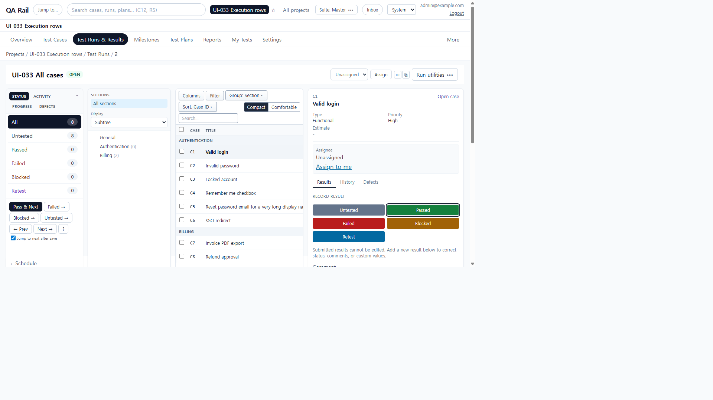
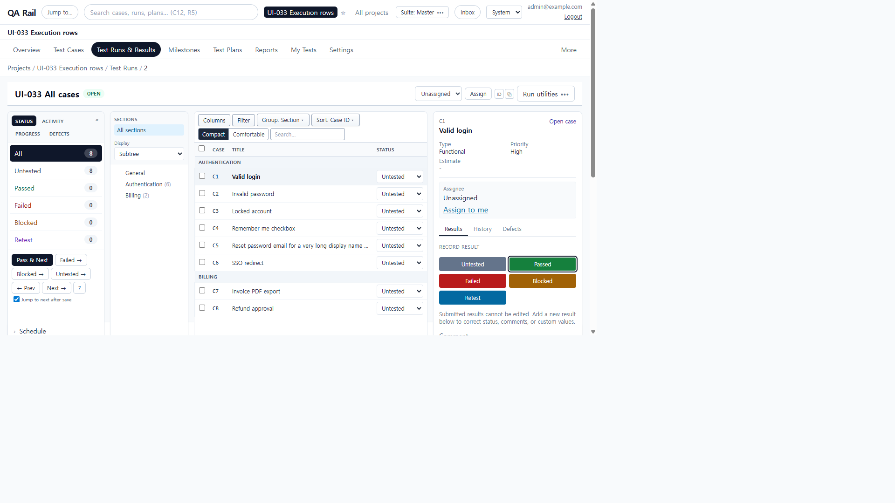
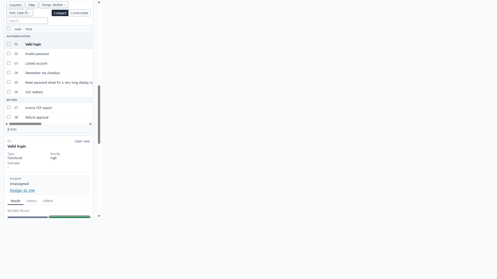
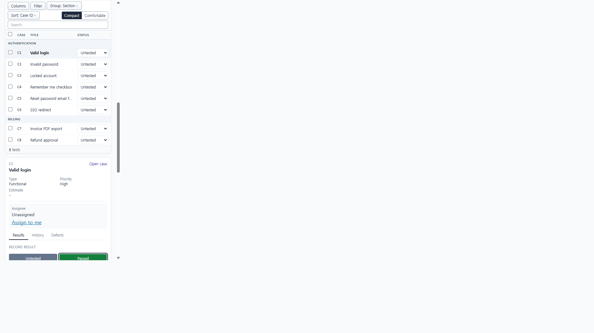
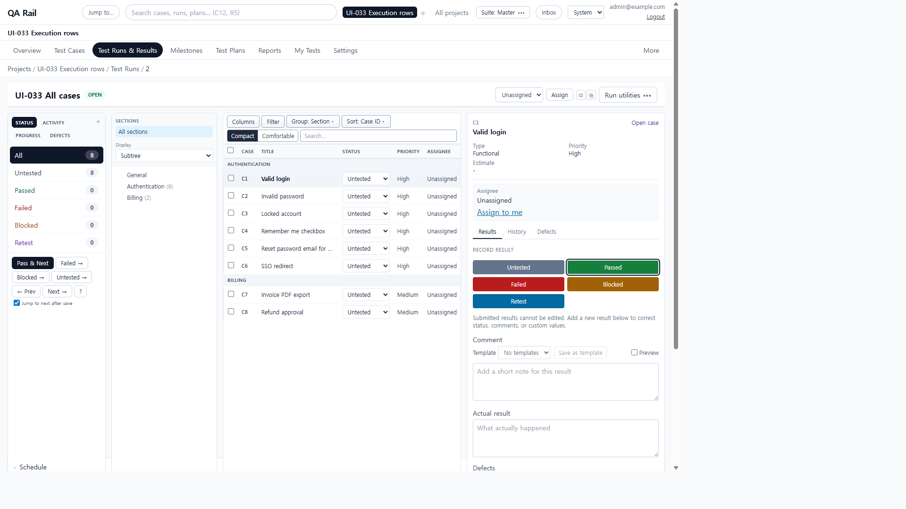

# UI-033 — Preserve readable title and status before optional execution columns

Completed: 2026-09-19

## Result

- Execution rows keep Case, Title, and full Status first. Optional Priority, Type, Updated, Assignee, and Watch hide via the same container-query pattern as the case list when the tests column is squeezed by the section tree and result pane.
- At 1024–1439px with tree and pane open, the tree column narrows to 10.5rem and the pane caps at 20rem so the table keeps remaining width. No extra toolbar or card was added.
- The table no longer forces `min-width: 640px`. Title uses the remaining width with ellipsis; Status keeps a 7.25rem column so labels such as Untested stay intact. Assignment stays on the selected-test pane.

## Verification

- Fixture: in-memory API `localhost:4000`, Vite `http://localhost:5173`, login `admin@example.com`. Project **UI-033 Execution rows**. Run **UI-033 All cases** (`/projects/1/runs/2?testId=3`) with default Section grouping, Subtree display, compact density, eight tests in Authentication and Billing, C1 selected so the result pane is open.
- Before, 1280×720: tests column 345px; inner table `scrollWidth` 832 vs `clientWidth` 343. Visible headers were Case/Title only; Status sat off-canvas (select width 38px). Eight compact rows were in the viewport but status was unreadable. UI-008 content start: `#run-tests-section` y=239, table y=337, first row y=392.
- After, 1280×720: tree 168px, tests 501px, table overflow 0. Visible headers Case/Title/Status. Eight complete rows; every status select showed **Untested** at ~100px. Short titles fully visible; C5 long title ellipsized with the full string in `title`. Result pane stayed open with Assign to me and Passed. Content start unchanged: tests y=239, table y=306, first row y=361 (still below the prior ~323px header baseline once chrome is counted). Page `scrollWidth=clientWidth` 1265px.
- After, 390×844: page overflow 0; table overflow 0 (`341=341`). Title + Untested on-screen without the inner horizontal scrollbar. Assign to me and Passed remained in the same scroll view as the table. Search wrapped to a full row instead of clipping to “Sea”.
- After, 1440×1000: tree beside the table (both y=239); Priority and Assignee returned; Watch/Updated stayed hidden at this width. Status still Untested; overflow 0; eight complete rows.
- Keyboard: focusing the C1 status control exposed `Status for C1. Failed, Blocked, and Retest open the result composer.` Row checkboxes kept `Select C1`. Selected row `aria-selected="true"`.
- `npx.cmd vitest run src/features/runs/utils/runExecutionColumnLayout.test.ts src/features/runs/utils/runExecutionDensity.test.ts` (9 passed)
- `npm.cmd run lint -w apps/web`
- `npm.cmd run build -w apps/web` (passed; existing Vite large-chunk warning remains)

## Screenshot review

## Not live-verified

- Native Tab into the status select was not used (`browser_press_key` Tab still routes to the Cursor UI). Focus was set with `HTMLElement.focus()`.
- A screen reader was not run; names were read from the DOM/`aria-label`.
- Comfortable density was not re-measured; compact is the run-execution default.
