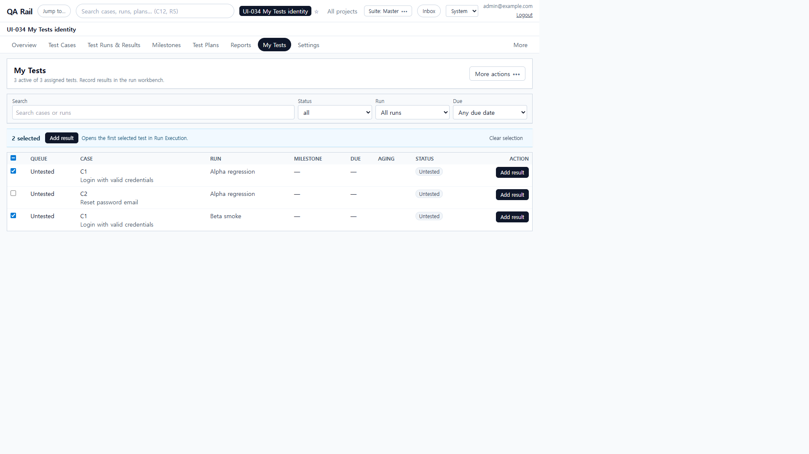
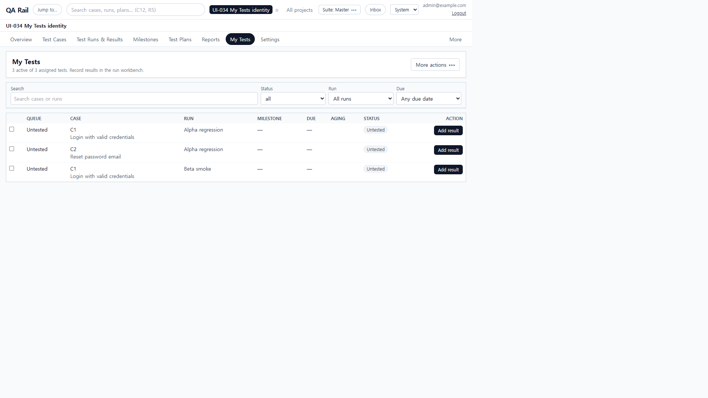
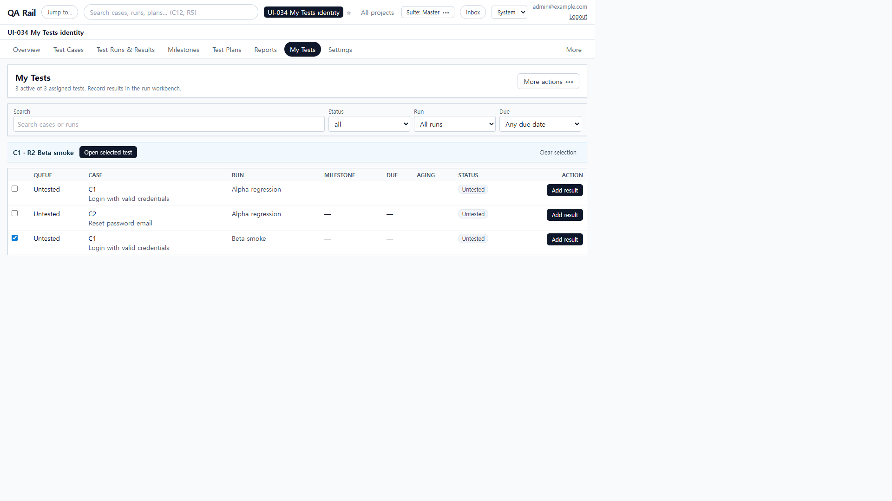
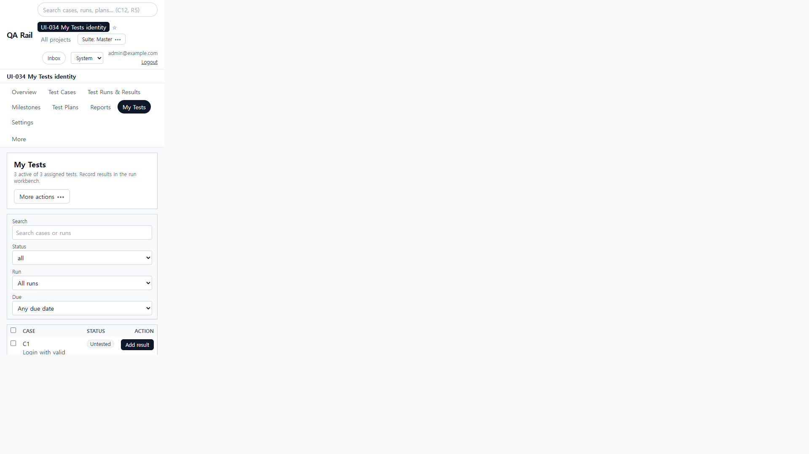
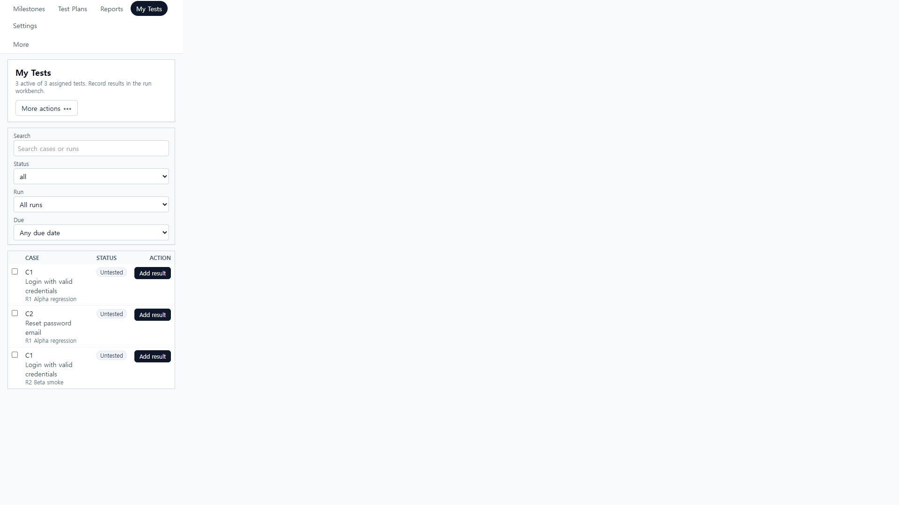
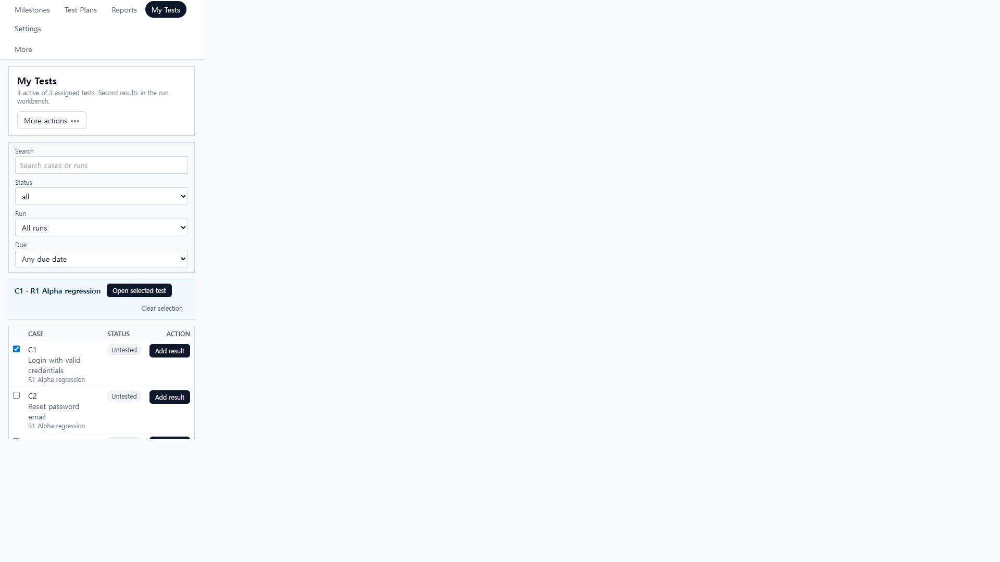

# UI-034 — Make My Tests identity and selection intent explicit

Completed: 2026-09-19

## Result

- On viewports below `sm`, each My Tests row keeps a short run identifier under the case title (`R1 Alpha regression` / `R2 Beta smoke`). The Run column still hides there; at 1280 the Run column remains and the subtitle stays `sm:hidden`.
- Selection is one test at a time. There is no Select all. The shared `SelectionActionBar` names the target (`C1 · R2 Beta smoke`) and **Open selected test**; it no longer says Add result for a multi-row set.
- Filtering a selected test out of the queue clears the selection instead of keeping a hidden target.

## Verification

- Fixture: in-memory API `localhost:4000`, Vite `http://localhost:5173`, login `admin@example.com`. Project **UI-034 My Tests identity**. C1 *Login with valid credentials* assigned in **Alpha regression** (`testId=1`) and **Beta smoke** (`testId=3`); C2 *Reset password email* in Alpha only.
- Before, 390×844: both C1 rows were `C1 Login with valid credentials` with no run name; `scrollWidth` 390. Two C1 checkboxes shared the accessible name `Select Login with valid credentials`.
- Before, 1280×720: selecting both C1s showed `2 selected` / **Add result** / `Opens the first selected test in Run Execution.` The bar opened `/projects/1/runs/1?testId=1` only.
- After, 390×844: C1 rows show **R1 Alpha regression** and **R2 Beta smoke** under the title (`display:block`, `right` 190px, no horizontal overflow). Checkboxes are `Select C1 … in R1 Alpha regression` vs `… in R2 Beta smoke`.
- After selection: bar is `C1 · R1 Alpha regression` + **Open selected test** (not Add result). Checking Alpha replaces Beta; one checkbox remains checked. **Open selected test** opened `/projects/1/runs/1?testId=1` (Alpha). Row **Add result** on the Beta C1 opened `/projects/1/runs/2?testId=3` with Beta smoke and C1 selected.
- Filter: Beta C1 selected, Run = Alpha regression. Beta left the table; the selection bar disappeared; no checked row remained.
- After, 1280×720: RUN column `table-cell`; run subtitles `display:none`; header action is only **More actions**; no Select all; page overflow 0. One selected row shows a single bar `C1 · R2 Beta smoke` / **Open selected test** / Clear selection.
- `npx.cmd vitest run src/features/runs/utils/myTestsQueue.test.ts` (5 passed)
- `npm.cmd run lint -w apps/web`
- `npm.cmd run build -w apps/web` (passed; existing Vite large-chunk warning remains)

## Screenshot review

## Not live-verified

- Native Tab into the table was not used (`browser_press_key` Tab still routes to the Cursor UI). Space on a focused checkbox via that tool did not toggle; the checkbox was selected with a click instead.
- A screen reader was not run; names were read from the accessibility tree.
