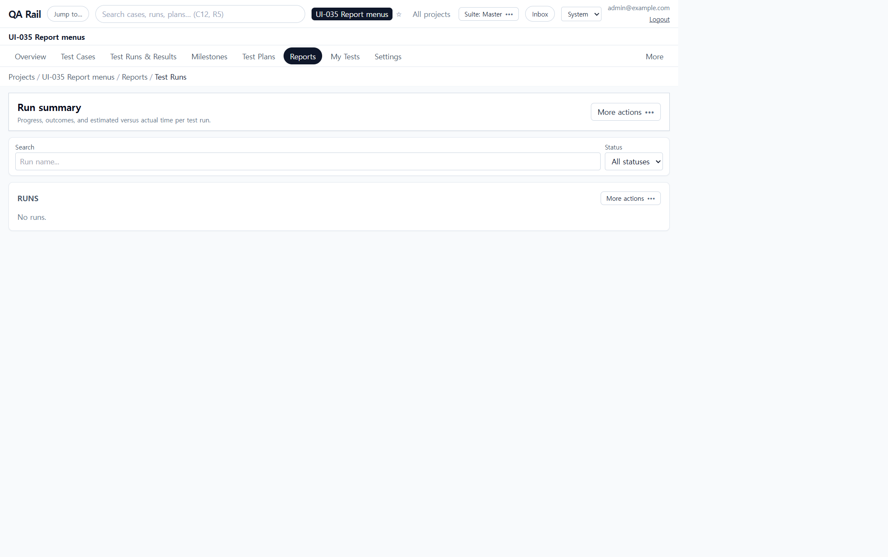
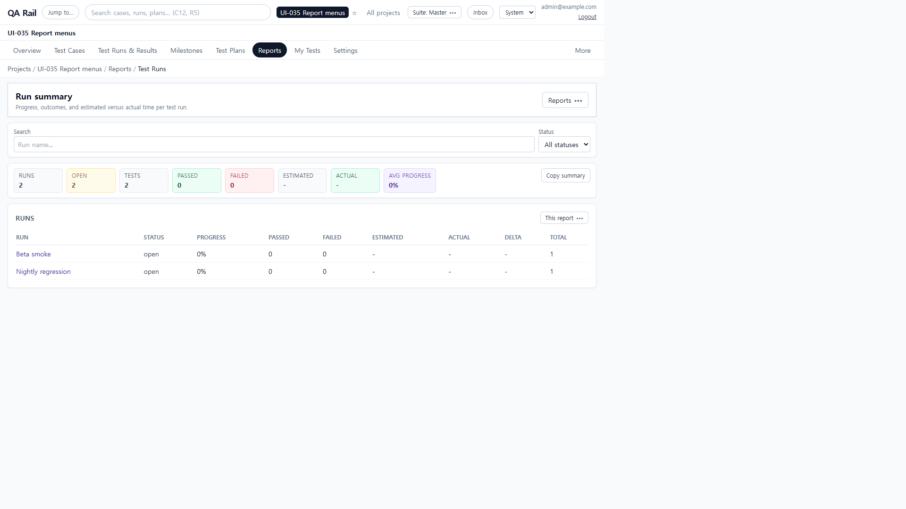
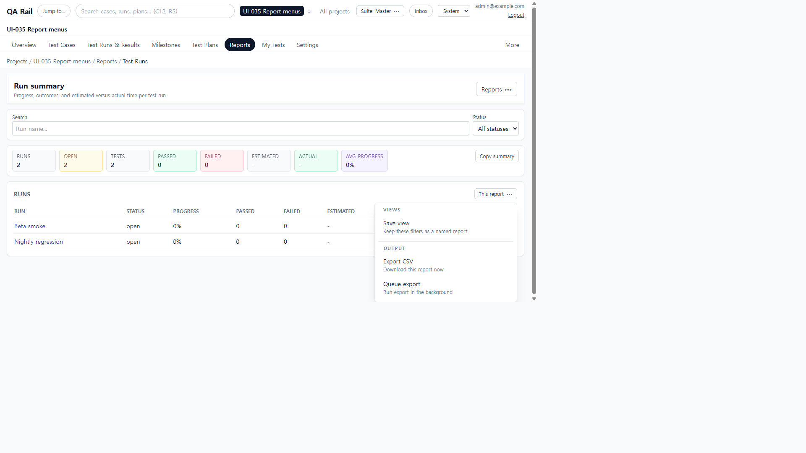
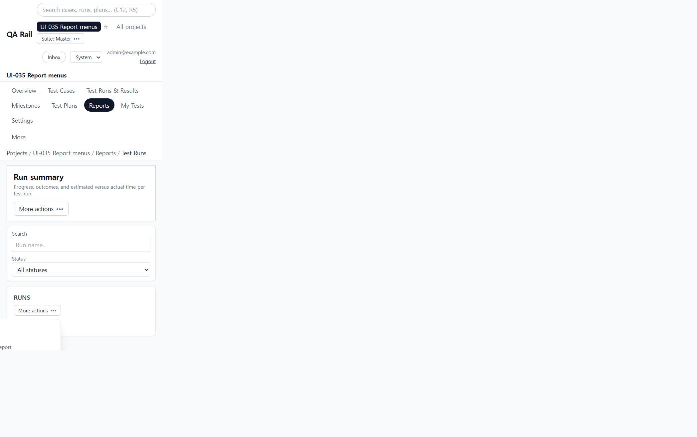
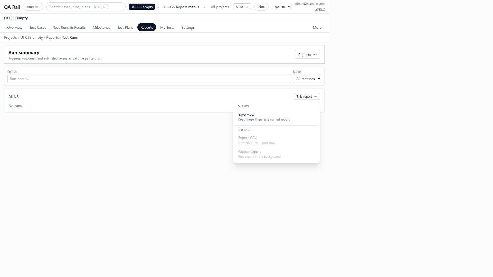
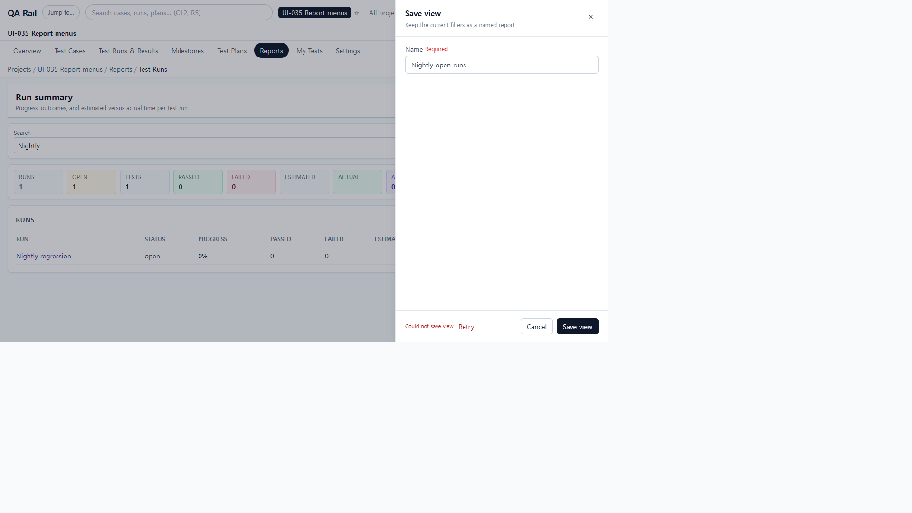
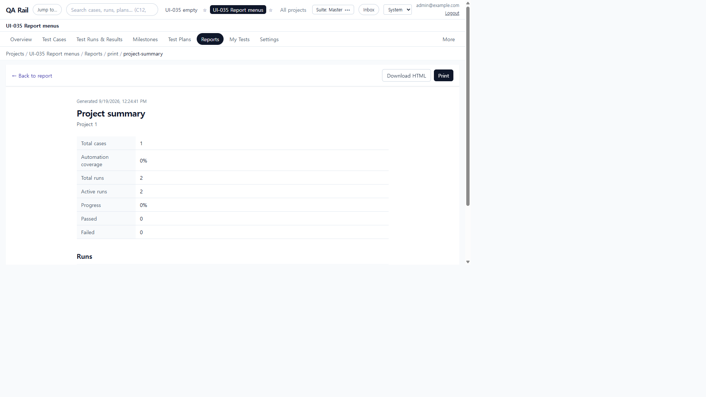

# UI-035 — Give report menus distinct context and verify populated reports

Completed: 2026-09-19

## Result

- Report drilldown header overflow is named **Reports** (All reports, Saved & exports). The result overflow is named **This report** (Save view, Print when the type has a slug, Export CSV, Queue export).
- Keyboard and accessibility names no longer share **More actions**.
- Run summary filters are URL-owned, so loading a saved view reapplies `search`/`status`. Empty reports omit Print and disable CSV/Queue.
- Save-view and export failures show local **Retry**. In-memory saved reports persist so the preset can reopen.

## Verification

- Fixture: in-memory API `localhost:4000`, Vite `http://localhost:5173`, login `admin@example.com`. Project **UI-035 Report menus** (id 1) with **Nightly regression** and **Beta smoke**. Empty check used project **UI-035 empty** (id 2).
- Before, empty Run summary 1280×720 and 390×844: two buttons both named **More actions**. Toolbar menu: Save view enabled; Export CSV and Queue export disabled; no Print (run_summary has no print slug). Overflow 0 at 390.
- After, accessible names are **Reports** vs **This report**. Reports menu: All reports, Saved & exports. This report (populated): Save view, Export CSV, Queue export; Print still omitted on run_summary.
- Filtered Search to **Nightly** (`?search=Nightly`); table showed only Nightly regression. Save view **Nightly open runs**: first POST 500 showed **Could not save view.** + Retry; Retry saved. Clearing search then loading the preset restored `?search=Nightly` and only Nightly regression.
- Export CSV requested `/api/projects/1/reports/export?reportType=run_summary&format=csv&q=Nightly`. In-memory GET export returns 501; the toolbar showed that error with **Retry**.
- Project summary **This report** included **Print view** → `/projects/1/reports/print/project-summary`. Print document listed Project 1, 2 runs, Beta smoke and Nightly regression.
- Empty project 2: No runs; Export CSV and Queue export disabled; no Print. 390 CDP: overflow 0, menus Reports / This report, Nightly filter retained.
- `npx.cmd vitest run src/features/projects/utils/reportHeaderMenu.test.ts` (5 passed)
- `npm.cmd run lint -w apps/web` (`tsc --noEmit`)
- `npm.cmd run build -w apps/web` (passed; existing Vite large-chunk warning remains)

## Screenshot review

## Not live-verified

- Native Tab through the two menus was not used (`browser_press_key` Tab still routes to the Cursor UI). Names were read from the accessibility tree and `aria-label`.
- In-memory `GET /reports/export` returns 501, so CSV bytes were not downloaded. Filter wiring was confirmed from the request query `q=Nightly`.
- Plan summary had no print row because `/reports/plan-summary` returned no items for existing plans; print was verified on project summary instead.
- The 390 after visual capture reused the empty-report compositor frame; 390 layout was confirmed by CDP (`inner` 390×844, overflow 0, menus Reports / This report, search Nightly).
- A screen reader was not run.
