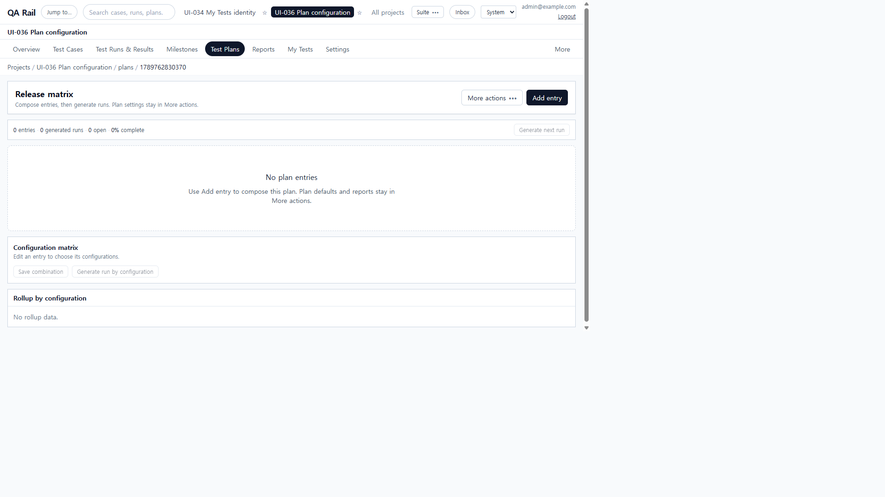
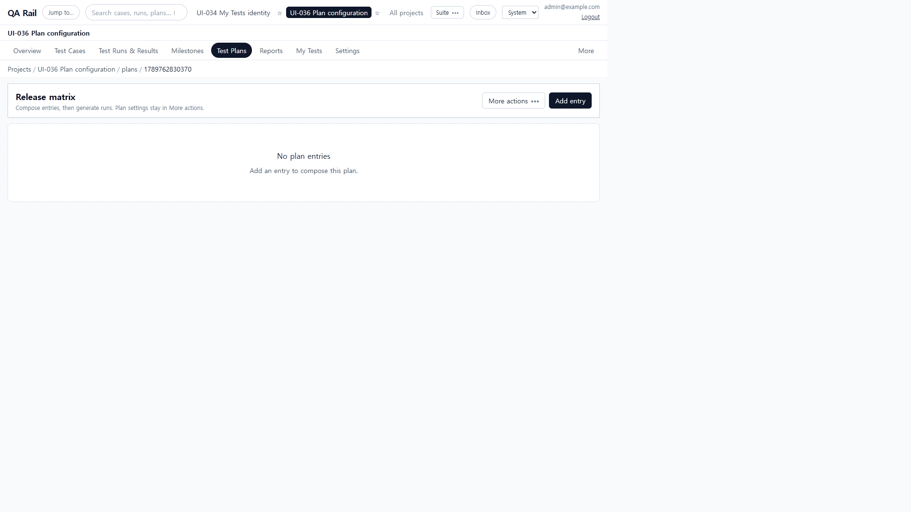
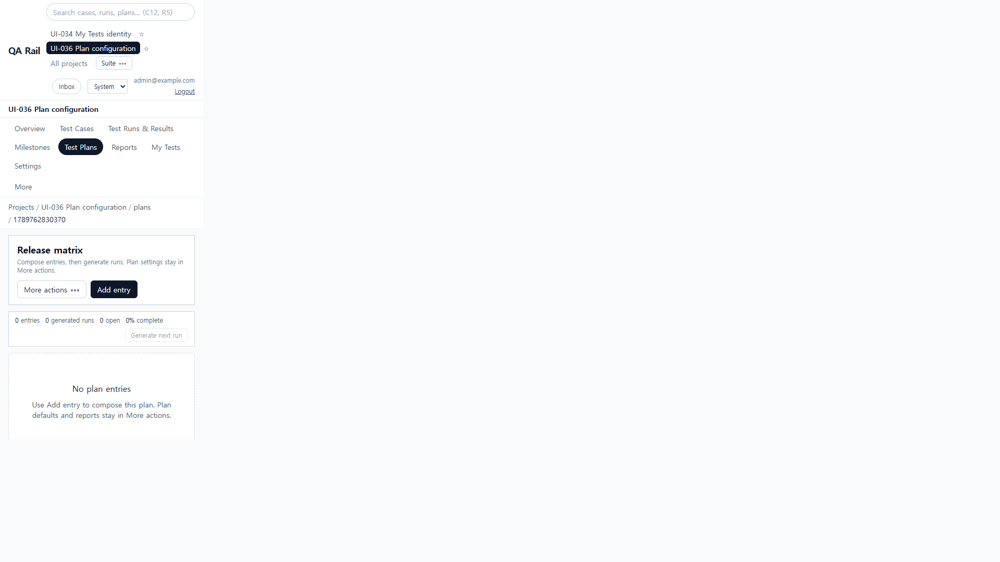
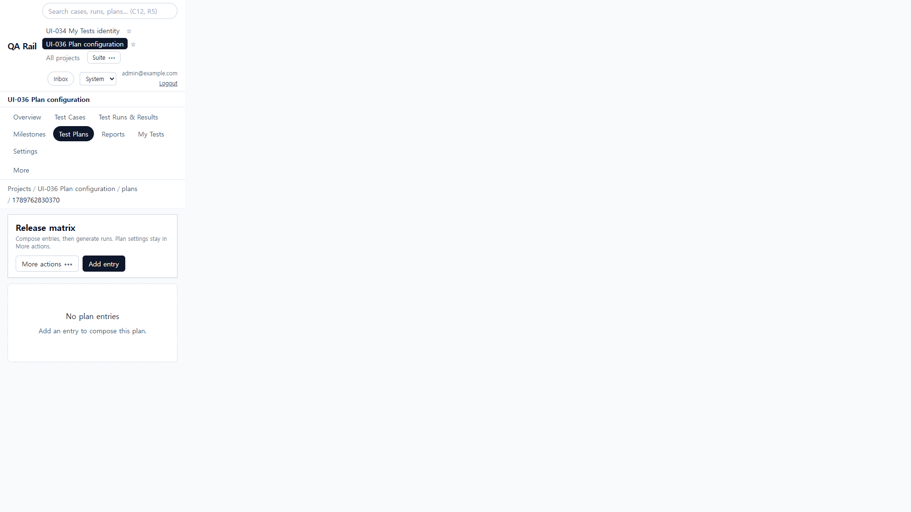
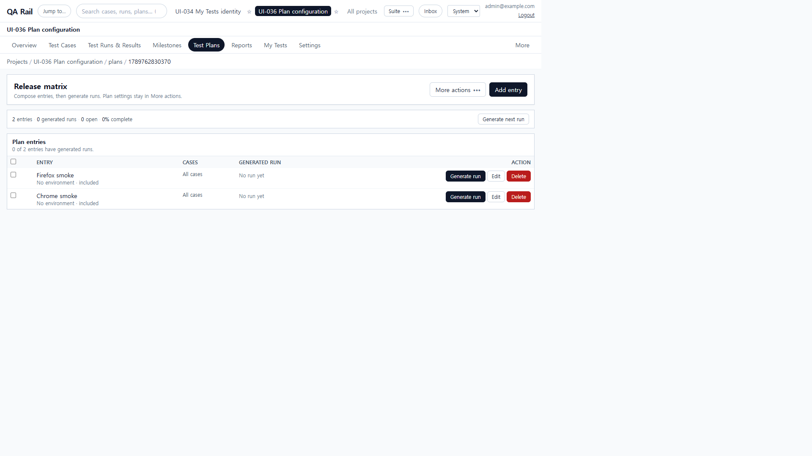
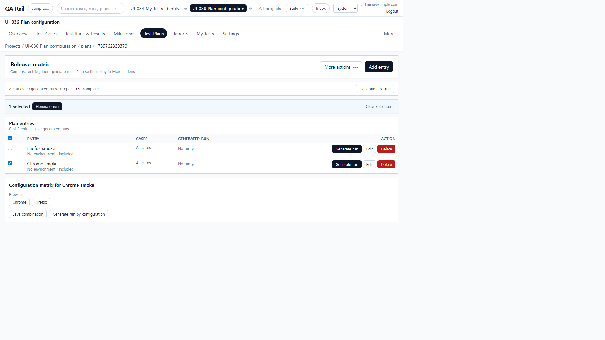

# UI-036 — Reveal Plan configuration only when an entry needs it

Completed: 2026-09-19

## Result

- An empty plan shows **Add entry** and a short empty explanation. **Generate next run**, **Save combination**, **Generate run by configuration**, and empty rollup no longer appear as a disabled wall.
- With entries but none selected, the table and **Generate next run** are the work. Configuration controls stay hidden.
- Selecting exactly one entry reveals **Configuration matrix for {entry name}**. Switching or deleting that entry removes or retargets the controls; Save is refused until the loaded mapping matches the visible owner.

## Verification

- Fixture: in-memory API `localhost:4000`, Vite `http://localhost:5173`, login `admin@example.com`. Project **UI-036 Plan configuration**, plan **Release matrix**.
- Before, empty hub 1280×720: **Add entry** plus disabled **Generate next run**, **Save combination**, **Generate run by configuration**, and **Rollup by configuration / No rollup data**.
- After, empty hub 1280×720 and 390×844: only **Add entry** / **More actions** and “Add an entry to compose this plan.” No Save/Generate/Rollup. 390 overflow 0; Add entry `right` 264px.
- Created **Chrome smoke** from the header. Populated-unselected: table + **Generate next run**, no matrix. Added **Firefox smoke** and Browser/Chrome/Firefox configurations.
- Selected Chrome: heading **Configuration matrix for Chrome smoke**, owner id matched Chrome. Selecting both hid the matrix. Leaving Firefox selected retargeted the heading to **Configuration matrix for Firefox smoke**.
- Injected a 500 on the first configuration PUT: **Could not save Firefox smoke** + Retry. Retry saved: **Saved Firefox smoke**. Deleting Firefox removed the matrix; Chrome remained.
- After, selected 390×844: heading unclipped, overflow 0, Save/Generate visible for Chrome smoke.
- `npx.cmd vitest run src/features/projects/utils/planMatrixContext.test.ts src/features/projects/utils/planHeaderMenu.test.ts` (4 passed)
- `npm.cmd run lint -w apps/web`
- `npm.cmd run build -w apps/web` (passed; existing Vite large-chunk warning remains)

## Screenshot review

## Not live-verified

- Native Tab through the matrix was not used (`browser_press_key` Tab still routes to the Cursor UI). Checkboxes were activated with clicks.
- After deleting Firefox, focus did not return to a specific remaining row control (ConfirmDialog). Matrix controls for the deleted entry were gone.
- **Generate run by configuration** was shown for the named owner but not clicked; failure/retry was proven on **Save combination**.
- A screen reader was not run; names were read from the accessibility tree.
