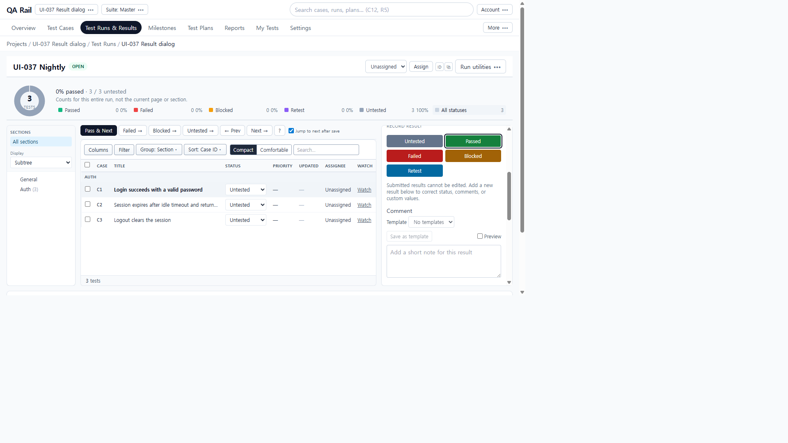
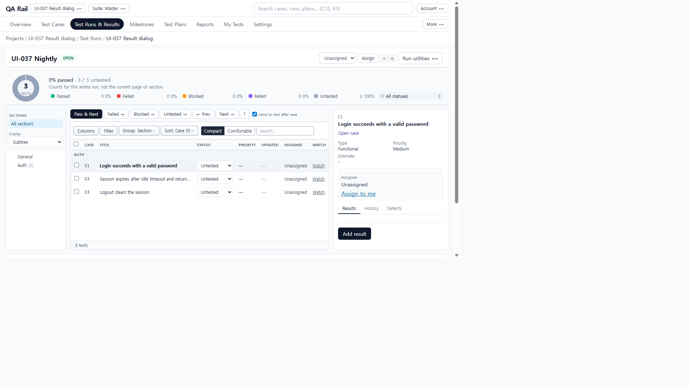
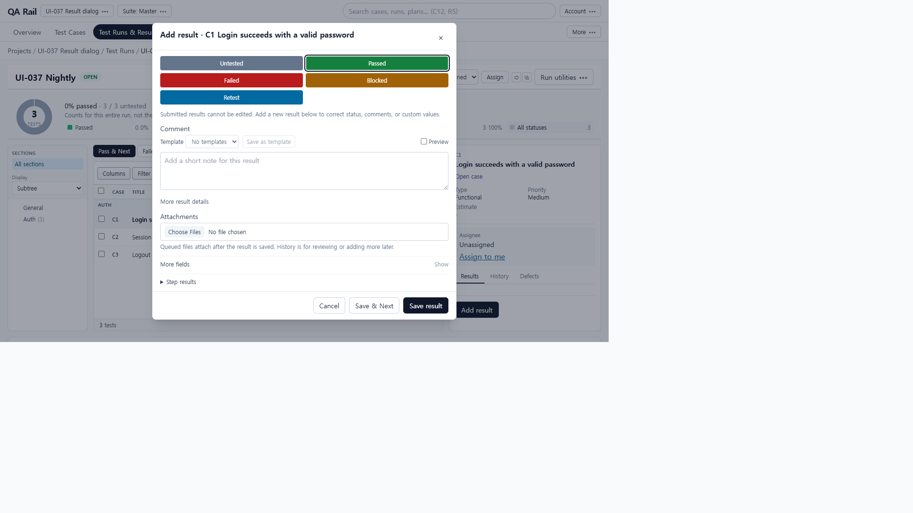
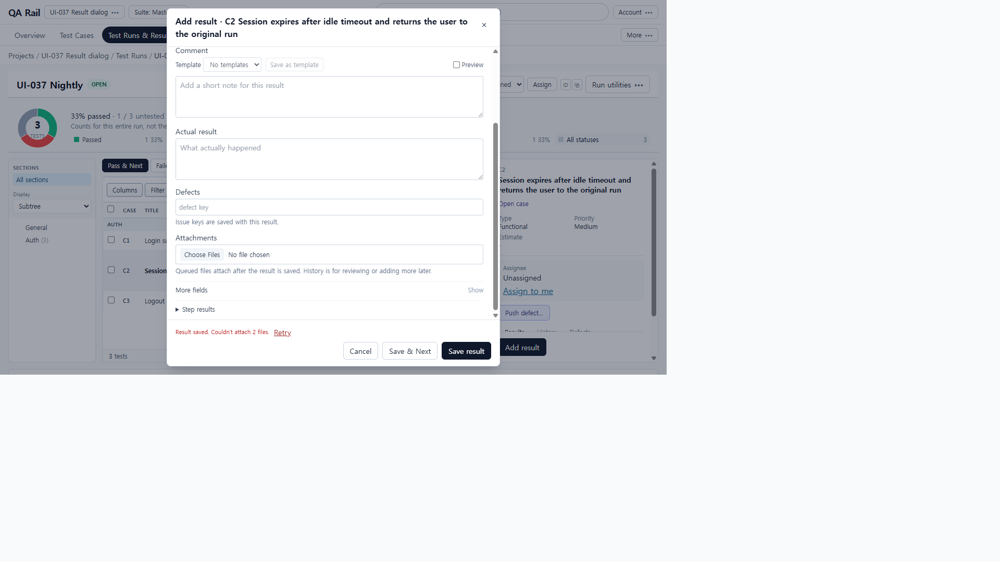
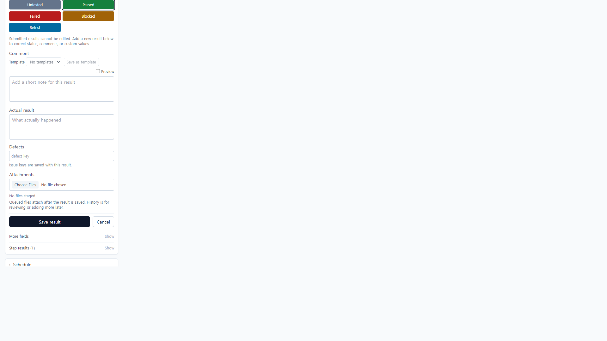
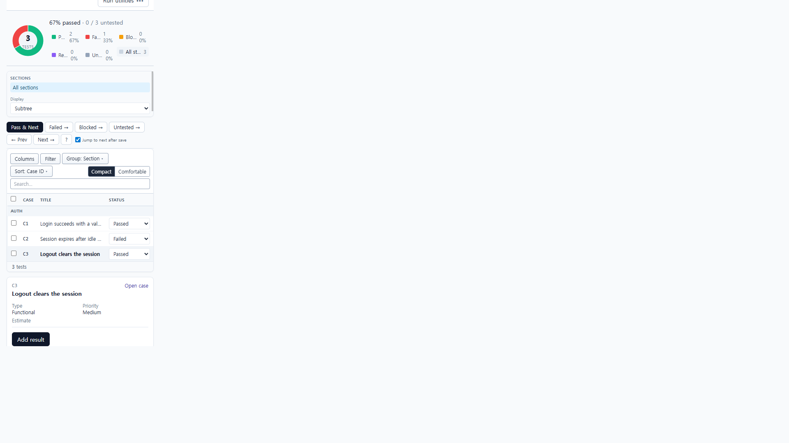
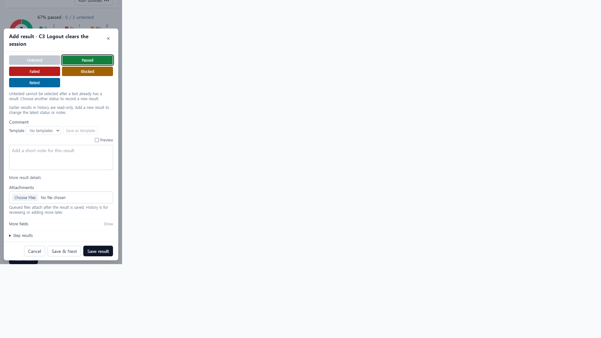
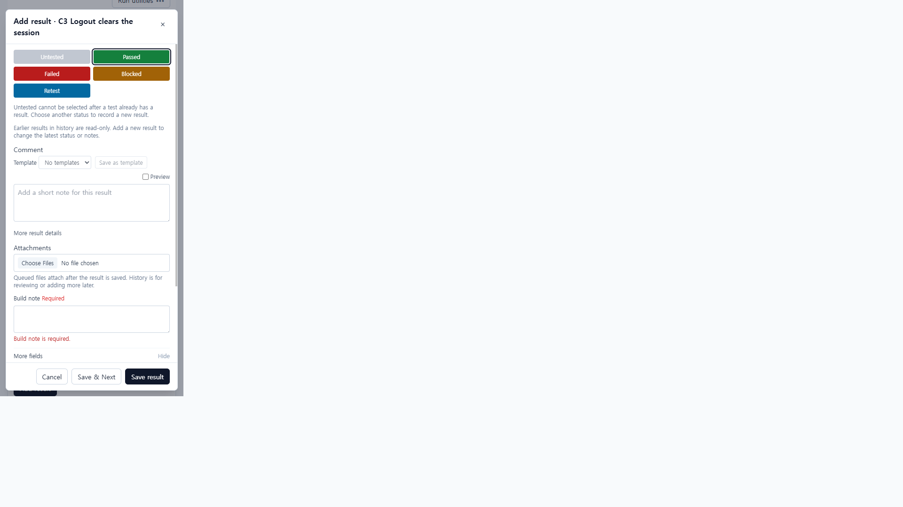

# UI-037 — Move panel result entry into a shared compact dialog

Completed: 2026-09-19

## Result

- The Results pane no longer hosts the always-visible Record result form. A compact **Add result** action opens a shared centered `Dialog` titled `Add result · {code} {name}`.
- List **Failed / Blocked / Retest** reuse the same dialog with the chosen status preselected. Explicit **Pass & Next** stays on the tests toolbar (UI-010).
- Footer is **Cancel / Save & Next / Save result**. Jump to next does not flip Save result into an advance. Save & Next on the last visible test does not wrap.
- Dirty close uses in-dialog **Keep editing / Discard draft** (partial-success copy when a result id is already owned). Backdrop click does not discard. Close is `aria-label="Close"`.
- UI-030/031: two-file attachment failure keeps the dialog open on the submitting test, shows **Result saved. Couldn't attach 2 files. Retry**, and does not advance. Opening another test then saving creates a new result (`POST /api/runs/1/results`), not attachments on the previous result id.

## Verification

- Fixture: in-memory API `localhost:4000`, Vite `http://localhost:5173`, login `admin@example.com`. Project **UI-037 Result dialog** (`/projects/1/runs/1`), run **UI-037 Nightly**, tests C1 Login / C2 long Session expires… / C3 Logout. Later live save of required-field check added custom field **Build note** (`scope=result`, required).
- Before 1280×720: Results tab showed **Record result**, Comment / Actual / Defects / Attachments, and **Save result** in the pane. Before 390×844: the same stacked composer.
- After 1280×720: pane heading is the case title with **Add result**; no Record result form. Dialog 640×625, title names the target, Close labelled. After 390×844: overflow-x 0; pane **Add result**; dialog **366×741** at left 12px, **Save result** in view.
- Failed from the C2 Status list opened `Add result · C2 …` with Actual/Defects visible. Save result on C1 with Jump to next checked stayed on `testId=1`. Save & Next on last test C3 closed the dialog and stayed on `testId=3` (no wrap to C1).
- Two files on C2: `POST /api/runs/1/results` created result 2; both presigns 501 `STORAGE_UNAVAILABLE`; dialog stayed open with recovery `data-result-recovery-id=2`; URL `testId=2`. C3 Save & Next posted only `POST /api/runs/1/results` (no `/api/results/2/attachments`). Duplicate submit: footer/Close disabled while **Saving…**.
- Required **Build note**: empty Save result left the dialog open with `role="alert"` **Build note is required.** Dirty cancel showed **Discard this draft? The test is unchanged.** Keep editing restored the footer.
- Keyboard/focus: first enabled status received focus (Untested when available, Passed when Untested disabled). `#root.inert` true while open. Native Tab was not used (`browser_press_key` Tab routes to the Cursor UI).
- `npx.cmd vitest run` resultEntryDialogModel, runSelectedTestState, resultSaveLifecycle, resultSaveFeedback, modalFocus (39 passed)
- `npm.cmd run lint -w apps/web`
- `npm.cmd run build -w apps/web` (existing large-chunk warning)

## Exception

- Native Tab / Shift+Tab cycle was not used in this Electron session. Focus used `HTMLElement.focus` / `firstFieldRef`.
- 1440×1000 was specified in the design fixture list; the controlling checklist Done-when is 1280×720 and 390×844, which were live. 1440 was not recaptured here.
- Pass & Next was confirmed present on the tests toolbar after the layout change. A fresh Pass & Next click was not repeated after all three tests already had results.
- List **Passed** still saves immediately (UI-038). Result-create HTTP failure (not attachment) was not injected this run; attachment-only failure was live.

## Screenshot review

