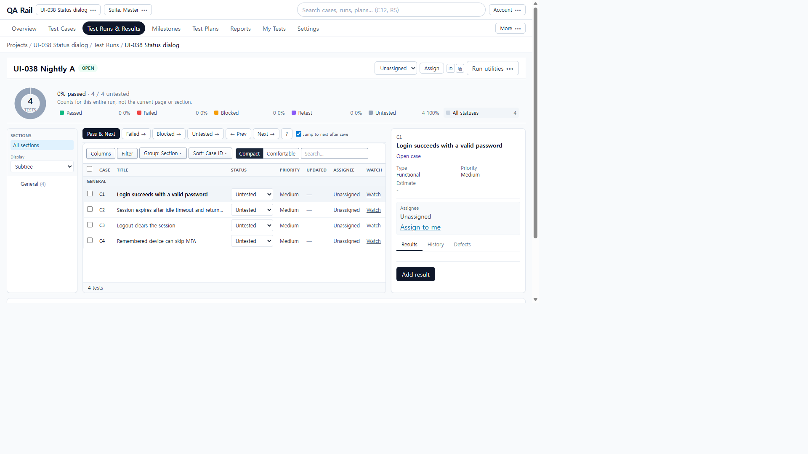
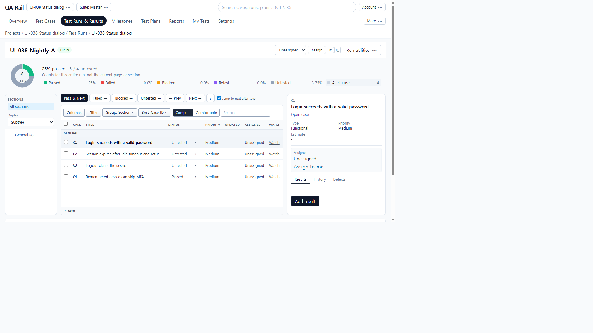
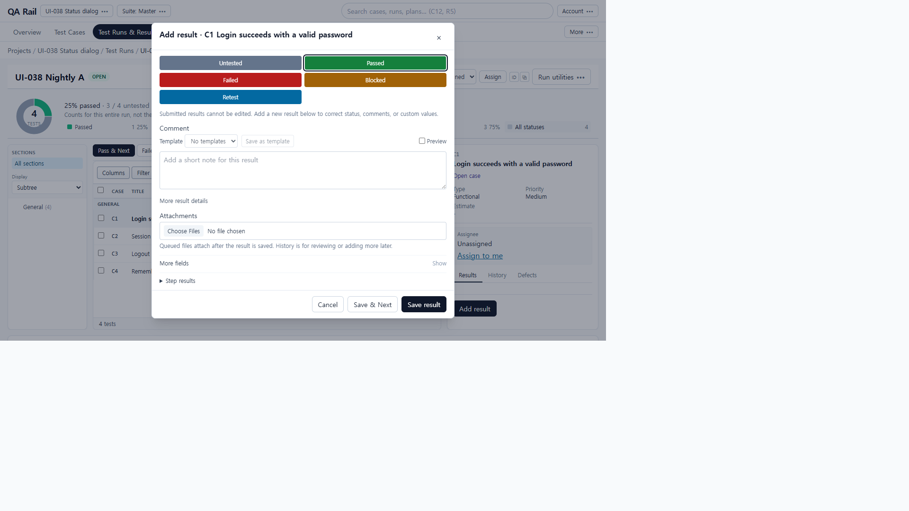
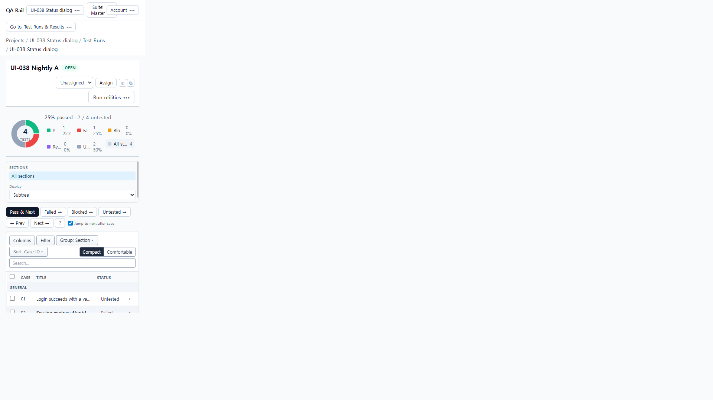
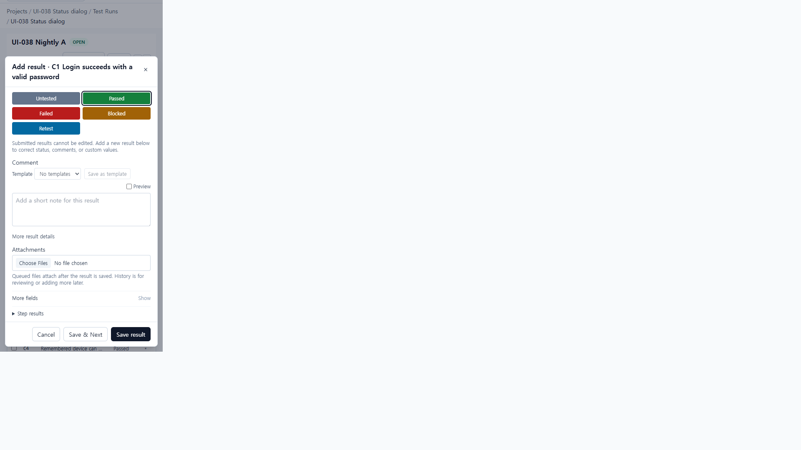
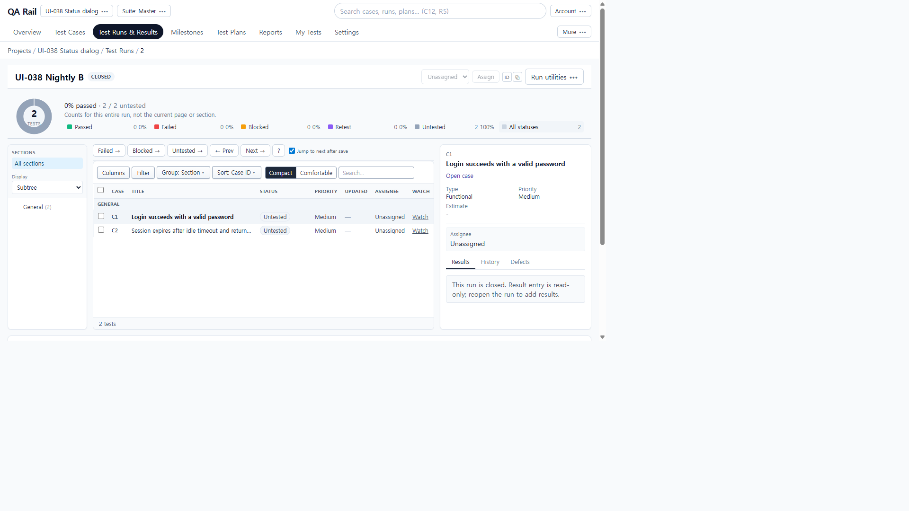

# UI-038 — Route every Run-list status choice through the shared dialog

Completed: 2026-09-19

## Result

- The existing Status column is a compact labeled `OverflowMenu` (`Untested▾` / `Failed▾` / `Passed▾`) with restrained status color. It is not a button grid or a new column.
- Every recordable choice, **including Passed**, opens UI-037’s `Add result · {code} {title}` dialog with that status pressed. Ordinary Status selection does not POST a result.
- Same-status re-recording works because the control is a menu, not a native `<select>` whose `onChange` ignores the current value.
- Accessible name: `Status for {code}. Opens the result dialog with the chosen status.` Title: `Choose a status to add a result. The current status can be chosen again. The test is not updated until you save.` Neither says Passed saves immediately.
- Untested stays disabled. Explicit **Pass & Next** remains on the tests toolbar (UI-010). Closed runs keep `StatusBadge` (no menu). Bulk row checkboxes are unchanged.
- Overlapping title/Status readability: [UI-033](./UI-033.md). This unit does not recertify UI-033.

## Verification

- Fixture: in-memory API `localhost:4000`, Vite `http://localhost:5173`, login `admin@example.com`. Project **UI-038 Status dialog** (`/projects/1`). Run A **UI-038 Nightly A** (`/projects/1/runs/1`, tests 1–4). Run B **UI-038 Nightly B** (`/projects/1/runs/2`, tests 5–6, same cases 1–2). Group: Section / General (4). pageSize 50 so paging had no extra page.
- Before (reproduced): C4 Status **Passed** on the native select saved immediately (`POST /api/runs/1/results`), no dialog, progress 25% passed. Aria mentioned Failed/Blocked/Retest opening the composer.
- After 1280×720: compact Status labels + ▾. C1 Passed opened `Add result · C1` with Passed pressed; `window.__ui038Posts` stayed `[]` on open; Cancel left C1 **Untested▾** and 25% unchanged.
- Save: C2 Failed opened the same dialog (Actual/Defects visible), URL `testId=2`, `POST /api/runs/1/results` created result id 2 status `failed`. GET `/api/tests/2/results` total 1.
- Same-status: C4 current Passed (`menuitemcheckbox` checked) opened `Add result · C4` at `testId=4`; close without save.
- Filter: Failed legend → URL `?testId=2&status=failed`, one row C2 **Failed▾**, pane C2. Clear filter restored General (4).
- Two runs: Run B case 2 remained untested (test id 6) after Run A C2 failed. After closing Run B, Status cells were badges `Untested` (0 Status menus), pane “This run is closed…”, checkboxes still present, C1/C2 still untested (0% passed).
- 390×844: `innerWidth` 390, `overflowX` 0. C1 Status at x=261,y=793,w=104 (in view) labeled **Untested**. Menu items: Untested disabled, Passed/Failed/Blocked/Retest enabled. Passed opened the named dialog; dirty Cancel → **Discard this draft? The test is unchanged.** Discard: posts `[]`, C1 still **Untested▾**, 25% unchanged. Dialog heading 296px wide; footer Cancel / Save & Next / Save result in the captured frame.
- Keyboard/a11y: Status is `aria-haspopup="menu"`; choices are `menuitemcheckbox`. Native Tab was not used (`browser_press_key` Tab routes to the Cursor UI). Escape on Run utilities focused the first menuitem rather than closing in this Electron session. After discard, document focus was not returned to the Status trigger.
- `npx.cmd vitest run src/features/runs/utils/runListStatusEntry.test.ts` (3 passed)
- `npm.cmd run lint -w apps/web`
- `npm.cmd run build -w apps/web`

## Exception

- Native Tab / Shift+Tab cycle was not used in this Electron session.
- 1440×1000 is listed in the design fixture table; the controlling Done-when viewports are 1280×720 and 390×844, which were live. 1440 was not recaptured.
- Paging: 4 tests on pageSize 50, so a second page was not available. Grouped + filtered rows were live.
- At 390, the Status menu’s Passed item measured y=870 (below 844) until scrolled/clicked via a11y. Compact menu `w-56` with `align="right"` was applied after the 1280 captures to keep the menu on-screen horizontally; the 390 menu-open frame itself was not recaptured after that alignment change.
- Before 390×844 compositor returned a stale 1280 dialog frame; no trustworthy native-select 390 before image. After 390 list/dialog frames were unique (Go to chrome; Comment-focused dialog).
- Tester review: pending.

## Screenshot review

