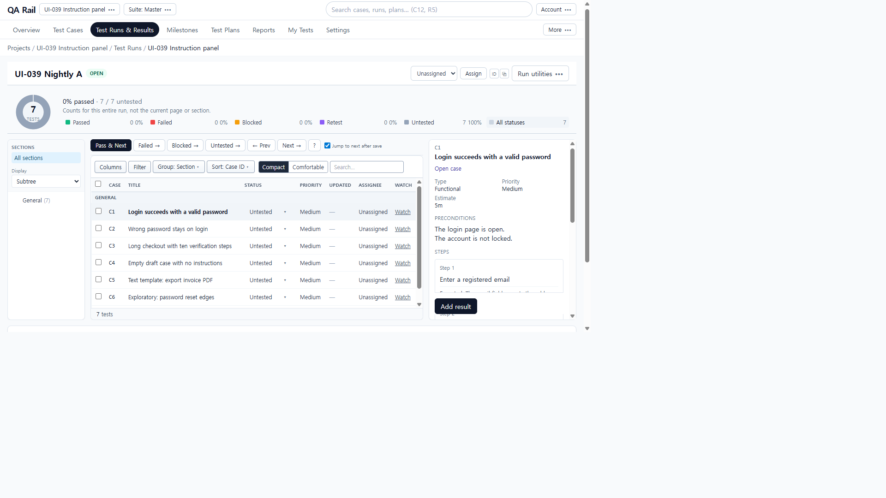
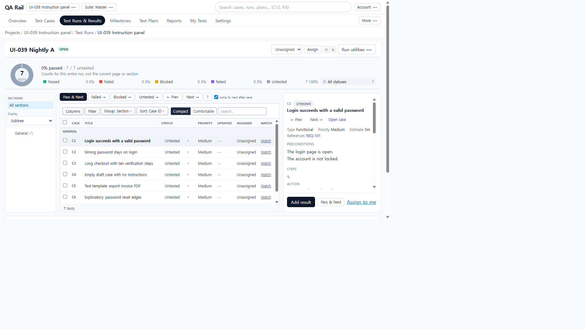
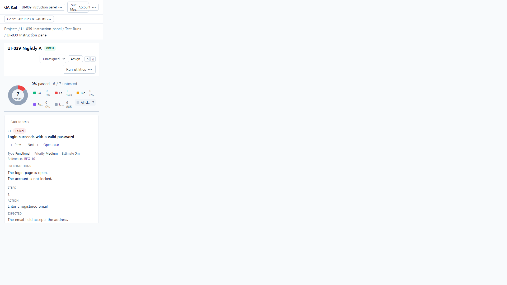
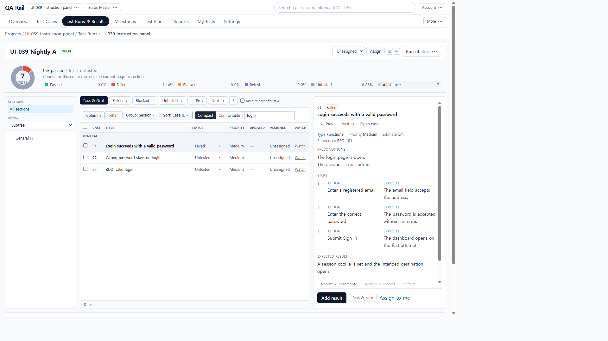

# UI-039 — Verify a content-first case execution panel end to end

Completed: 2026-09-19

## Result

- Selected-test pane is instruction-first: case ID, current Status badge, title, Prev/Next beside identity, then a compact Type/Priority/Estimate/References line, then Preconditions, numbered Action/Expected pairs, and case-wide Expected even when steps exist.
- Text templates render as prose (`Instructions`), not an empty step table. Exploratory shows Mission/Goals. BDD shows scenario name and Given/When/Then. Empty cases say “No instructions written for this case.”
- Results & comments / History & context / Defects stay below the instructions. Footer has Add result, Pass & Next, and compact assignment. Checkboxes still only bulk-select.
- 390 hides the list and tree while a test is selected and shows **Back to tests**, which restores the list (`testId` cleared). 1440 uses a 420px pane so Action/Expected sit side by side; 1280 (~320px pane) stacks them.

## Verification

- Fixture: in-memory API `localhost:4000`, Vite `http://localhost:5173`, login `admin@example.com`. Project **UI-039 Instruction panel** (`/projects/1`). Run A **UI-039 Nightly A** (`/projects/1/runs/1`, tests 1–7). Run B **UI-039 Nightly B** (`/projects/1/runs/2`, C1/C2).
- Before 1280×720: C1 pane had Type/Priority/Estimate cards, step **cards**, no current status on the identity, Add result covering later steps, Pass & Next only on the list toolbar, common expected missing.
- After 1280×720: identity **Untested** + Prev/Next + Open case; compact Type Functional / Priority Medium / Estimate 5m / REQ-101; two preconditions; stacked Action/Expected; footer **Add result / Pass & Next / Assign to me**. `overflowX` 0. Last C3 step (10 steps) sat above the footer after pane scroll (`lastBottom` 450 vs footer 646).
- Flow: grouped list → C1 → Add result → Failed + comment + actual + AUTH-101 → Save result (Jump to next off). Stayed on `testId=1`. **Latest: failed · Dashboard stayed on login…** below instructions. Status badge **Failed**. Next → C2 **Wrong password stays on login**, REQ-102, different three steps, expected “No session is created.”
- Refresh `/projects/1/runs/1?testId=1` resumed C1 Failed + Latest failed. List Status on C2 opened `Add result · C2 Wrong password stays on login`; Cancel left C2 Untested.
- Templates live: C4 empty copy; C5 prose invoice-PDF instructions; C6 Mission/Goals; C7 BDD Given/When/Then. C3 10 steps.
- 390×844 (`innerWidth` 390, `scrollWidth` 390, `overflowX` 0): list/tree hidden, **Back to tests** visible, stacked Action then Expected. Back to tests restored `/projects/1/runs/1` with the grouped list and no pane.
- 1440×1000: pane 420px, step grid `24px 169.5px 169.5px` (side by side). All three C1 Action/Expected pairs plus common expected visible with footer.
- Loading: C2 Status→Failed showed pane **Loading case…** while the dialog opened. Case API blocked: **Case details are unavailable.** Distinct `Could not load case details` (isError) was not reached with URL blocking.
- Keyboard/a11y: Prev/Next `aria-label` Previous test / Next test; Add result; Back to tests; Status `Status for {code}. Opens the result dialog…`; tablist **Result review**. Native Tab was not used (`browser_press_key` Tab routes to the Cursor UI).
- Tests: `npx.cmd vitest run src/features/runs/utils/runCaseInstructionModel.test.ts` (3 passed). `npm.cmd run lint -w apps/web`. `npm.cmd run build -w apps/web`.

## Exception

- Composer Defects `AUTH-101` did not persist on `GET /api/tests/1/results` (`defects: []`). History **Add link** showed Adding… then still “No defect links yet.” Defects tab stays empty until a history item is selected; that click was intercepted by the pane scroll/footer in this session. Linked-defect inspect is therefore incomplete in the UI.
- Native Tab / Shift+Tab cycle was not used in this Electron session.
- Before 390×844 compositor was a stale 1280-like frame; after 390 used unique Go-to chrome plus comment text. 1440 after used unique header search `ui039-1440`.
- Tester review: pending.

## Screenshot review

