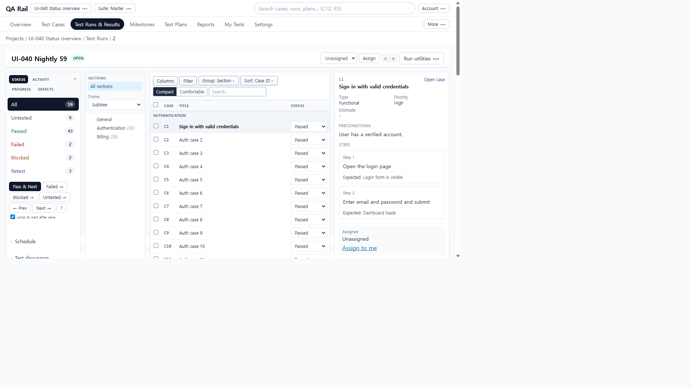
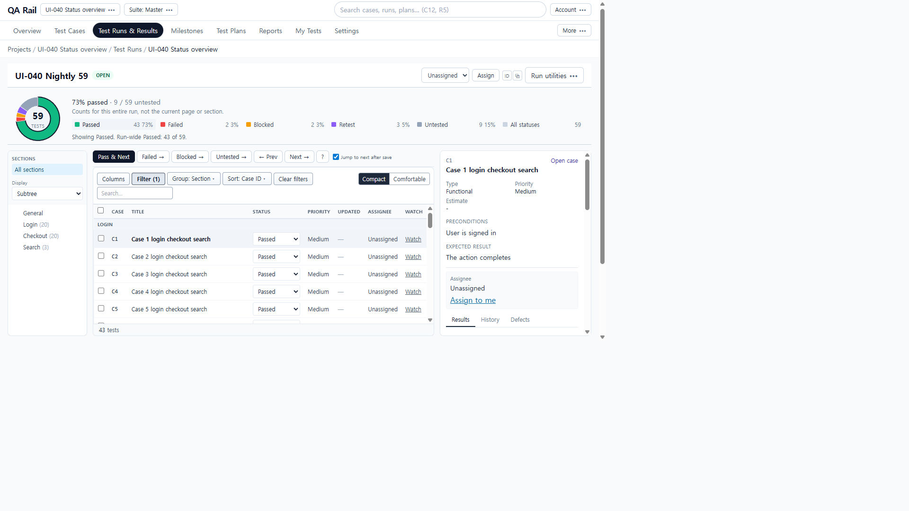
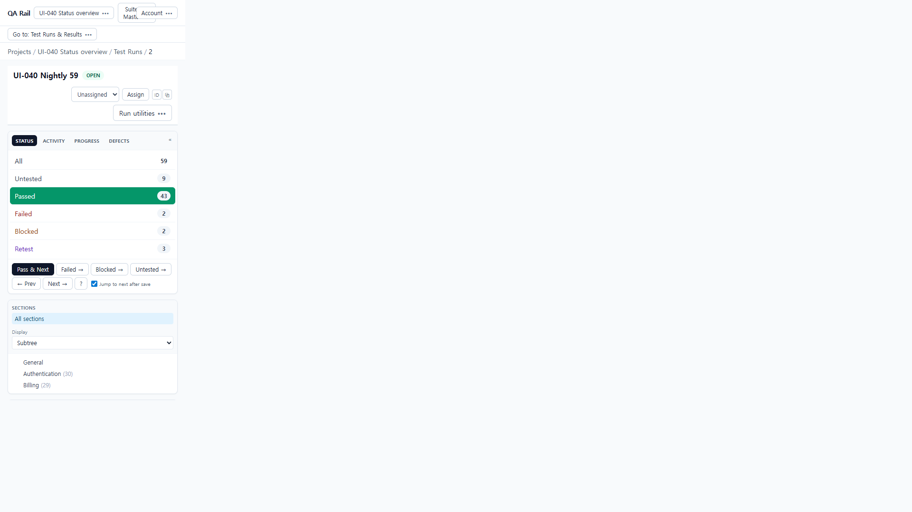
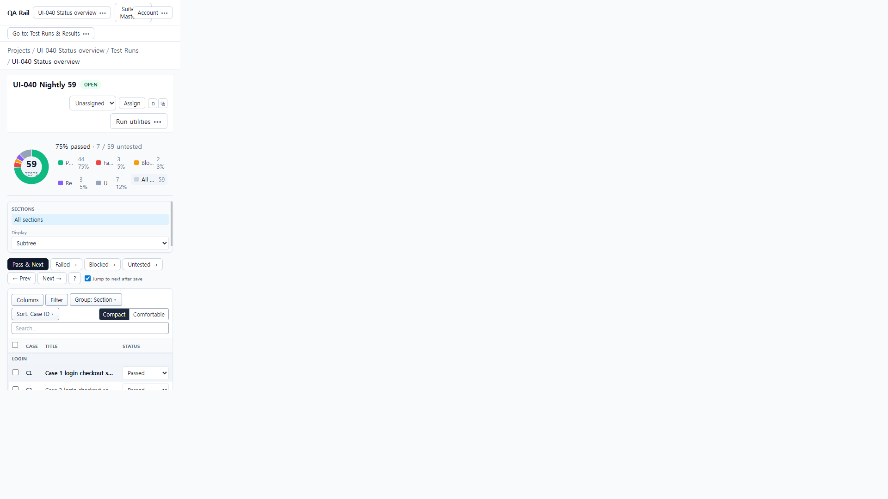
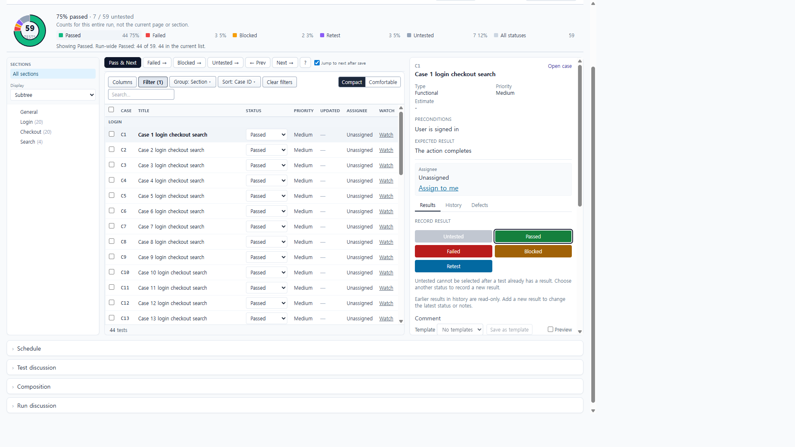

# UI-040 — Move Run status statistics above the execution workbench

Completed: 2026-09-19

## Result

- One compact **Run-wide status** strip sits under the run title: donut (center = test count), **73% passed · 9 / 59 untested**, and a legend that keeps zero-count statuses plus **All statuses**.
- The permanent left Status/Activity/Progress/Defects column (`lg:w-52`) is gone. At 1280×720 with tree and detail open the tests column is **721px** (was **501px**). No empty grid track remains.
- Legend clicks only set the status filter. They do not record a result. **All statuses** clears only `status` and keeps `testId`.
- **Pass & Next** sits on the tests column. **Activity** opens a `Drawer` from **Run utilities**. **Defect summary** stays in that menu; per-test Defects stay on the selected-test pane.
- The section tree is unchanged in role; on 390px it is height-capped and scrollable so the first case row fits the initial viewport.

## Verification

- Fixture: in-memory API `localhost:4000`, Vite `http://localhost:5173`, login `admin@example.com`. Project **UI-040 Status overview** (`/projects/1/runs/1`), run **UI-040 Nightly 59**, 59 tests. Seeded counts were Passed 43 / Failed 2 / Blocked 2 / Retest 3 / Untested 9 (73% passed, 15% untested, 85% recorded). Later live saves changed the working copy to Passed 44 / Failed 3 / Untested 7; the 73% vs 85% check used the seeded state before those saves.
- Before 1280×720: four columns including a 208px Status sidebar; Pass & Next lived in that column. Before 390×844: stacked Status/Activity/Progress/Defects; first case was below the fold (CDP top ~1008).
- After 1280×720, tree+detail open: overview **73% passed · 9 / 59 untested**; no 85% primary metric; columns tree **168px** / tests **721px** / pane **320px**; overflow-x 0. Compact rows **C1–C7** were fully in the 720px viewport (seven ≥ six).
- Legend **Passed** set `?status=passed`, pressed the Passed control, listed 43 passed tests, and left overview at 43/59. **All statuses** removed `status` and kept `testId=1`. Hint: `Showing Passed. Run-wide Passed: 43 of 59. 43 in the current list.`
- **Pass & Next** on an untested test: 43→44 passed, 9→8 untested, advanced to Case 52, URL stayed `status=untested`. Bulk **Apply result** Failed on C53: Failed 2→3, Untested 8→7. Overview stayed run-wide, not page-local.
- **Run utilities** includes Activity, Defect summary, and management/output items, not Pass & Next. Activity drawer showed empty + **View all project activity**, then Close.
- Empty run `/projects/2/runs/3`: **0 tests**, legend all `0 0%`. Zeros run `/projects/2/runs/4`: Passed 2 100% with Failed/Blocked/Retest/Untested **0**. Missing run `/projects/1/runs/999`: **Run not found** with Retry.
- After 390×844, detail stacked below the list: overflow-x 0; first case **C1** top 789 / bottom 826 **in view**; **Go to: Test Runs & Results**; Pass & Next still present. After 1440×1000: columns **224 / 725 / 420**, overflow-x 0 (CDP `innerWidth` 1440).
- Keyboard: legend buttons expose `aria-label` / `aria-pressed`. **All statuses** received DOM focus. Native Tab was not used.
- `npx.cmd vitest run src/features/runs/utils/runStatusOverview.test.ts src/features/runs/utils/runExecutionHeaderMenu.test.ts` (5 passed)
- `npm.cmd run lint -w apps/web`
- `npm.cmd run build -w apps/web` (existing large-chunk warning)

## Exception

- The 59-test percents were verified on the seeded 43/9/85 split. Subsequent Pass & Next and bulk Failed mutated that in-memory run; later 390/1440 captures show 75% passed / 7 untested.
- Result **save failure / retry** was not simulated on the network. Success paths (Pass & Next, bulk Apply) were live.
- **Loading run...** was not captured; session was already warm (`Checking session…` / project chrome). Error and empty states were live.
- Native Tab into the legend was not used (`browser_press_key` Tab still routes to the Cursor UI). Focus used `HTMLElement.focus()`.
- A generic 390 PNG reused a 1280 compositor frame until the unique **Go to** click capture. Use that capture plus CDP (`innerWidth` 390, C1 in view) as the 390 after evidence. 1440 before was not recaptured this unit; after used CDP 1440 plus the Passed-legend PNG.

## Screenshot review

