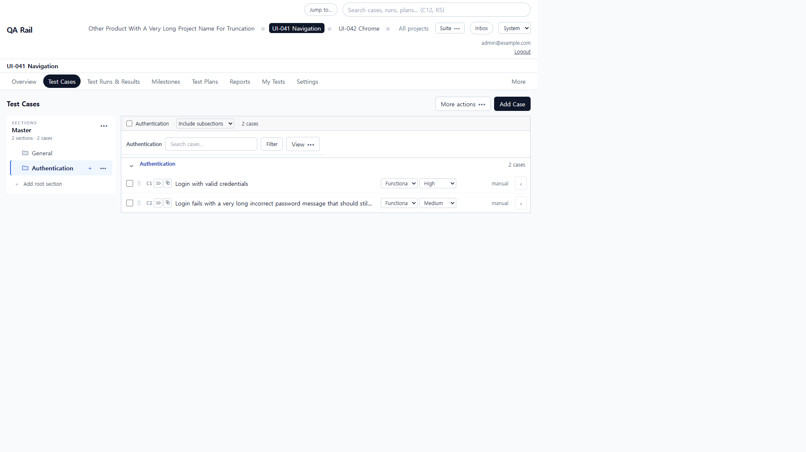
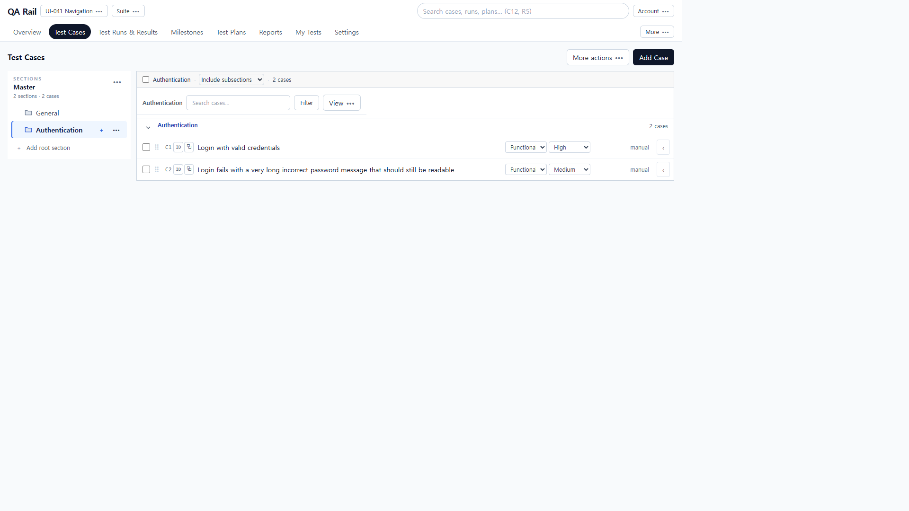
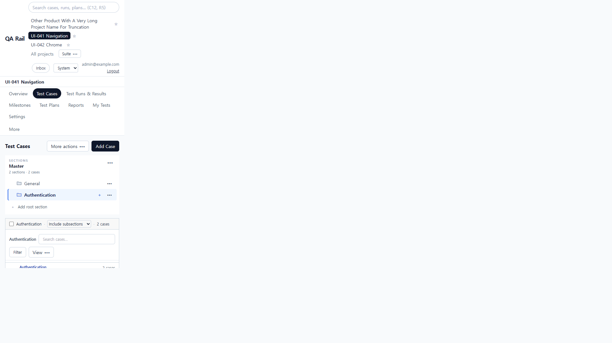
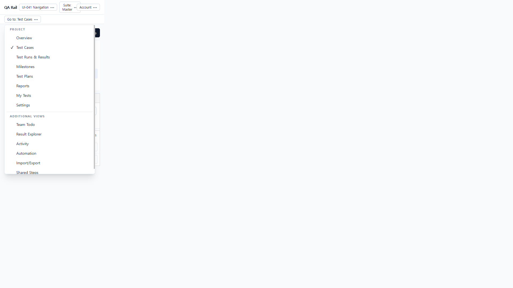

# UI-041 — Flatten global context and project navigation

Completed: 2026-09-19

## Result

- One global context row: **QA Rail**, current **project** menu, **Suite** menu, desktop **Search**, **Account**.
- The extra `ProjectHeader` heading row is unmounted. Project identity is no longer repeated as a same-level `h1`.
- Infrequent globals moved into named **Account**: Search project, Jump to… (Ctrl+K), Inbox, Color theme, signed-in email, Logout.
- Project chips/pins are a named project menu (Pinned / Projects / Pin / All projects). Long names stay in the accessible name; the trigger truncates.
- Desktop keeps one primary-tab row plus named **More**. At 390px those tabs are replaced by **Go to: {current}** with every existing primary and secondary route.
- UI-027 Suite disclosure is unchanged (`Suite` / `Suite: Master`). Archived context is the switcher suffix `(Archived)` plus the existing read-only banner.

Removed from permanent chrome: Jump to, Inbox, theme select, email/Logout, all project chips, duplicate project `h1`, wrapping primary-tab pills on narrow screens. Moved: those actions into **Account** / project / **Go to** menus. Nothing was replaced by unlabeled icons.

## Verification

- Fixture: in-memory API `localhost:4000`, Vite `http://localhost:5173`, login `admin@example.com`. Project **UI-041 Navigation** (id 2), suite **Master**, section **Authentication**, cases **C1 Login with valid credentials** and long-title **C2**. Second project **Other Product With A Very Long Project Name For Truncation** (id 3), later archived from Settings.
- Before 1280×720: global bar 141px (Jump to, Search, every project chip including the long name, Suite, Inbox, theme, Logout), project `h1` 33px, tabs 41px, chrome **215px**. After: global 47px + tabs 41px, chrome **88px**. No duplicate `h1`. Overflow-x 0. Dominant page CTA remains Add Case.
- Before 390×844: global 241px + `h1` 33px + wrapping tabs 153px, chrome **427px**. Test Cases title at 448px; first case 865–911px **not** in view. After: global 55px + **Go to: Test Cases** 35px, chrome **90px**. Title at 111px; first case 528–574px **in view**. Overflow-x 0. Search is disclosed from Account, not a permanent field.
- 1440×1000 after: chrome **88px**, overflow-x 0 (CDP `innerWidth` 1440). Before was 173px.
- Switcher lists the long project name; switching loads `/projects/3` Overview. Pinning Master labels **Suite: Master**. Settings → Archive updates the trigger to **… (Archived)** and shows the read-only banner.
- Direct URL `/projects/2/team-todo` shows **More: Team Todo**. More → Activity becomes **More: Activity**. Inbox `/projects/2/notifications` still loads. Account → Jump to opens the command palette. Escape from the 390 **Go to** menu closes it; first-item focus then trigger restore follow OverflowMenu.
- `npx.cmd vitest run` projectSwitcherMenu, projectAccountMenu, projectNavTabs, projectContextMenu (7 passed)
- `npm.cmd run lint -w apps/web`
- `npm.cmd run build -w apps/web` (existing large-chunk warning)

## Exception

- A generic 390 PNG of the Test Cases heading reused a 1280 compositor frame. Use the unique **Go to: Test Cases** capture plus CDP (`innerWidth` 390, first case in view) as the 390 after evidence. The archived Settings PNG was similarly stale; archived proof is the live a11y name `(Archived)` and banner text.
- Single-repository projects allow only one suite, so Suite switching is pin None ↔ Master, not a second suite.
- Notifications is not a primary/secondary tab, so 390 **Go to** is unlabeled beyond “Go to” on that URL; Inbox remains in Account.

## Screenshot review

