# UI-042 — Make the shared page grammar flat and consistent

Completed: 2026-09-19

## Result

- `WorkbenchPageHeader` is a title/action row with a thin bottom rule. The boxed `border` + `shadow-sm` card is gone.
- `WorkbenchToolbar` is a transparent filter/tools row. Nested `border border-slate-300` toolbar cards were removed from Runs, Milestones, Plans, Plan detail, and Reports.
- Report drilldown filters use the shared `toolbar` FilterBar (no card). KPI tiles and the results table keep meaningful borders. UI-035 **Reports** / **This report** names are unchanged.

Removed: decorative page-header cards and nested toolbar boxes. Moved: nothing functional; Add Run / Add Milestone / Add Plan / Add report stay the single dominant CTA.

## Verification

- Fixture: in-memory API `localhost:4000`, Vite `http://localhost:5173`, login `admin@example.com`. Project **UI-042 Chrome** (id 1) with **UI-042 Nightly**, **UI-042 Release**, **UI-042 Regression plan**, and the reports catalog.
- Before 1280×720: header `1px solid rgb(203,213,225)` + `0 1px 2px` shadow; toolbar a second boxed border. Same on Milestones, Plans, Reports. 390 Runs: two stacked cards above the list. CDP overflow 0.
- After 1280: header class `border-b … shadow` none; toolbar `border: 0` / `shadow: none`. Dominant CTAs: Add Run, Add Milestone, Add Plan, Add report. Choose-suite drawer still has a drop shadow. Inputs/selects keep borders. Overflow 0.
- Run summary: filters `border-b … bg-transparent`; menus **Reports** and **This report**.
- Dark: `html.dark`, header title `rgb(241,245,249)`, bottom rule `rgb(51,65,85)`, no white header card.
- Keyboard: Add Run focuses; next controls My runs → Order by → plan row.
- 390 Runs: Add Run `right` 238px, `bottom` 455px (in first viewport), overflow 0, first populated rows visible.
- 1440 CDP: `innerWidth` 1440, overflow 0. The 1440 PNG reused a 390 compositor frame; treat CDP as the 1440 evidence.
- `npx.cmd vitest run src/shared/ui/WorkbenchPage.test.ts` (2 passed)
- `npm.cmd run lint -w apps/web`
- `npm.cmd run build -w apps/web` (existing large-chunk warning)

## Exception

- List/table bodies still use a content border. Panel default is unchanged. Run execution toolbars and Cases chrome were not restyled as page cards. Global tabs wrapping at 390 is UI-041.

## Screenshot review

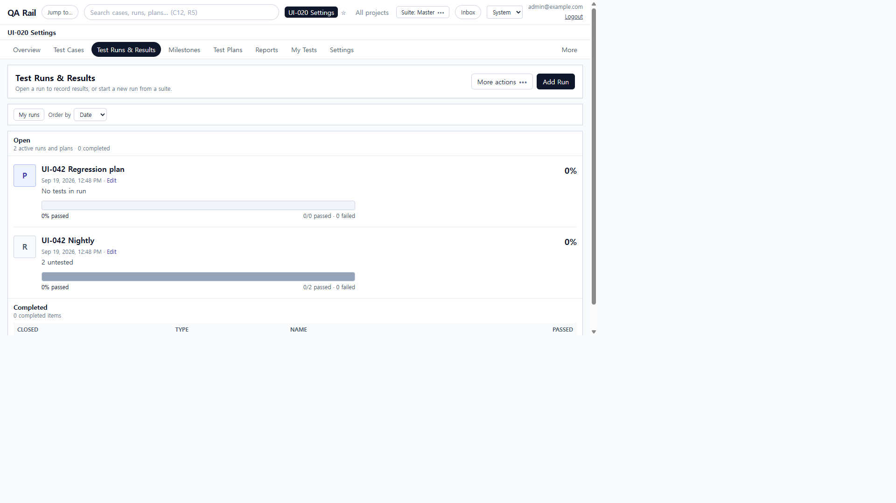

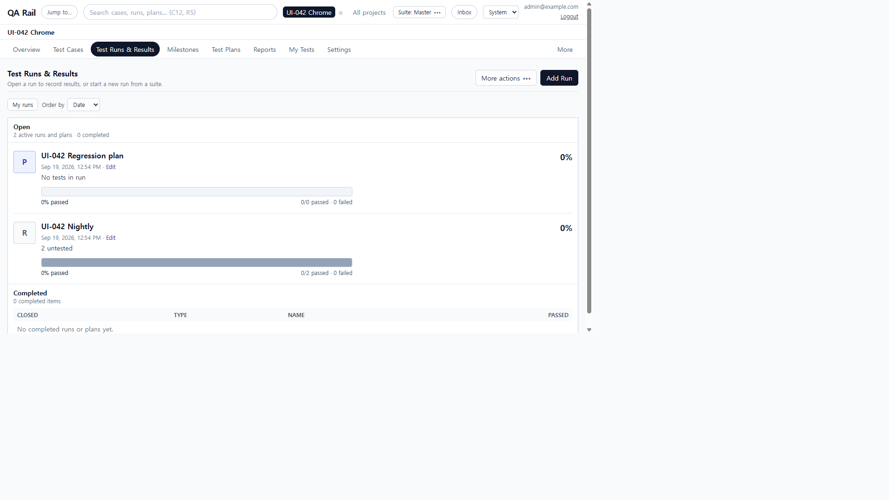

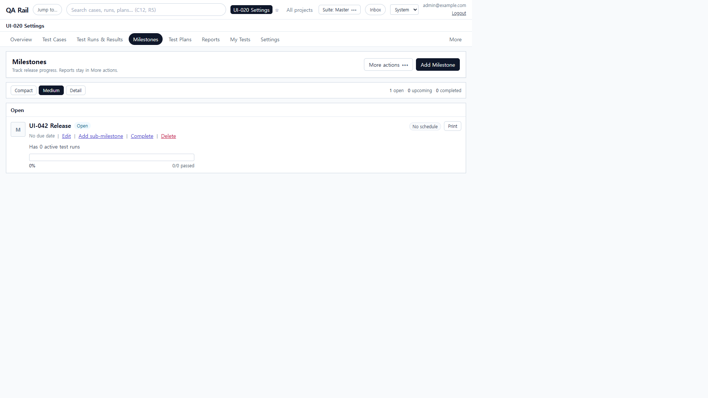

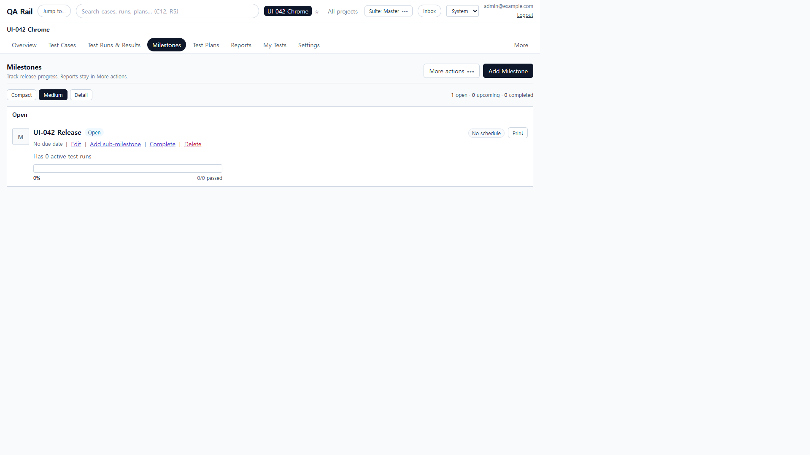

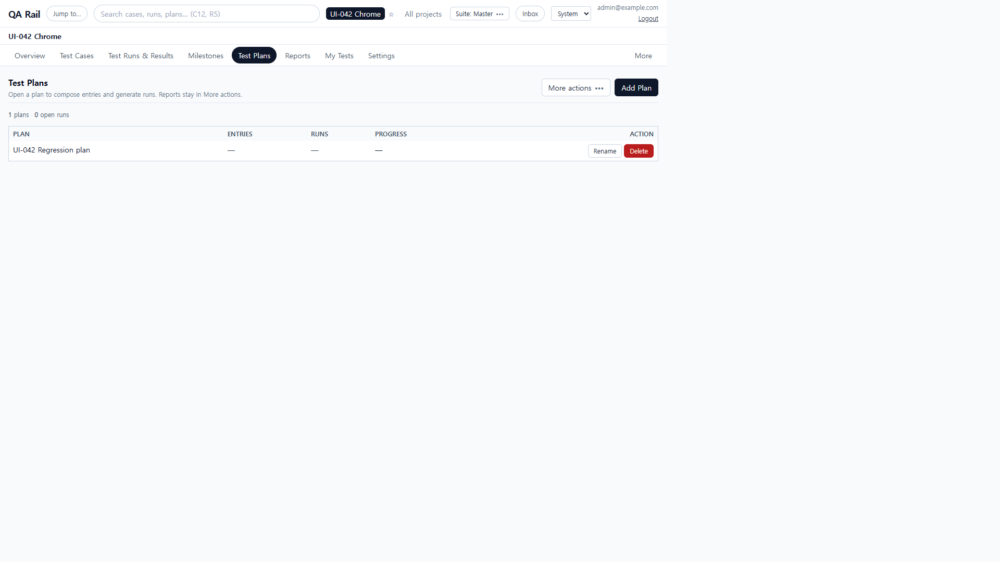

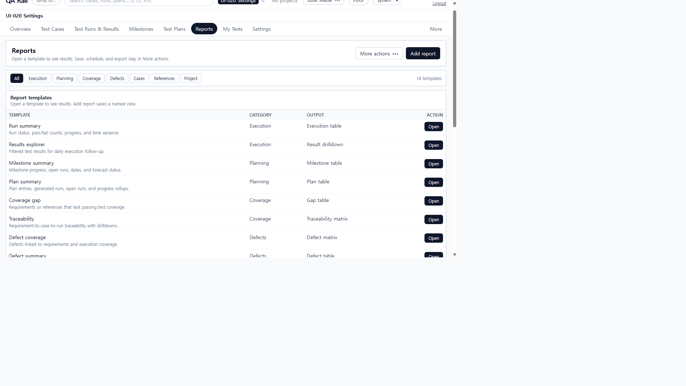

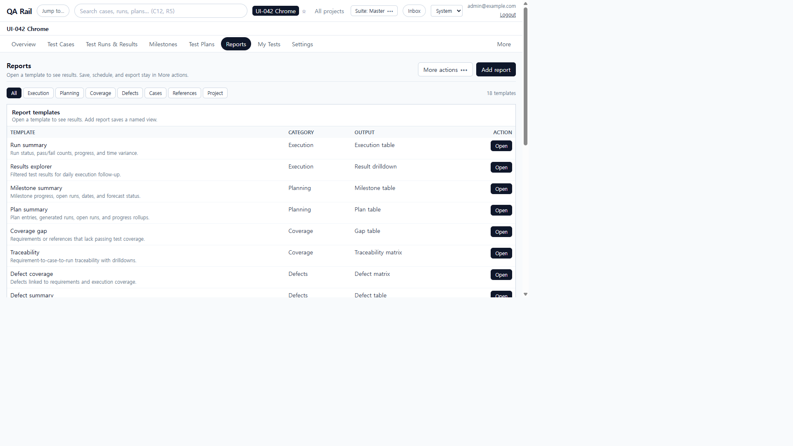

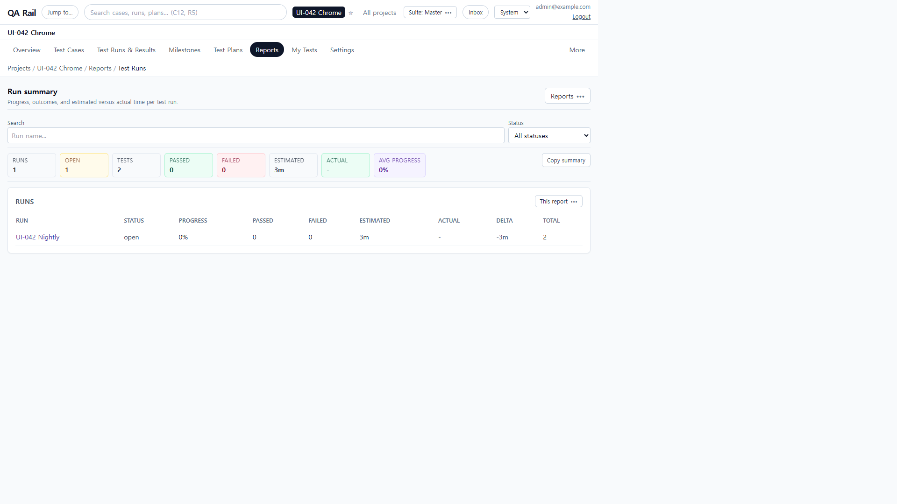

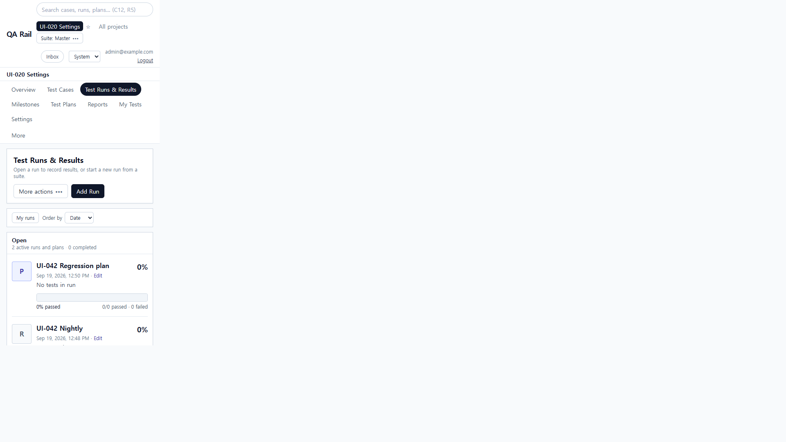

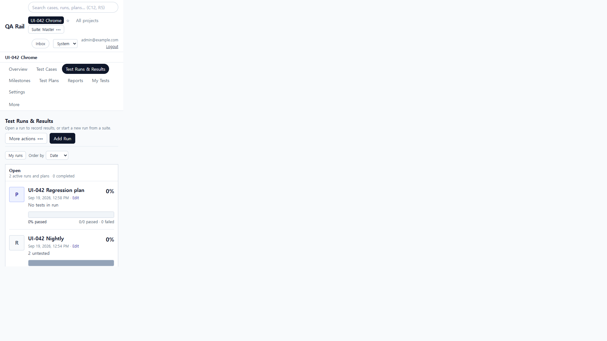

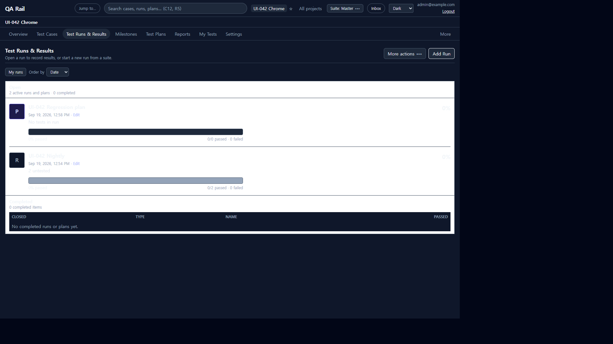
