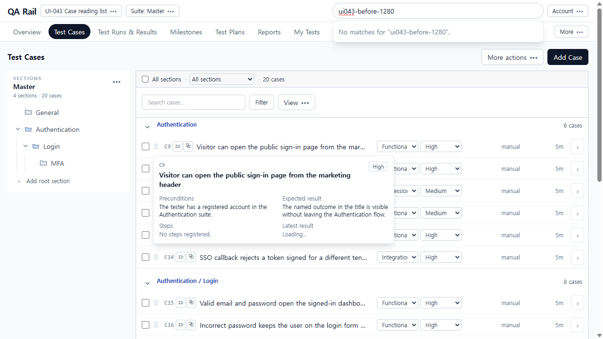
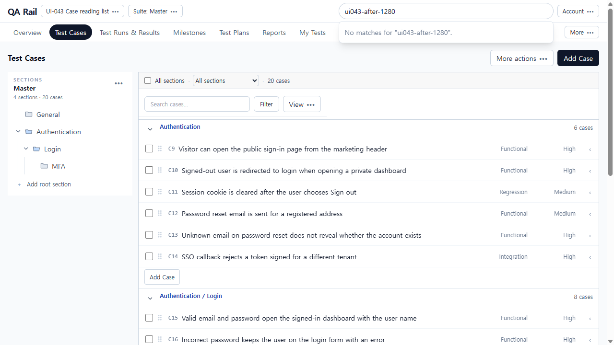
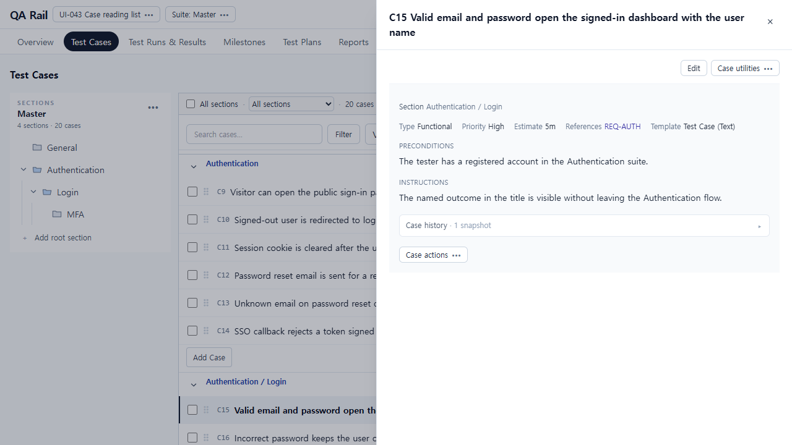
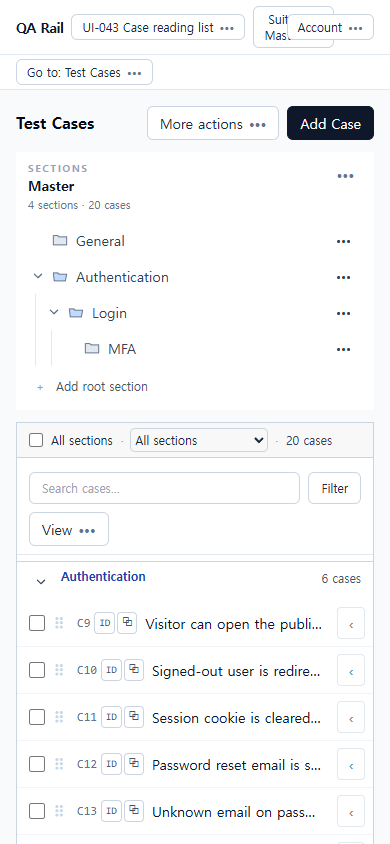
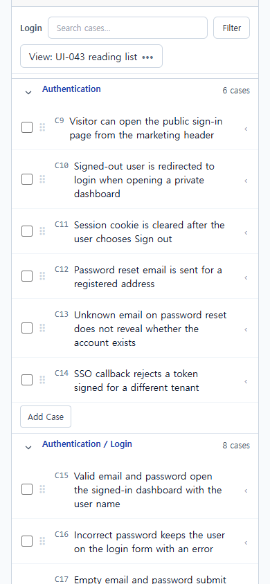
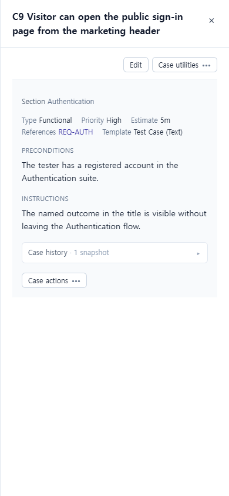
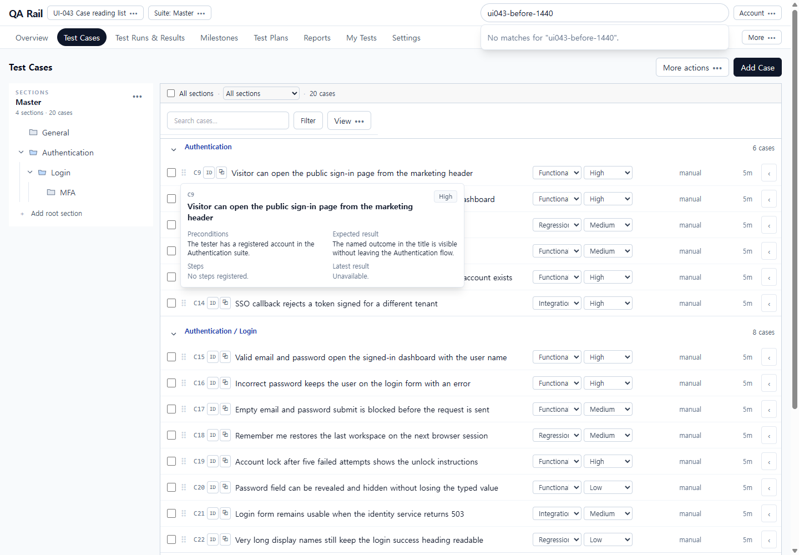
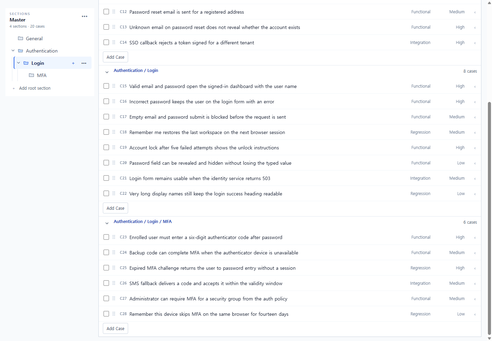

# UI-043 — Make case rows a reading list rather than permanent edit forms

Completed: 2026-09-19

## Result

- Case rows are a reading list: checkbox, ID, wrapping title, Type/Priority as short text, one quiet **Open details** affordance. Permanent Type/Priority selects and repeated ID/link copy icons are gone.
- Default View columns are type/priority only; extra saved columns stay available in View.
- Section blocks keep a text path, direct count and collapse; quiet **Add Case** outline sits at each block end. Header **Add Case** still opens full authoring.
- Opening title/detail marks the row with the same left-border reading selection as Run (`border-l-slate-900 bg-slate-100`) without changing bulk checkboxes. Explicit Edit and Selection actions still edit metadata; Case utilities still copy ID/link.

## Verification

- Fixture: in-memory API `localhost:4000`, Vite `http://localhost:5173`, login `admin@example.com`. Project **UI-043 Case reading list** (`/projects/2`), suite Master, nested **Authentication / Login / MFA**, cases C9–C28 (20). Saved view **UI-043 reading list**.
- Before 1280×720 / 1440×1000 / 390×844: 20 rows, Type/Priority `<select>`s, copy icons, truncated titles, default `manual` / `5m` columns, hover preview overlay covering titles.
- After 1280×720: 0 row selects, 0 copy icons, 20 **Open details**, wrapping titles, Type/Priority text, **Add Case** on Authentication / Login / MFA. Search token `ui043-after-1280`.
- Open C15 without checkbox change: `checked=[]`, `panelCaseId=15`, left-border reading row, header **Edit** / **Case utilities**. Bulk C15+C16: **2 selected**, **Edit**, **Clear selection**, **Selection actions** (overflow includes Copy or move).
- Filter `authenticator` → 2 MFA cases after deferred search (~1.5s). Login without filter: direct 8 / subtree 14 / all 20. Saved view control reads **View: UI-043 reading list**. Section **Add Case** opened **New test case** for Authentication / Login.
- 1280 detail: C15 drawer over the list; long title and Type Functional / Priority High remain readable beside the panel.
- 390×844 list: `innerWidth` 390, `overflowX` 0, titles wrap (`whiteSpace: normal`, height 64–84, width 258), path **Authentication / Login**, 20 detail buttons. Open C9 → **Close drawer** / **Close details for C9**; close restored 20 articles, path present, `panelCaseId` null.
- 1440×1000: `innerWidth` 1440, 0 selects, 0 copy buttons, 20 articles, Type/Priority text, quiet **Add Case** at each block.
- Keyboard/a11y: checkboxes **Select C#**; titles **Open C# …**; detail **Open details for C#**; section **Add Case to {path}**; scope combobox **Case query scope**. Native Tab was not used (`browser_press_key` Tab/Enter routes to the Cursor UI). Title click and detail button open reading without checkbox change.
- Tests: `npx.cmd vitest run src/features/cases/utils/caseListRowPresentation.test.ts` (3 passed). `npm.cmd run lint -w apps/web`. `npm.cmd run build -w apps/web`.

## Exception

- Native Tab / Shift+Tab / Enter cycle was not used in this Electron session.
- Hover preview remains in `CaseRow` but `CaseListPane` no longer wires it; UI-044 owns detail body content.
- Tester review: pending.

## Screenshot review

