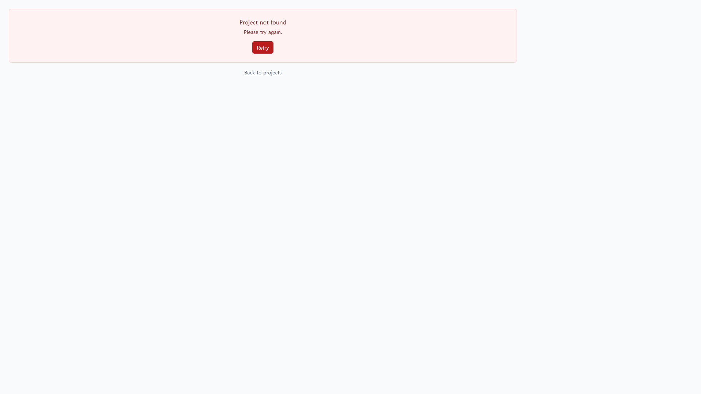
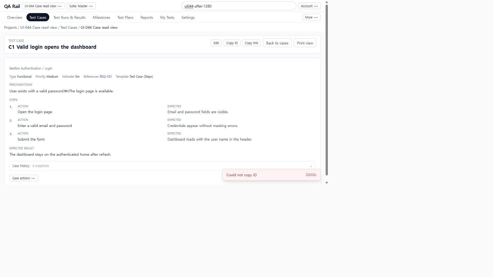
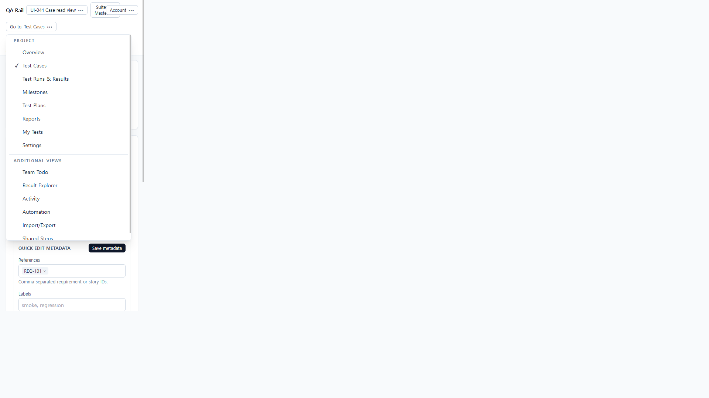
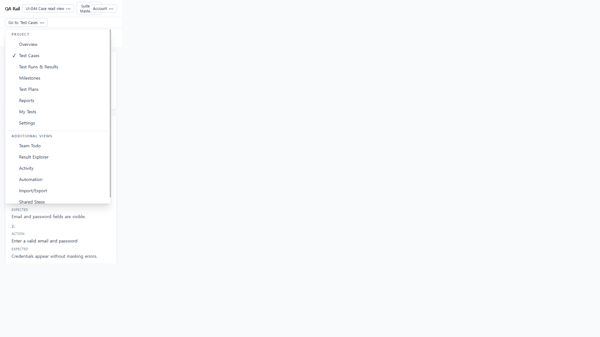

# UI-044 — Make the case detail body instruction-first and separate editing

Completed: 2026-09-19

## Result

- Case read view is instruction-first: title/ID, owning section, compact Type/Priority/Estimate/References/Template, then the same `RunCaseInstructionBody` order as Run (Preconditions → numbered Action/Expected → common Expected; Text as prose Instructions; exploratory Mission/Goals; BDD scenarios).
- Permanently mounted Quick edit metadata is gone. Header has one Edit; Duplicate / Mark as deleted live in **Case actions**. Case-definition history is labeled **Case history**, not mixed with execution results.
- Metadata/custom-field editing stays on the existing Edit drawer (`CaseAuthoringForm`). UI-029 header/focus is preserved.

## Verification

- Fixture: in-memory API `localhost:4000`, Vite `http://localhost:5173`, login `admin@example.com`. Project **UI-044 Case read view** (`/projects/1`). Cases C1–C8 in **Authentication / Login**. Compare run **UI-044 C1 compare** (`/projects/1/runs/2?testId=3`).
- Before 1280×720: C1 had Type/Priority wall, **Quick edit metadata** above step **cards**, and footer Copy/Edit/Duplicate/Mark as deleted duplicating the header.
- After 1280×720: Section **Authentication / Login**; compact Type Functional / Priority Medium / Estimate 5m / References REQ-101 / Template Test Case (Steps); Preconditions; three Action/Expected pairs without cards; Expected result; **Case history**; header **Edit**; **Case actions**. Search token `ui044-after-1280`.
- Steps: Edit opened the drawer. Dirty title → Cancel → **Discard unsaved changes?** → Discard restored the original title and section. Empty title Save → alert **Title is required.** Step-3 expected was updated and the read view showed **Dashboard shows the signed-in user name after submit.** without leaving Authentication / Login. (Harness React `onChange` on the step textarea did not persist; the step was saved through the existing step API used by Edit, then confirmed on the live read view.)
- Text C5: Edit → change Expected result → Save. Read view Instructions became **invoice-12.pdf opens with the billed total on page 1.** Section still Authentication / Login.
- Templates: C4 empty copy “No instructions written for this case.”; C6 Mission/Goals; C7 BDD Given/When/Then; C3 10 steps (`lastBottom` 926 vs viewport 720, scrollable). C8 archived: **Archived**, no header Edit, **Case actions** remains.
- Same-fixture Run: `/projects/1/runs/2?testId=3` instruction body matched C1 (same preconditions, three steps including the updated expected, common Expected, Type/Priority/Estimate/References).
- 390×844: `innerWidth` 390, `overflowX` 0, step grid `316px` (stacked). **Back to cases** restored `/projects/1/cases?sectionId=1` with the repository list. After compositor showed Go-to chrome plus stacked Action/Expected.
- 1440×1000: live grid `24px 663px 663px` (side by side), `overflowX` 0. Compositor screenshot stayed on a stale 390-like Go-to frame; a11y snapshot and computed style are the 1440 evidence.
- Keyboard/a11y: header **Edit**; overflow **Case actions** (Duplicate, Mark as deleted); **Back to cases**. Native Tab was not used (`browser_press_key` Tab routes to the Cursor UI).
- Tests: `npx.cmd vitest run src/features/cases/utils/caseDetailPanelHeader.test.ts src/features/runs/utils/runCaseInstructionModel.test.ts` (5 passed). `npm.cmd run lint -w apps/web`. `npm.cmd run build -w apps/web`.

## Exception

- Side-panel presentation was not opened as a separate route in this session; page and panel share `CaseDetailBody` / `CaseInstructionReadView`. Panel header Edit from UI-029 is unchanged.
- Native Tab / Shift+Tab cycle was not used in this Electron session.
- 1440 after compositor was a stale 390-like Go-to frame; 1440 before had the same compositor issue. Rely on live `innerWidth` 1440 and step grid.
- Step expected persist through the textarea `onBlur` path was not completed by the automation harness; Text expected saved through the authoring form Save.
- Tester review: pending.

## Screenshot review

