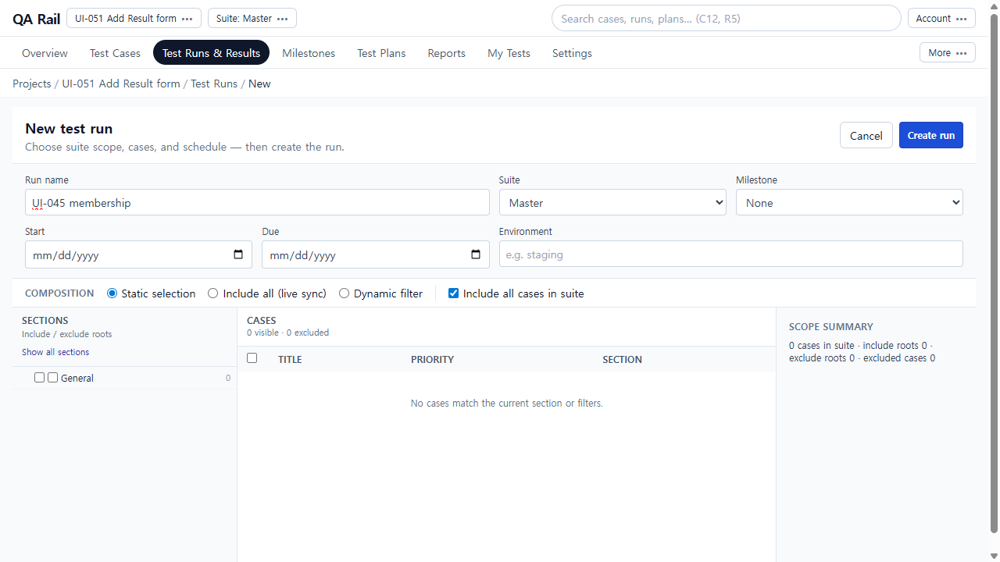
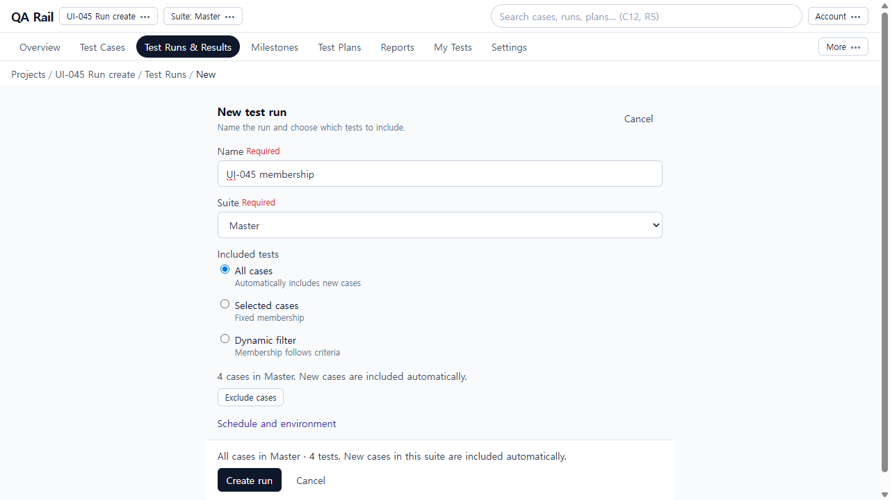
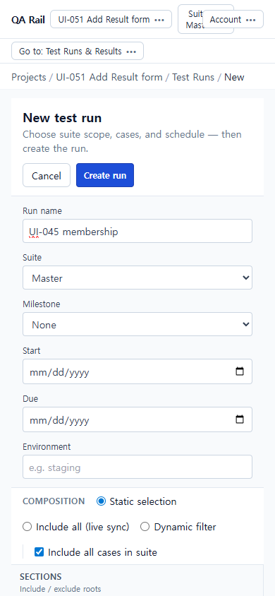
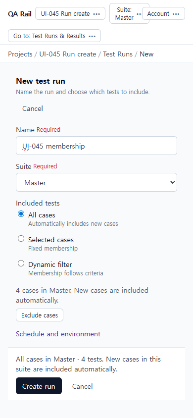

# UI-045 — Simplify Run creation around name and included tests

Completed: 2026-09-19

## Result

- Run create is one focused form: Name, Suite, then All cases / Selected cases / Dynamic filter.
- Fresh create defaults to **All cases** (`include_all_live`). That choice automatically includes new suite cases. Selected is fixed `static` + `caseIds`. Dynamic submits `filterDefinition` only.
- Internal `static` / `includeAll` are not competing radios. Schedule/environment stay behind a disclosure. Create sits under the target summary.

## Verification

- Fixture: in-memory API `localhost:4000`, Vite `http://localhost:5173`, login `admin@example.com`. First before-capture used leftover project **UI-051 Add Result form**. After store restart, live membership used project **UI-045 Run create** (`/projects/1`), suite Master, cases Add product to cart (high), Checkout returns 200 (high), Search catalog (medium).
- Before 1280×720 / 390×844: header Create run, always-visible milestone/dates/environment, radios Static selection / Include all (live sync) / Dynamic filter plus **Include all cases in suite**, always-open section tree and case table. Default was static + include-all (fixed, not live).
- After 1280×720: Name, Suite, All/Selected/Dynamic, “4 cases in Master. New cases are included automatically.”, Schedule disclosure, summary, **Create run** visible (`top=674` of 720). `overflowX` false.
- After 390×844: same membership radios and Create run visible (`top=762` of 844). `overflowX` false. Project chrome still collapses Suite/Account at this width (out of scope).
- Chooser: Selected → Select cases opened the existing tree/table with Search, **Select all current cases**, Apply/Cancel. Checking one case then Cancel restored “none yet”. Apply of two cases kept “2 selected”.
- Suite switch: clearing Master then reselecting it dropped the hidden two-case selection.
- All-cases create: POST `{ includeAll: true, compositionMode: "include_all_live" }` → run R1 instances `1,2,3`.
- Selected create: POST `{ includeAll: false, caseIds: ["1","2"], compositionMode: "static" }` → run R2 instances `1,2`.
- Dynamic create: POST `{ compositionMode: "dynamic_filter", filterDefinition: { priority: "high", state: "active" } }` → run R3 instances `1,2` (medium Search catalog omitted). Preview showed “2 matching”.
- Optional values: Schedule disclosure showed Milestone M1 / Environment / dates. First all-cases attempt used M1 + staging + inherited dates.
- Failure recovery: intercepted first POST `/runs` as 500; form kept Name/Suite/All/M1/staging and showed “Could not create run. Check the details and try Create run again.” Retry succeeded.
- Live vs fixed: added catalog case **Pay with saved card** (high, id 4). Sync all: `added: 1` → `1,2,3,4`. Sync selected: `skipped: static`, still `1,2`. Sync dynamic: `added: 1` → `1,2,4`.
- Keyboard/a11y: radios named All cases / Selected cases / Dynamic filter; Name Required; Suite Required; Exclude cases / Select cases; Create run; Cancel. Native Tab not used (Electron routes to Cursor UI).
- Tests: `npx vitest run src/features/runs/utils/runCreateMembershipModel.test.ts` (13 passed). `npx vitest run src/__tests__/services.test.ts` (8 passed). `npm.cmd run lint -w apps/web`. `npm.cmd run build -w apps/web`.

## Repair

- In-memory `getCasesForRun` used leftover run-store cases and ignored catalog/`filterDefinition`, so All/Dynamic labels were false on a polluted project. Catalog is now the source when present, and dynamic priority/state/section filters apply. Memory `syncRunComposition` implements the existing sync endpoint so live inclusion can be verified without Prisma.

## Exception

- Native Tab / Shift+Tab cycle was not used in this Electron session.
- Single-repository projects cannot add a second suite; suite-switch used Clear suite → Master instead of switching between two suites.
- Tester/design review: pending.

## Screenshot review

