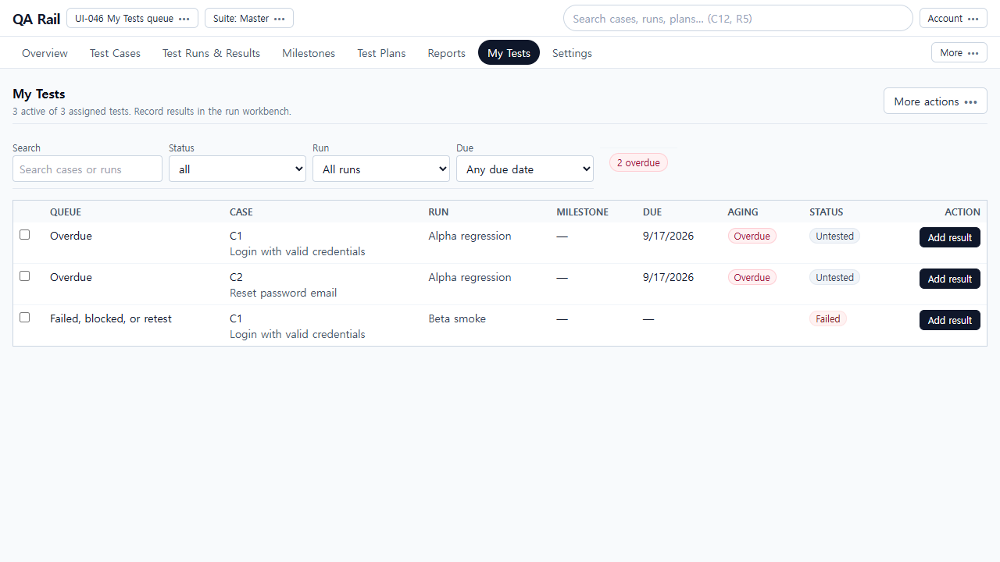
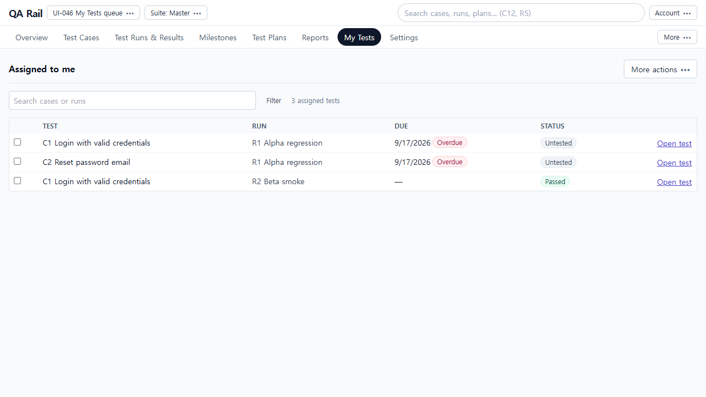
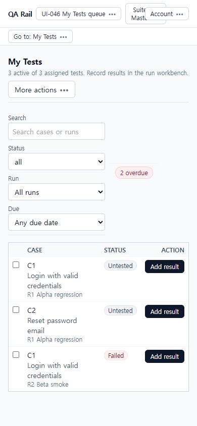
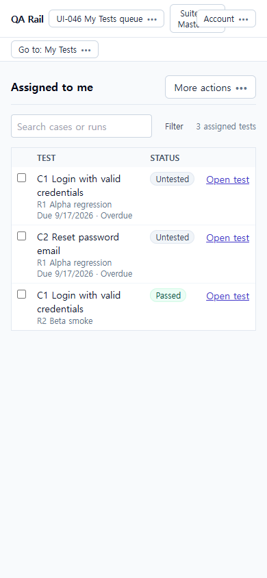

# UI-046 — Make My Tests a compact execution queue

Completed: 2026-09-19

## Result

- My Tests is an assigned-work queue titled **Assigned to me**, not a dashboard or a list of Add result buttons.
- Defaults stay unfiltered (`status=all`), so completed and blocked work remain visible until the tester changes filters. Search, a Filter disclosure, the match count, and named active-filter text sit above the rows.
- Rows show test ID/title, owning Run, status, and due/overdue context. A quiet **Open test** (or **Open selected test**) opens the exact Run reading panel. Recording uses the shared result dialog. Returning restores filters/context and the updated status.

## Verification

- Fixture: in-memory API `localhost:4000`, Vite `http://localhost:5173`, login `admin@example.com`. Project **UI-046 My Tests queue**. C1 *Login with valid credentials* assigned in **Alpha regression** (`testId=1`, overdue/untested) and **Beta smoke** (`testId=3`, failed then passed); C2 *Reset password email* in Alpha only (`testId=2`).
- Before 1280×720: title My Tests; Search/Status/Run/Due always visible; Queue/Milestone/Aging columns; **Add result** on every row; first row `top=291`.
- Before 390×844: filters stacked `height=249`; first row `top=515`; run names under titles; three **Add result** buttons `right=365`.
- After 1280×720: **Assigned to me**, Search + Filter + `3 assigned tests`, TEST/RUN/DUE/STATUS, quiet **Open test**. Same C1 distinguished as R1 Alpha vs R2 Beta. No Add result. `overflowX` false.
- After 390×844: first row `top=250` (was 515), visible; R1 Alpha / R2 Beta under titles; due/overdue on Alpha rows; **Open test** `right=365`; `scrollWidth=390`.
- Open intended C1: Filter Run = Beta smoke → `1 of 3` and `Run: Beta smoke` → Open test → `/projects/1/runs/2?testId=3` with Beta smoke, C1 instructions, latest failed. Opening did not add a result (still one failed history item).
- Record/return: shared Add result → Passed “Login succeeded after retry.” My Tests tab restored `?runId=2`, `1 of 3`, chip `Run: Beta smoke`, row **Passed**. Clear filters restored all three including the passed C1.
- Reassignment: unassigning C2 removed it (`2 assigned tests`). Status=blocked showed `0 of 2` / **No matching tests** / Clear filters. Unassigning the rest showed **No assigned tests**.
- Error: forced `assigned-to-me` 500 → **Could not load assigned tests** / Retry; Retry restored the queue.
- Selection: bar `C1 · R1 Alpha regression` / **Open selected test** opened `/projects/1/runs/1?testId=1` (not Beta).
- Keyboard/a11y: Search assigned tests; Filter assigned tests / Filter, N active (`aria-expanded`); Clear filters; Open C1 … in R1/R2; Select C1 … in R1/R2. Native Tab not used (Electron routes to Cursor UI).
- Tests: `npx vitest run src/features/runs/utils/myTestsQueue.test.ts src/features/runs/utils/myTestsHeaderMenu.test.ts src/features/runs/assignmentListFilters.test.ts` (11 passed).
- `npm.cmd run lint -w apps/web`
- `npm.cmd run build -w apps/web`

## Exception

- Native Tab / Shift+Tab cycle was not used in this Electron session.
- 1440×1000 was not captured; user default for this unit was 1280×720 and 390×844.
- Tester/design review: pending.

## Screenshot review

