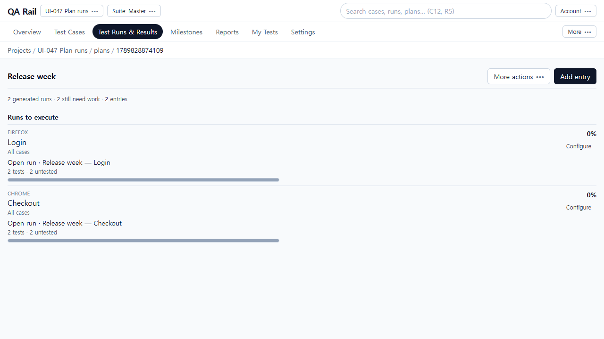
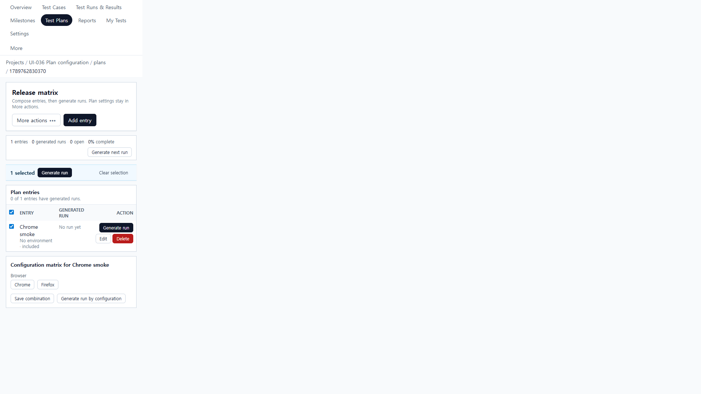
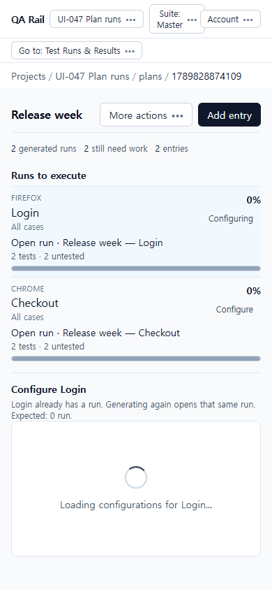
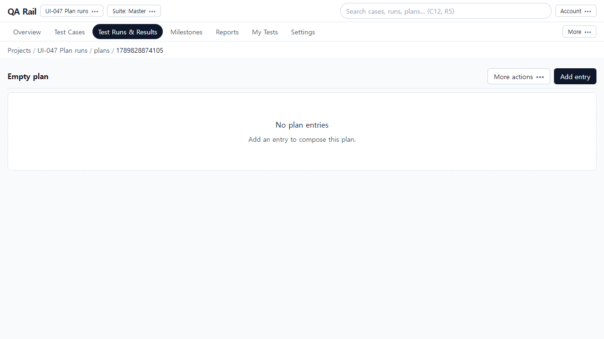
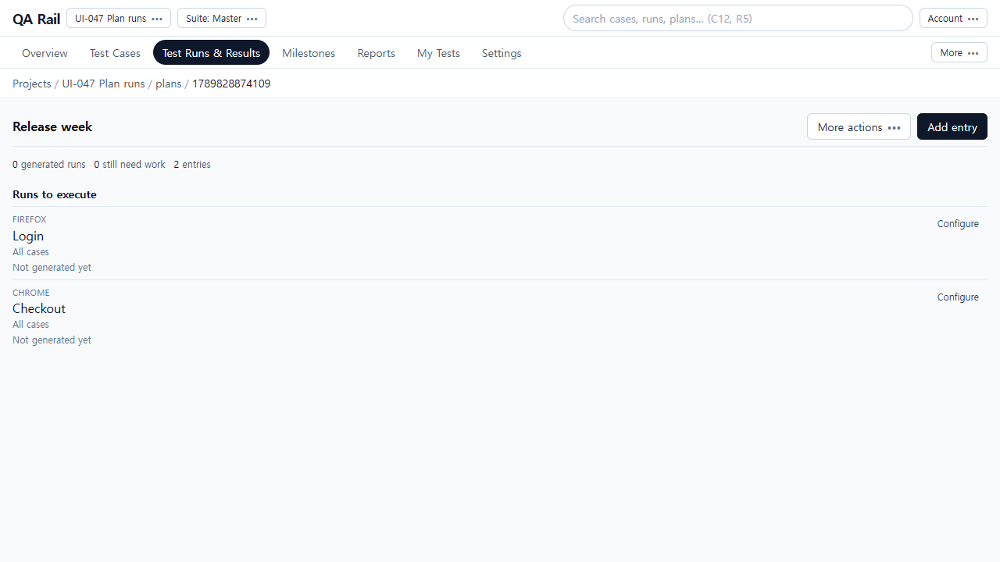
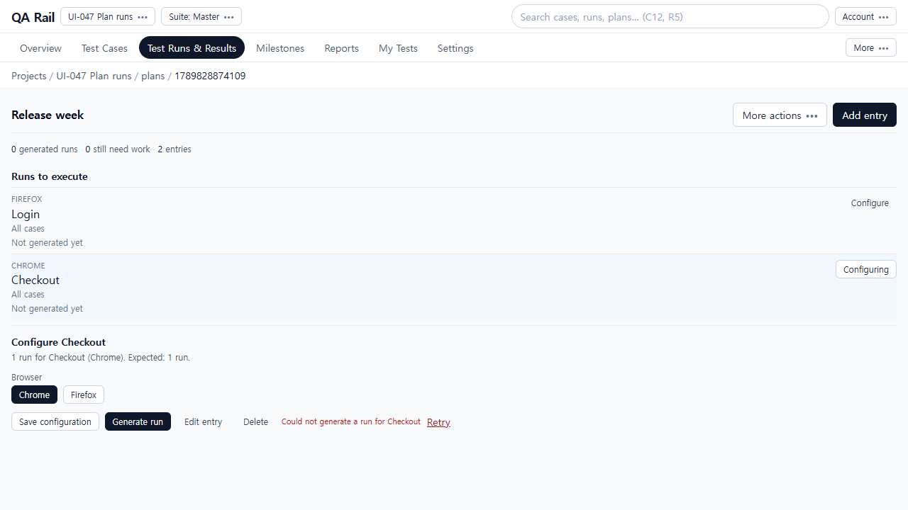

# UI-047 — Give Plan run-generation commands one clear target

Completed: 2026-09-19

## Result

- Plan detail leads with **Runs to execute**. Each entry is labeled by configuration (Chrome / Firefox), shows case scope, and either **Not generated yet** or an **Open run** link with untested count and compact progress. A tester does not need the configuration matrix to find the run.
- Competing **Generate next run**, selection-bar **Generate run**, and per-row **Generate run** controls are gone. Header **Add entry** remains. Configuration and a single **Generate run** appear only in **Configure {entry}** after selecting one entry (UI-036).
- Preview names the selected configurations and expected run count (1 if ungenerated, 0 if a run already exists). **Save configuration** saves mapping; **Generate run** creates or reopens the entry run and is never labeled Save.

## Verification

- Fixture: in-memory API `localhost:4000`, Vite `http://localhost:5173`, login `admin@example.com`. Project **UI-047 Plan runs**. Plan **Empty plan**. Plan **Release week** with entries **Checkout** (Chrome) and **Login** (Firefox), two cases, Browser/Chrome/Firefox configurations.
- Before 1280×720 / 390×844: UI-036 after captures of the same Plan hub — table of entries, **Generate next run**, selection **Generate run**, per-row **Generate run**, and **Generate run by configuration**. Live recapture of that wall was not possible after this rewrite landed.
- After empty 1280×720 and 390×844: **Add entry** only; “No plan entries”; no Generate. 390 overflow 0; Add entry `right` 374px.
- After ungenerated 1280×720: Firefox Login and Chrome Checkout both **Not generated yet**; summary `0 generated runs · 0 still need work · 2 entries`; no Generate until Configure.
- Configure Checkout: heading **Configure Checkout**, preview `1 run for Checkout (Chrome). Expected: 1 run.`, Chrome pressed, one **Generate run**. Add entry Cancel left 0 generated runs. Forced POST `/plans/:id/runs*` 500: **Could not generate a run for Checkout** + Retry; Checkout stayed ungenerated. Retry created run 1 **Release week — Checkout**. Second Generate: **Opened the existing run for Checkout**; API still one run. Configure Login preview `1 run for Login (Firefox). Expected: 1 run.`; generate created run 2 only.
- After generated 1280×720: `2 generated runs · 2 still need work · 2 entries`. Open run links **Release week — Login (Firefox)** and **Release week — Checkout (Chrome)**; both `2 tests · 2 untested`. Opened `/runs/1` heading **Release week — Checkout** / Chrome, and `/runs/2` heading **Release week — Login** / Firefox.
- After 390×844: `innerWidth` 390, overflow 0, no clipped headings/links. Configure/Open `aria-label`s; Configure Checkout focused via scripted focus. Native Tab not used (Electron).
- Tests: `npx vitest run src/features/projects/utils/planExecutionModel.test.ts src/features/projects/utils/planMatrixContext.test.ts src/features/projects/utils/planHeaderMenu.test.ts` (6 passed).
- `npm.cmd run lint -w apps/web`
- `npm.cmd run build -w apps/web`

## Exception

- Current generation APIs attach one `runId` per plan entry and allow one configuration per group. The two-entry Chrome/Firefox fixture therefore yields two real runs, not a cartesian four. Fake extra rows were not added (out of scope).
- Native Tab / Shift+Tab cycle was not used in this Electron session.
- Tester/design review: pending.

## Screenshot review

