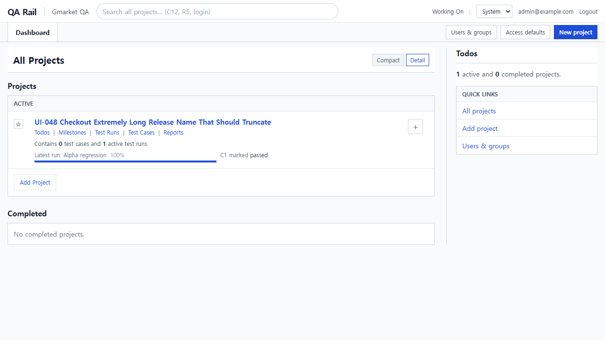
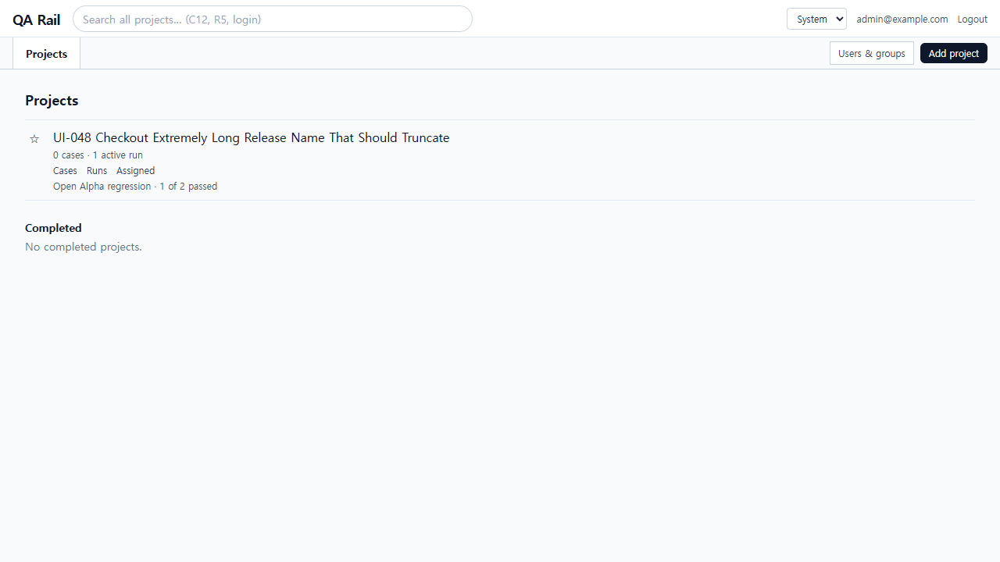
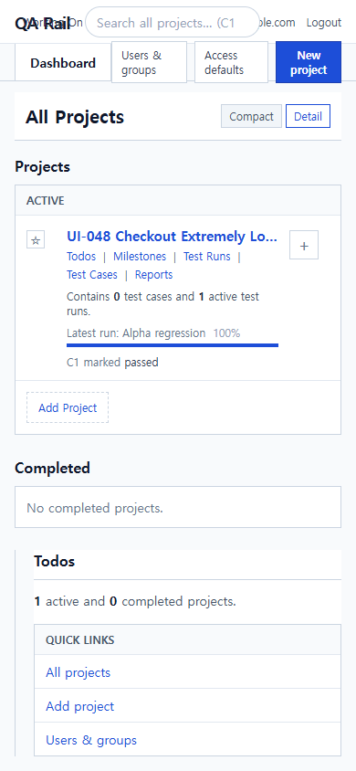
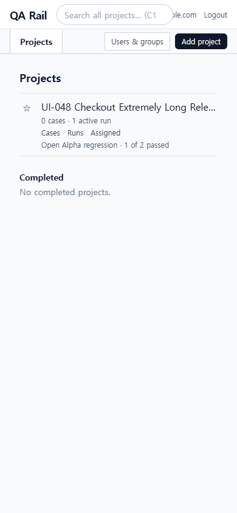
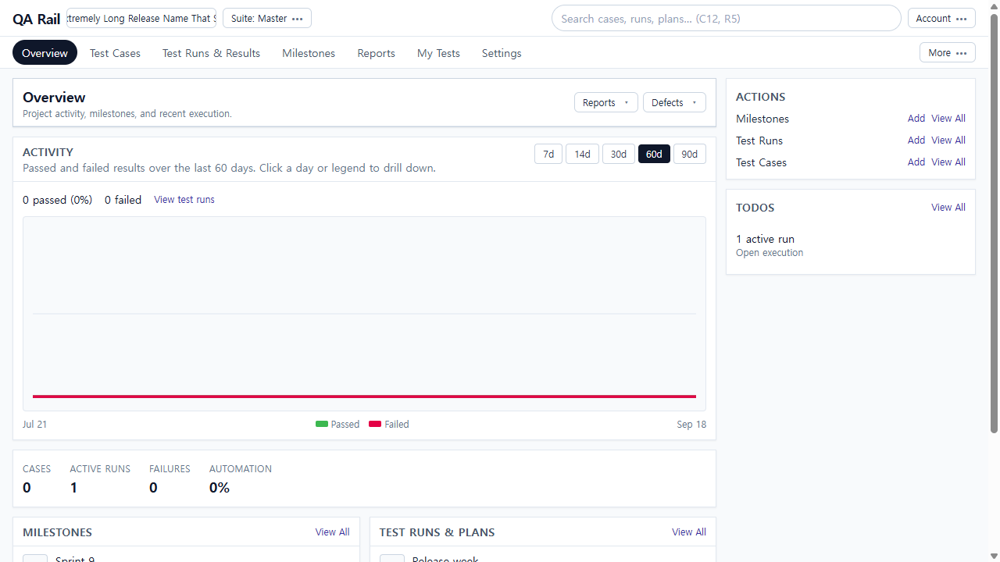
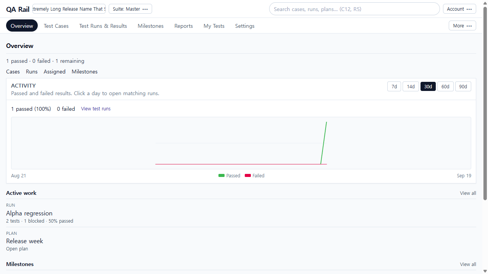

# UI-048 — Make project entry lead directly to cases and active runs

Completed: 2026-09-19

## Result

- Projects is a named list. One **Add project** in the header when projects exist; empty first-use keeps that action only in the empty state. Compact/Detail, list-footer Add Project, Quick Links Add project, and the unexplained **+** control are gone.
- Rows show quiet case/run counts, Cases / Runs / Assigned, and **Open {run} · n of m passed**. Long names truncate.
- Project overview keeps a compact activity chart, then execution remaining, Cases/Runs/Assigned/Milestones, active Run/Plan rows with status, open milestone context, and blocked/failed attention. Duplicate Actions Add/View All and KPI cards (Cases 0 / Failures 0 / Automation) are gone.

## Verification

- Fixture: in-memory API `localhost:4000`, Vite `http://localhost:5173`, login `admin@example.com`. Project **UI-048 Checkout Extremely Long Release Name That Should Truncate**. Run **Alpha regression** (C1 passed, C2 blocked). Milestone **Sprint 9**. Plan **Release week**.
- Before empty 1280/390: header **New project**, empty **New project**, Quick Links **Add project**, inert Compact/Detail.
- Before populated list 1280: Compact/Detail, Todos|Milestones|Test Runs|Test Cases|Reports, Latest run 100%, **+**, Add Project + Add project.
- Before overview 1280: Reports/Defects header, Cases 0 / Failures 0 KPI, Actions Add×3, Alpha `open / 100% / 0 failed`.
- After list 1280: one **Add project**; Open Alpha **1 of 2 passed**; Cases/Runs/Assigned; overflow 0. Opened `/runs/1` **Alpha regression** with blocked work. Cancel Add project created nothing.
- After overview 1280: `1 passed · 0 failed · 1 remaining`; Active work **Alpha regression** `2 tests · 1 blocked · 50% passed` + Plan Release week; Sprint 9; Needs attention **C2 Sign in blocked**. Cases opened `/projects/1/cases?sectionId=1`. No Add actions. overflow 0.
- After 390 list: overflow 0, long name truncated (`scrollWidth > clientWidth`), name focused, one Add project.
- After 390 overview: overflow 0, Overview heading `top=110`, no clipped headings.
- Tests: `npx vitest run src/features/projects/utils/projectListModel.test.ts src/features/projects/utils/projectOverviewModel.test.ts` (3 passed).
- `npm.cmd run lint -w apps/web`
- `npm.cmd run build -w apps/web`

## Exception

- In-memory `/overview` still reports `totalCases: 0`; list progress says **0 cases · 1 active run** even though two cases exist. Run/blocked state used run-summary and runs-overview instead.
- POST `/api/projects` allows any authenticated user; no viewer-only fixture was available. Add project is shown when signed in.
- Empty after-state was not recaptured after creating the fixture (would require deleting the only project). Empty before plus after populated placement were live.
- Native Tab not used (Electron). Tester/design review: pending.

## Screenshot review

