# UI-049 — Author executable case instructions in a template-specific form

Completed: 2026-09-19

## Result

- Full Add/Edit is template-specific: **Title** first, compact **Section / Template / Type / Priority**, then the instruction body. Template description cards are gone.
- **Text:** Preconditions → prose Steps → Expected result. Prose Steps persist as one `CaseStep` action; common Expected stays on `expectedResult`.
- **Steps:** Preconditions → ordered Action/Expected with quiet Add step / Up / Down / Remove → common Expected, then References. Changing Template with entered instructions opens **Change template?** and keeps compatible draft values.
- Create and Edit persist into the existing UI-044 case read view and UI-039 Run instruction body.

## Verification

- Fixture: in-memory API `localhost:4000`, Vite `http://localhost:5173`, login `admin@example.com`. Project **UI-049 Case authoring** (`/projects/1`), suite Master, section **Authentication / Login**.
- Before 1440×1000 / 390×844 Text: Template card first, Title, Preconditions, Expected, References — no Steps field, no Type/Priority. Before 1280 Steps: Template card first, Title after Template, Action/Expected, no Type/Priority, no common Expected.
- After Text form 1280/1440/390: Title, Section Login, Template/Type/Priority, Preconditions, Steps, Expected result, References, sticky Cancel/Create.
- C1 Text create: title “Invoice PDF is attached to the confirmation mail”; preconditions “A billed order exists for a trial account”; steps “Open the confirmation mail and choose Download invoice”; expected “invoice-12.pdf opens with the billed total on page 1”; Type Functional, Priority High. Case read and Run `testId=1` showed the same three distinct blocks.
- C1 Edit saved expected “…page 1 (edited)” and the case read view showed the edited Expected result.
- C2 Steps create: three Action/Expected pairs after reorder (email → password → submit), common Expected “The session cookie is set”. Case read and Run `testId=2` showed numbered ACTION/EXPECTED plus EXPECTED RESULT.
- Empty Create: `aria-invalid` on `#case-title`, alert **Title is required.**
- Dirty Text → Steps: dialog **Change template?** / “The prose Steps become the first Action…”. Keep current template left Text selected. Cancel opened **Discard unsaved case?**
- 390×844: `innerWidth` 390, `overflowX` false, stacked Template/Type/Priority, Action/Expected visible. 1440×1000: compact row plus Expected before References.
- Keyboard/a11y names: Title, Template, Type, Priority, Preconditions, Steps, Add step, Action, Expected, Expected result, References, Cancel, Create; reorder buttons `Move step N up/down`, `Remove step N`. Native Tab/Enter was not used (`browser_press_key` routes to the Cursor UI).
- Tests: `npx.cmd vitest run src/features/cases/utils/caseAuthoringInstructions.test.ts src/features/cases/utils/caseAuthoringDraft.test.ts src/features/runs/utils/runCaseInstructionModel.test.ts` (10 passed). `npm.cmd run lint -w apps/web`. `npm.cmd run build -w apps/web`.

## Exception

- Native Tab / Shift+Tab / Enter cycle was not used in this Electron session.
- File attachment upload was not re-exercised; the existing References field remained on the form.
- The Run C2 panel screenshot crops below the first Action; all three steps plus common Expected were confirmed in the live DOM and in the case read capture.
- Tester review: pending.

## Screenshot review

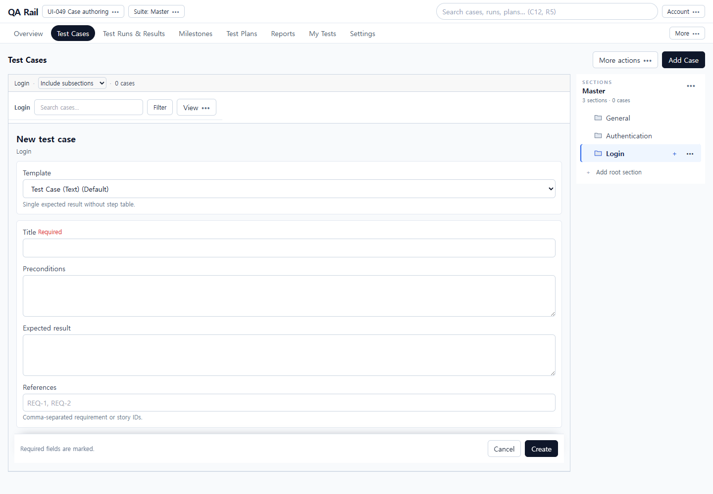

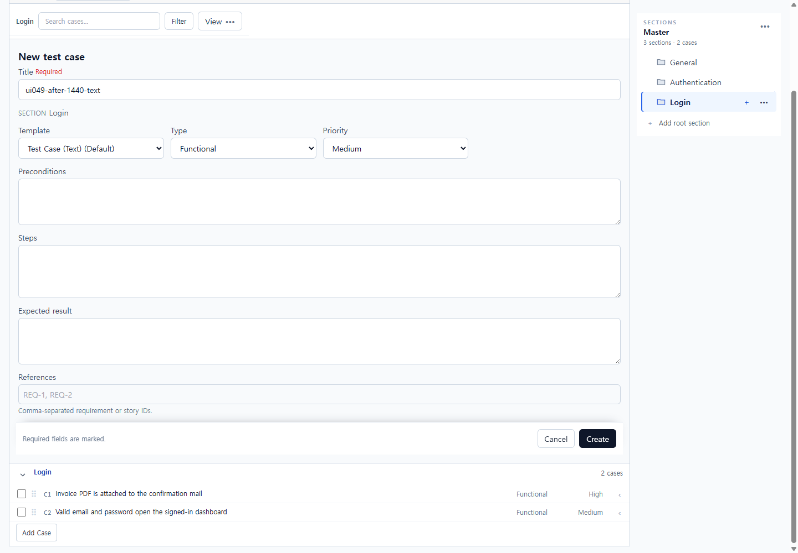

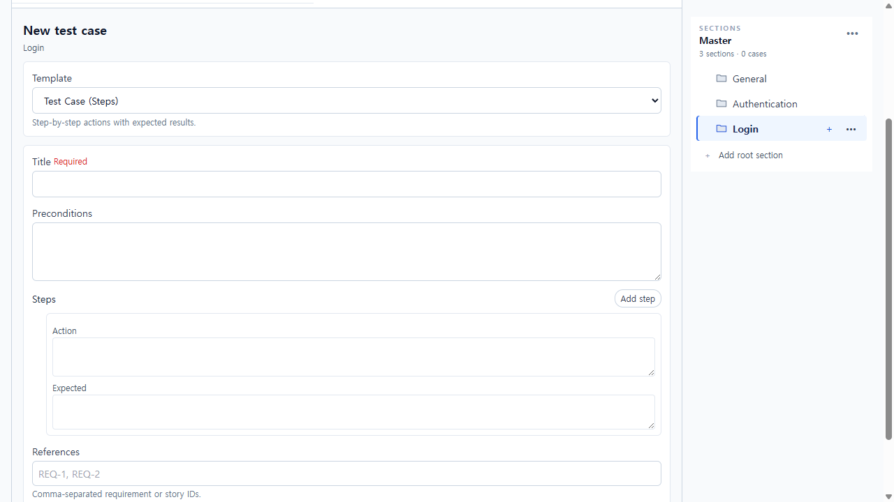

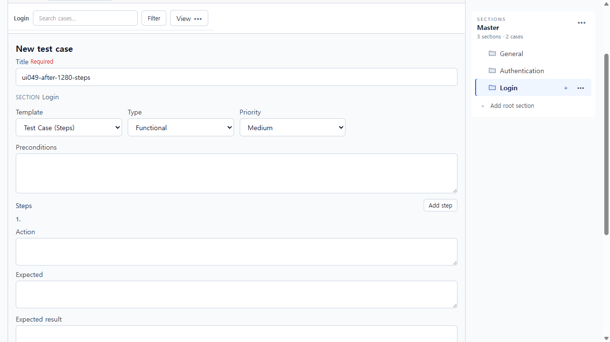

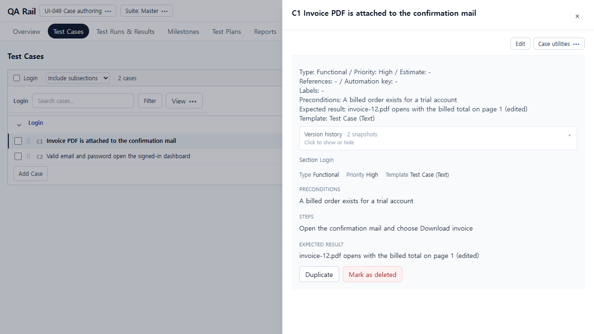

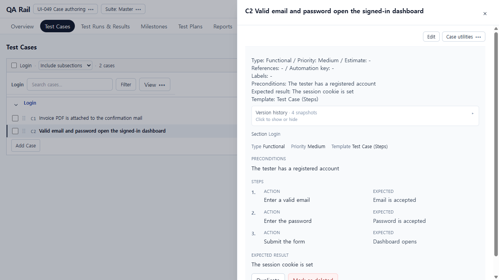

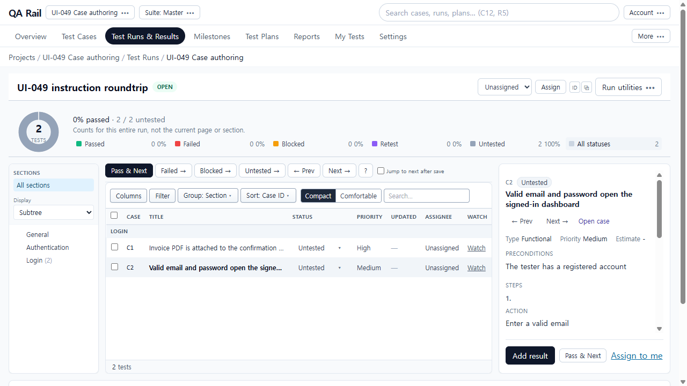

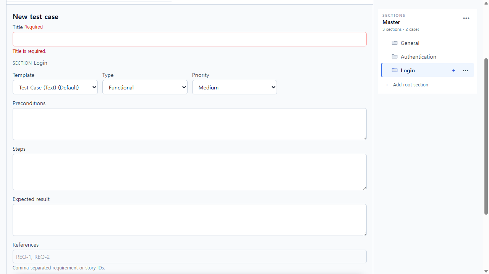

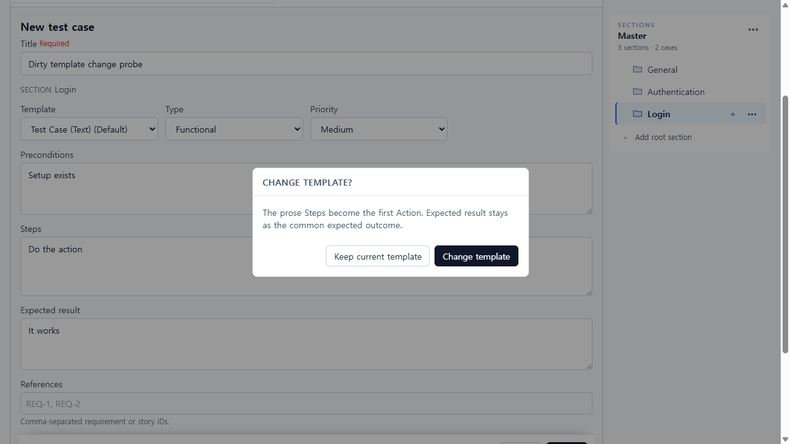

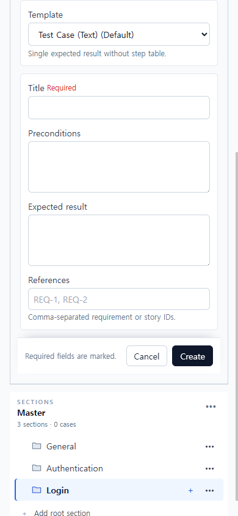

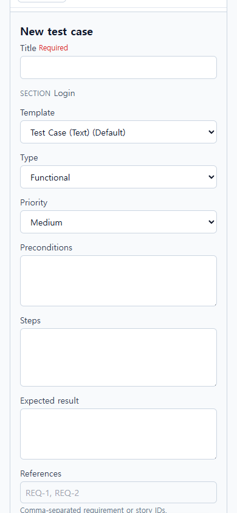

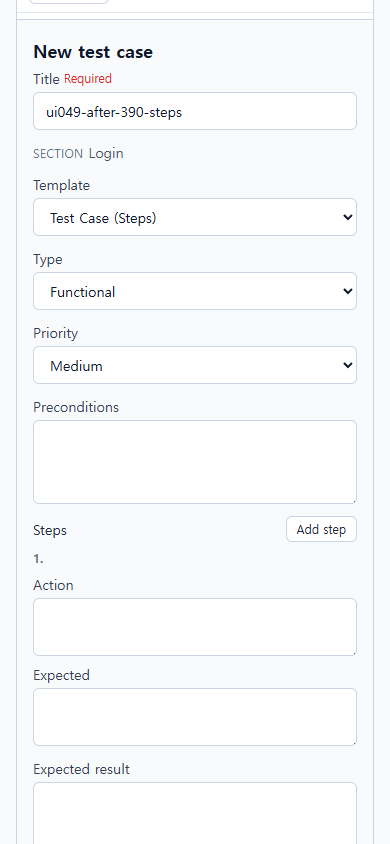
