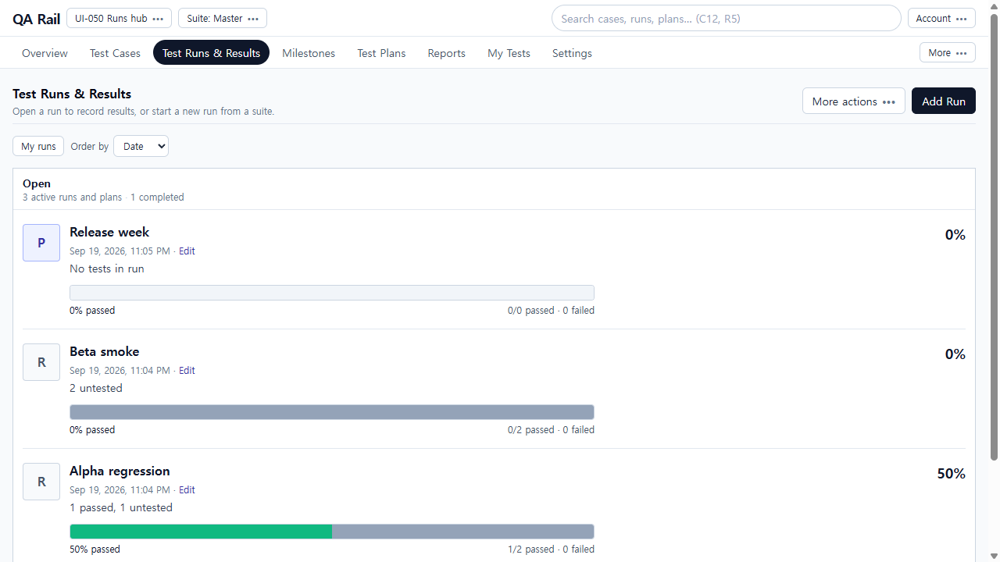
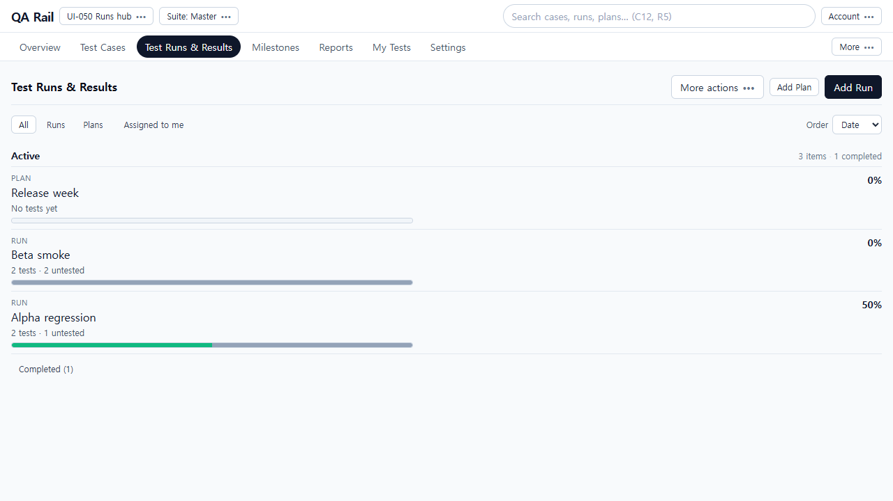
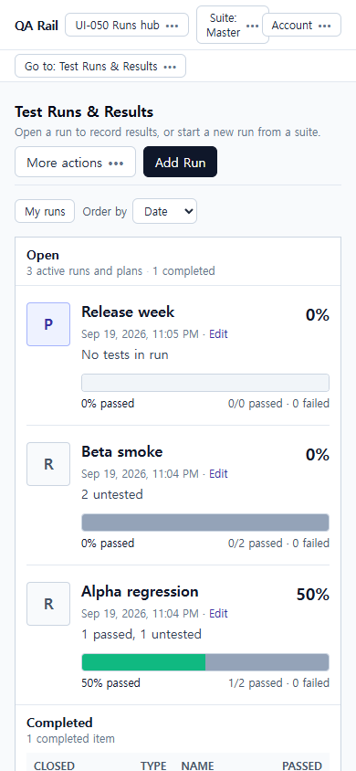
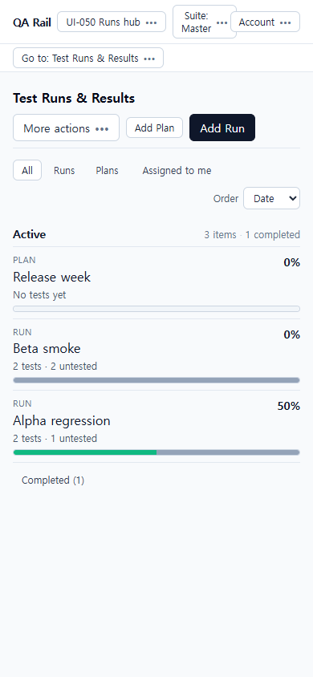

# UI-050 — Make the existing Runs & Results hub the execution landing page

Completed: 2026-09-19

## Result

- One execution-area entry: primary nav **Test Runs & Results**. Plans is a scoped All/Runs/Plans control plus a More **Test Plans** entry, not a competing top-level tab. `/runs` and `/plans` URLs stay; Run and Plan detail mark the same tab current (`aria-current="page"`).
- Active work is the default reading area. Completed work is a collapsed **Completed (n)** disclosure. Rows say **Run** or **Plan**, name, remaining work from existing overview totals, and compact progress. Names open the actual Run or Plan. A Plan row has no result action.
- **Add Run** is the primary create action; **Add Plan** is a named secondary action. Reports/compare/export stay in More actions (**Compare runs**, **Manage plans**, Reports). Assigned to me and active filter text sit near the list. Returning to the hub restores URL/session filters.

## Verification

- Fixture: in-memory API `localhost:4000`, Vite `http://localhost:5173`, login `admin@example.com`. Project **UI-050 Runs hub**. Cases C1 Login / C2 Reset. Open: **Alpha regression** (2 tests · 1 untested · 50%), **Beta smoke** (2 tests · 2 untested · 0%), **Plan Release week** (Checkout · Chrome named configuration, no generated tests). Completed: **Nightly completed** (100%).
- Before 1280×720: competing **Test Plans** tab; Add Run only; My runs; Open card with P/R tiles; Plan copy “No tests in run”; completed table below the fold.
- After 1280×720: Test Runs current, no Test Plans tab; Add Plan + Add Run; All/Runs/Plans; Active list; Completed (1) collapsed. Beta still needs both tests; Alpha still needs one.
- After 390×844: `innerWidth` 390, `overflowX` 0, first row `top=308`. **Go to: Test Runs & Results**. Add Plan + Add Run wrap. Same identities/progress.
- Open targets: Alpha `/runs/1` 2 TESTS · 50% passed · 1/2 untested; Beta `/runs/2` 0% · 2/2 untested; Plan `/plans/1789826649866` heading Release week, Checkout · Chrome, no Add result; Nightly `/runs/3` CLOSED 100%. Tab stayed Test Runs on each.
- Return with filters: `?scope=runs` hid the Plan; after Beta, history back restored `scope=runs` and filter text **Runs**. Navigating to `/runs` restored stored `highlightRunId`/`completed`.
- Add Run opened **Choose test suite** (Master). Escape closed it and returned focus to Add Run. Add Plan went to `/plans?new=1`, opened Name/Cancel/Add plan, then stripped `new`. Direct `/plans` kept Test Runs current at 1280 (`aria-current=page`) and 390 (`Go to: Test Runs & Results`).
- More actions: Compare runs, Manage plans, Reports. No Add test plan on rows.
- Keyboard/a11y: Show runs or plans; Assigned to me; Add Run; Add Plan; Completed (n) `aria-expanded`; row names. Native Tab not used (Electron routes to Cursor UI).
- Tests: `npx vitest run src/features/runs/utils/runListHubModel.test.ts src/features/runs/utils/runListHeaderMenu.test.ts src/shared/ui/projectNavTabs.test.ts src/features/projects/utils/listViewDeepLink.test.ts` (14 passed).
- `npm.cmd run lint -w apps/web`
- `npm.cmd run build -w apps/web`

## Exception

- Overview DTO has no milestone/assignee/configuration fields; rows used present totals only. Named Chrome configuration was confirmed on Plan detail (UI-047 owns that page).
- Forced `runs-overview` 500 did not stay on screen (a later request or cached data succeeded). ErrorState/Retry is implemented; live fail/retry was not proven this run.
- Native Tab / Shift+Tab cycle was not used in this Electron session.
- 1440×1000 was not captured; this unit used 1280×720 and 390×844.
- Tester/design review: pending.

## Screenshot review

