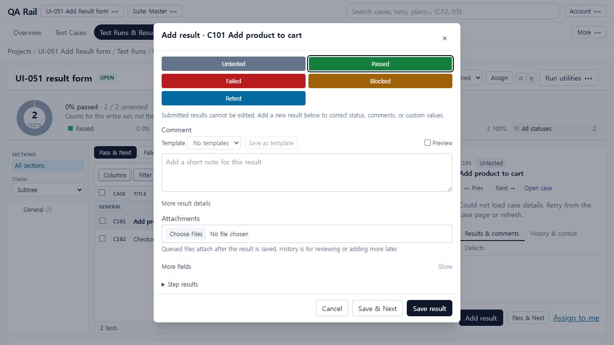
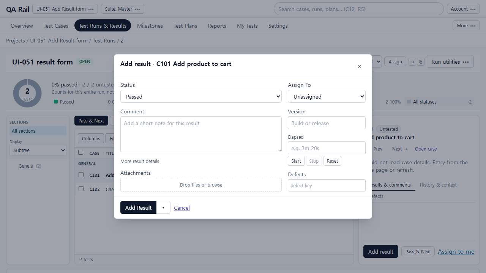
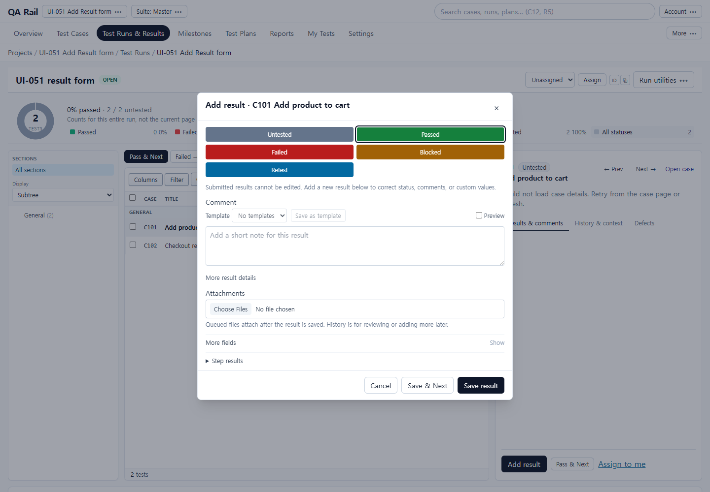
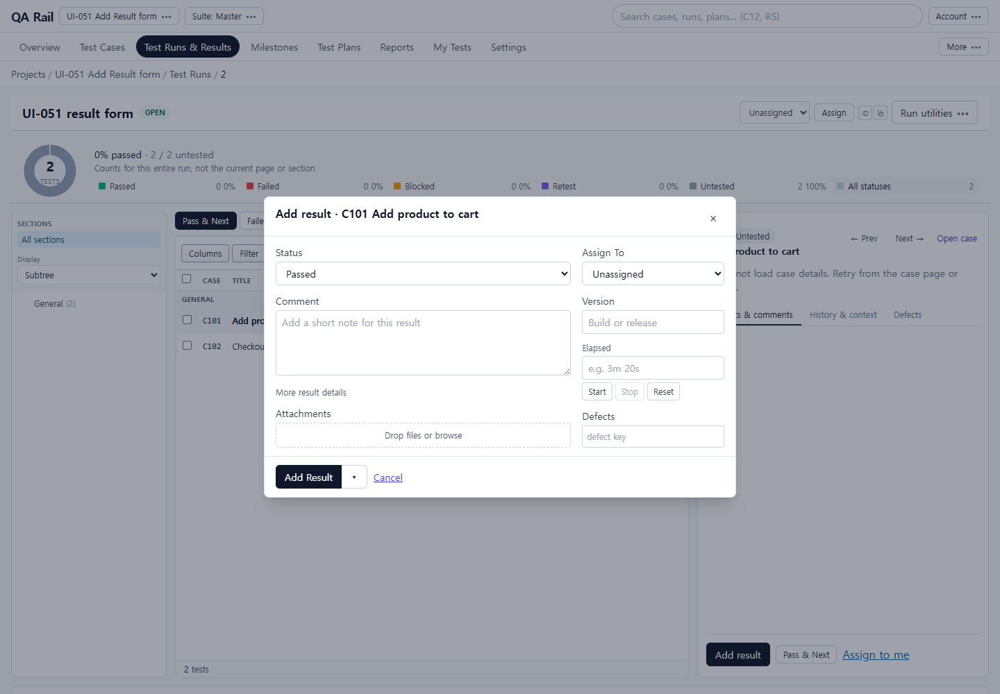
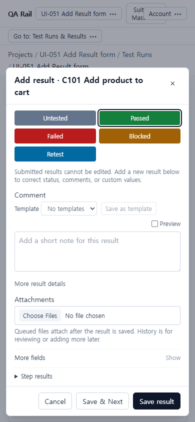
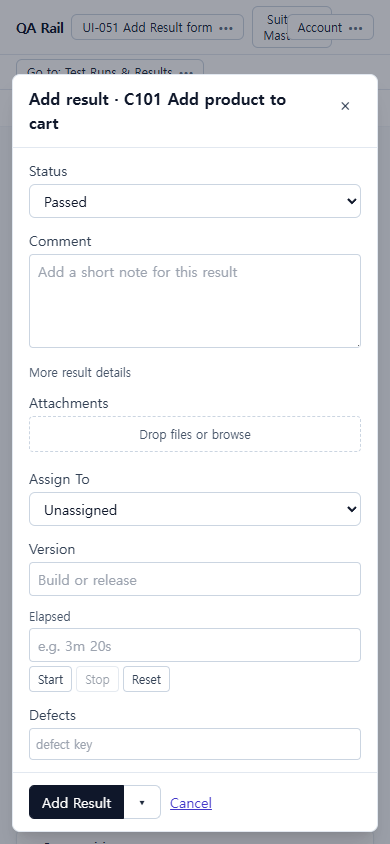
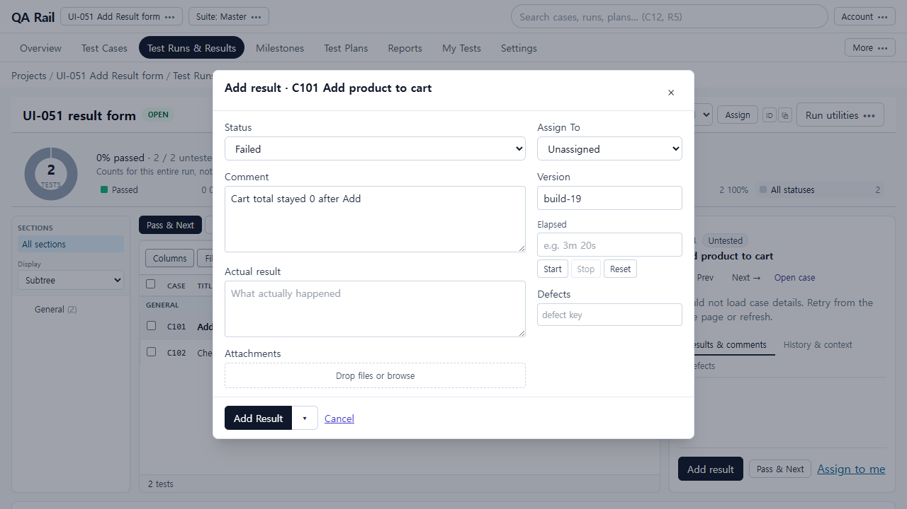
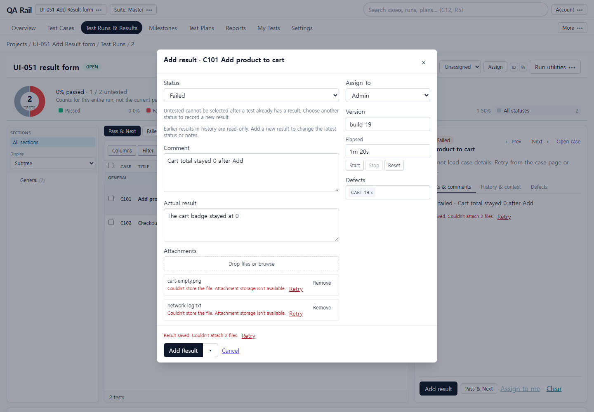
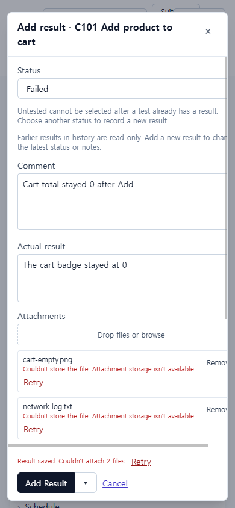
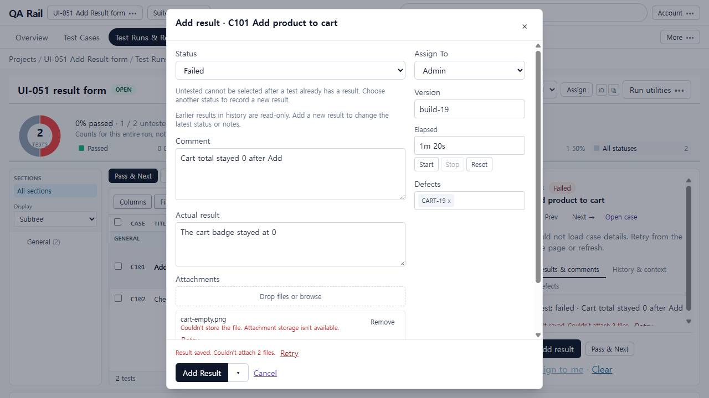

# UI-051 — Match the supplied TestRail Add Result form

Completed: 2026-09-19

## Result

- Shared Add Result dialog is a ~680px two-column form: left Status dropdown, Comment, compact drop/browse attachments; right Assign To, Version, Elapsed, Defects.
- Footer is **Add Result** plus text **Cancel**. **Save & Next** lives in the primary button’s small split menu (`More save actions`), not a third large button.
- Assign To is a draft until submit. Cancel writes nothing. Result is created first; assignment runs after; attachment/assignment failures keep the result ID and retry without a duplicate.

## Verification

- Fixture: in-memory API `localhost:4000`, Vite `http://localhost:5173`, login `admin@example.com`. Project **UI-051 Add Result form** (`/projects/1`), run R2 **UI-051 result form** (`/projects/1/runs/2?testId=1`), C101 Add product to cart / C102 Checkout returns 200.
- Before (panel, same dialog as list): 1440×1000 / 1280×720 / 390×844 showed status tiles, Template/Preview, Choose Files, More fields, three footer buttons (Cancel / Save & Next / Save result). No Assign To / Version / Elapsed / Defects on the default surface.
- After panel 1280×720: dialog 680×434, Status `<select aria-label="Status">` focused (`#result-status`), Comment, Drop files or browse, Assign To (Unassigned / Admin), Version, Elapsed, Defects, Add Result + split + Cancel. No tiles. `overflowX` false. Dialog body did not scroll; the Run page behind the overlay remains taller than 720.
- After panel 1440×1000: same 680px two-column composition.
- After panel 390×844: one column, dialog 366px with 12px inset, `overflowX` false, all default fields and footer visible.
- List Status for C101 → Failed opened the same form with Status prefilled Failed and Actual result disclosed. After 1280 list capture is the empty Failed form; 1440/390 list captures are the same form after submit recovery.
- Cancel: comment + Assign To Admin, then Cancel → “Discard this draft? The test is unchanged.” Discard left C101 untested/unassigned (still 2/2 untested).
- Save from list Failed: comment “Cart total stayed 0 after Add”, actual “The cart badge stayed at 0”, version `build-19`, elapsed `1m 20s`, defect `CART-19`, Assign To Admin, two staged files. API read-back: one result `id=1` status `failed`, same comment/elapsed/version/defects; instance `assignedTo=1`. Run counts Failed 1 / Untested 1. Assignee row showed User 1.
- Two attachments: `cart-empty.png` and `network-log.txt` staged live. Persist failed with “Couldn't store the file. Attachment storage isn't available.” Dialog stayed open with Retry; result was not duplicated (`total=1`).
- Keyboard/a11y: Status combobox received initial focus; names Status, Comment, Attachments, Drop files or browse, Assign To, Version, Elapsed, Defects, Add Result, More save actions, Save & Next, Cancel. Native Tab not used (Electron routes to Cursor UI).
- Tests: `npx vitest run src/features/runs/utils/resultEntryDialogModel.test.ts src/features/runs/utils/resultSaveLifecycle.test.ts src/features/runs/utils/runListStatusEntry.test.ts src/features/runs/utils/resultSaveFeedback.test.ts` (37 passed). `npm.cmd run lint -w apps/web`. `npm.cmd run build -w apps/web`.

## Exception

- Native Tab / Shift+Tab cycle was not used in this Electron session.
- Real object-storage for the two staged files is unavailable in this in-memory environment; recovery Retry was shown live. Result + assignment + defect/metadata persisted.
- Case details for C101 still show “Could not load case details” (out of scope).
- Tester/design review: pending.

## Screenshot review

