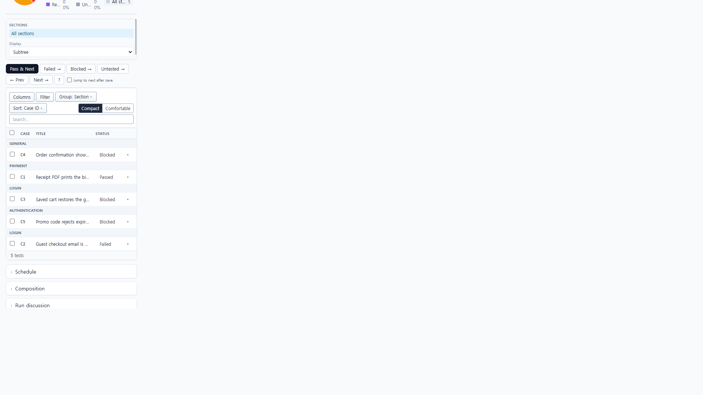
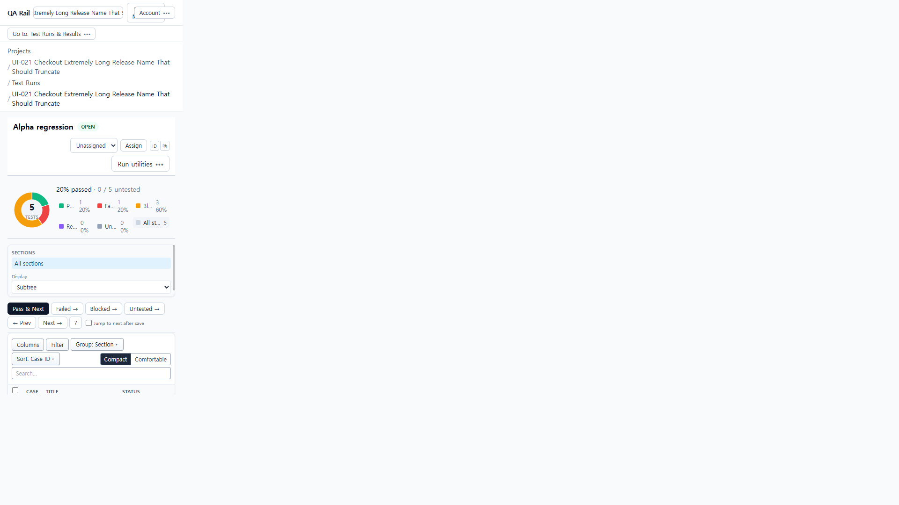
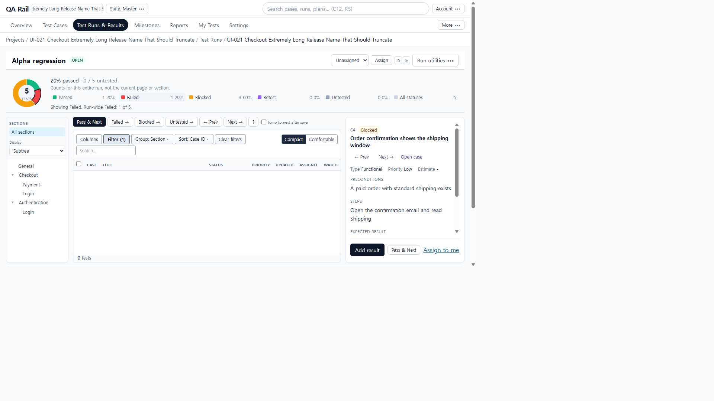

# UI-052 — 모바일 Run 목록 복귀와 선택 복원 충돌 수정

Completed: 2026-09-20

## Result

- 390px에서 `testId` 없는 Run URL은 목록을 유지한다. 첫 테스트를 URL에 자동 삽입하지 않는다.
- **Back to tests**는 명시적 목록 복귀로 처리한다. 대기/재렌더 후에도 이전 상세로 튕기지 않는다.
- 명시적 `?testId=` 딥링크와 행 클릭은 해당 지침을 연다. 데스크톱(≥1024px)은 기존처럼 첫 가시 테스트를 시드한다.

## Reproduction (before)

- Fixture: in-memory API `localhost:4000`, Vite `http://localhost:5173`, login `admin@example.com`. Project 1, run **R1 Alpha regression** (`/projects/1/runs/1`), 5 tests.
- 390×844에서 `/projects/1/runs/1` 진입 → URL이 `?testId=4`(C4)로 자동 변경, `data-run-pane=open`, 목록 행 높이 0.
- Back to tests 직후 짧게 목록이 보였다가 ~1–2초 내 다시 `?testId=4`로 복귀.
- 원인: `resolveSelectedRunTest`가 `testId` 없을 때 첫 행을 시드하고, `clearSelectedTest`의 pending clear가 stale URL보다 약해 재삽입됨.

## Change

- `runSelectedTestState.ts`: `seedWhenMissing: false`로 빈 선택 허용; `CLEAR_SELECTED_TEST_PENDING`으로 Back to tests 레이스 차단.
- `RunDetailPage.tsx`: Tailwind `lg` `(min-width: 1024px)`로 split 여부 구독. 스택 모바일만 시드 비활성. clear 시 pending sentinel 기록.

## Verification

- Before 390×844 auto-open: `innerWidth` 390, `href` `.../runs/1?testId=4`, pane open, first list row height 0.
- After 390 no-`testId` load + refresh: `href` without `testId`, pane closed, 5× `Select C*` checkboxes (13×13), row height 37, `overflowX` false / `scrollWidth` 390.
- After Back to tests from C4 and C1: waited ≥2s, URL stayed without `testId`, list remained, no bounce.
- Explicit `?testId=4` opens C4 instructions; row click on C1 opens `?testId=1`.
- Browser Back from `?testId=2` → list; Forward → C2 detail again.
- Desktop 1280×720 / 1440×1000: `/runs/1` still seeds first visible (`?testId=4`), list + detail both visible; Failed filter reseeds to C2.
- Focus/a11y: **Back to tests** button focusable by name; list **Select C4** focuses as `INPUT` with that name.
- Tests: `npx vitest run src/features/runs/utils/runSelectedTestState.test.ts` — 10 passed.
- `npm.cmd run lint -w apps/web` (tsc `--noEmit`) — passed.
- `npm.cmd run build -w apps/web` — passed.

## Exception

- Native Tab / Shift+Tab cycle was not used in this Electron session (DOM focus + named controls only). Full keyboard traversal remains E02/UI-062.
- 1440 capture file was not saved as a separate PNG; live CDP at 1440×1000 confirmed seed + list/detail. Controlling before/after PNGs are 390 and 1280.

## Linked UI-021 issue

- J08 / proposed repair #9 (**390 Run list after Back to tests**): **수정됨 · 통합 재검증 대기** → [UI-052.md](./UI-052.md).

## Screenshot review

