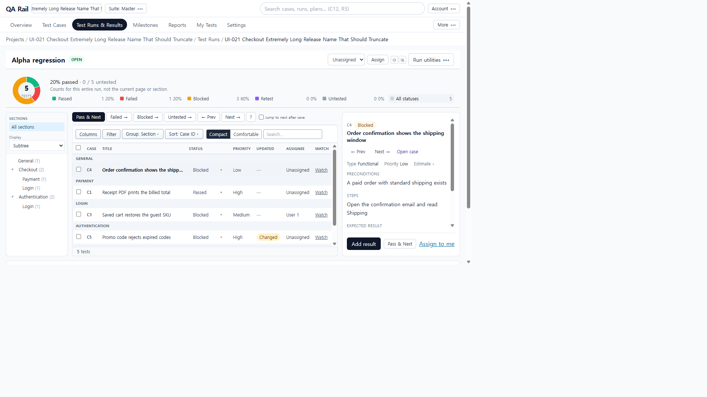
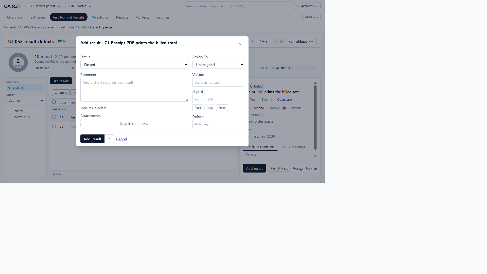
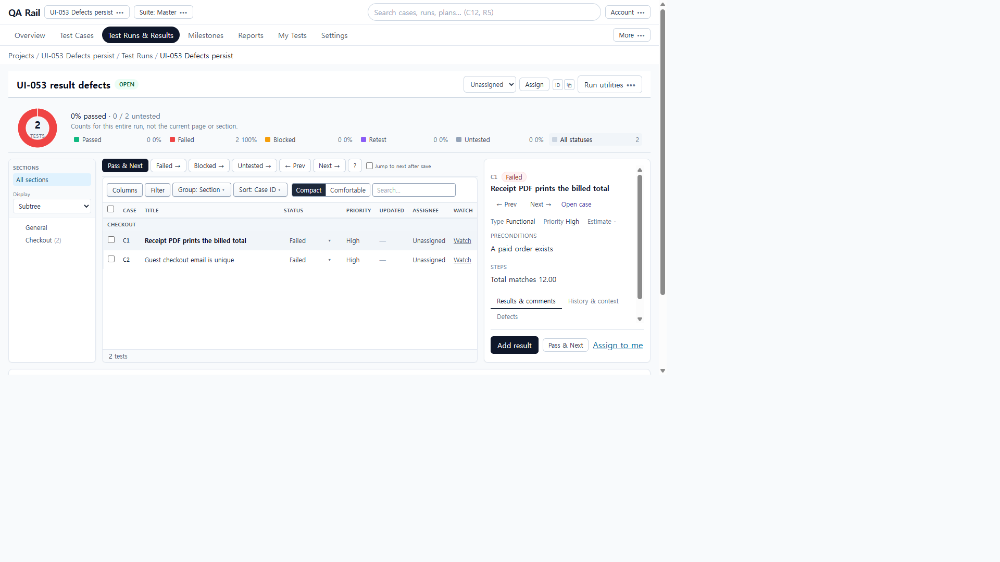
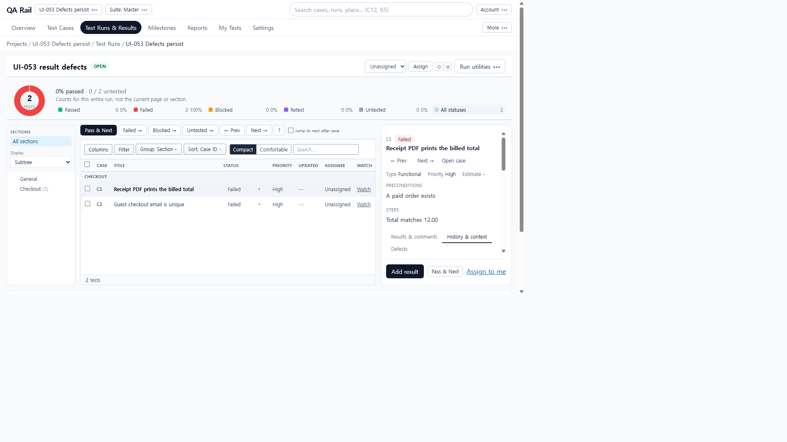
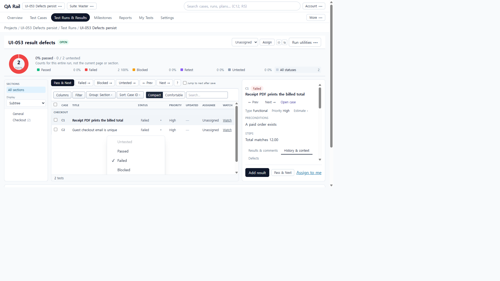
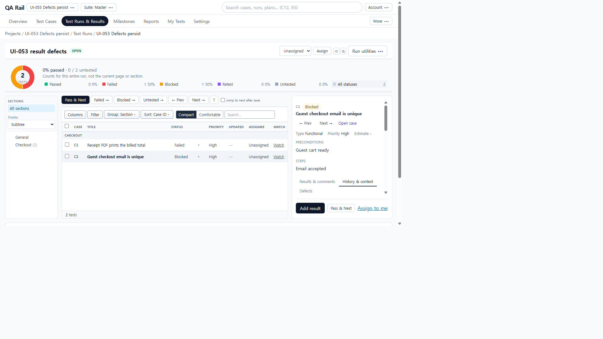
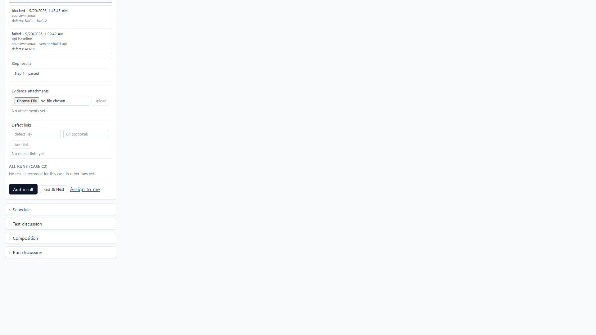

# UI-053 — 결과 Defects 저장/재조회

Completed: 2026-09-20

## Result

- Enter/blur 없이 입력한 결함 키도 Save 시 payload에 포함된다.
- 패널·목록 진입점 모두 단일/복수 키가 결과 API·History에 동일하게 남는다.
- Cancel/Discard는 쓰지 않고, 칩 제거 후 저장하면 제거된 키가 빠진다.
- 저장 실패 시 초안(칩)과 Retry가 유지된다.

## Reproduction (before)

- Fixture: in-memory API `localhost:4000`, Vite `http://localhost:5173`, `admin@example.com` / `password`. Project **UI-053 Defects persist**, run R1, tests C1/C2.
- Panel/list Add result: Defects에 `CART-21` 입력 후 Enter 없이 Add Result.
- Observed: POST body `defects: []` while comment/version persisted; `GET /api/tests/*/results` empty defects.
- API baseline with `defects:["API-99"]` persisted → server OK; client draft not flushed before submit (blur + setState race).

## Change

- `resultEntryUtils.ts`: `mergeDefectKeys(committed, draftInput)`.
- `DefectKeyInput.tsx`: `forwardRef` + `flush()` commits typed text and returns merged keys; `onDraftChange` for dirty tracking.
- `ResultEntryPanel.tsx`: both Defects fields share `defectKeysRef`; submit uses `flush()` for payload; dirty includes draft.

## Verification

- Before: typed CART-21 without Enter → empty defects (screenshots `ui-053-before-1280x720-*.png`).
- After panel C1: `CART-21` in POST and `GET /api/tests/1/results`; History shows `defects: CART-21`.
- After list C2 Blocked: typed `BUG-1, BUG-2` without Enter → POST `["BUG-1","BUG-2"]`; History `defects: BUG-1, BUG-2`.
- Cancel: typed `CANCEL-99` → Discard draft; result total stayed 2; no CANCEL-99.
- Remove: chip `RM-1` removed, typed `KEEP-9` without Enter → saved `["KEEP-9"]` only (id=5).
- Save failure: blocked `*/api/runs/*/results*` → “Failed to fetch”, **Retry**, chip **Remove RETRY-1** retained. Unblock + Retry then hit wiped in-memory fixture (`test 2 not found`); no duplicate RETRY result created while blocked. Attachment retry not exercised (E01).
- Invalid/blank: existing `splitDefectKeys` drops whitespace-only; no silent invented keys. No separate format-error UI beyond that contract.
- 390×844: History KEEP-9 / dialog visible; `innerWidth` 390, `overflowX` false / `scrollWidth` 390.
- Focus/a11y: Defects textbox named **Defects**; Remove chips named `Remove {KEY}`; Retry/Add Result/Cancel named.
- Tests: `npx vitest run src/features/runs/components/resultEntryUtils.test.ts` — 2 passed.
- `npm.cmd run lint -w apps/web` — passed.
- `npm.cmd run build -w apps/web` — passed (chunk size warning only). Note: shared rebuild later wiped in-memory API fixture during retry follow-up.

## Exception

- Native Tab cycle not used (E02/UI-062). DOM focus + accessible names only.
- Attachment re-upload after saved result not live-tested (E01 storage).
- Post-unblock Retry against wiped fixture not a product defect; primary flush path already proven.

## Linked UI-021 issue

- J05 / proposed repair #8 (**Result Defects persist**): **수정됨 · 통합 재검증 대기** → [UI-053.md](./UI-053.md).

## Screenshot review

