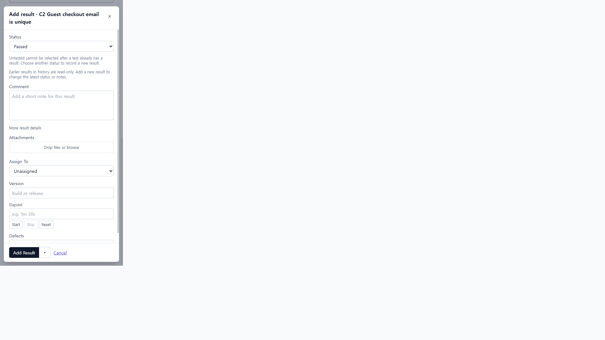
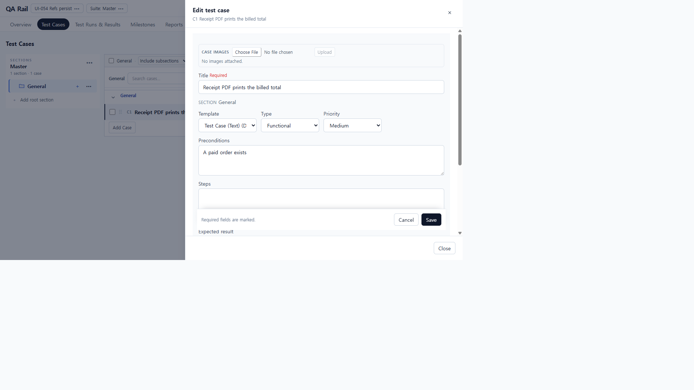
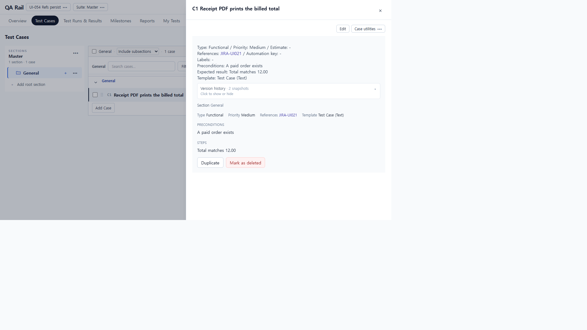
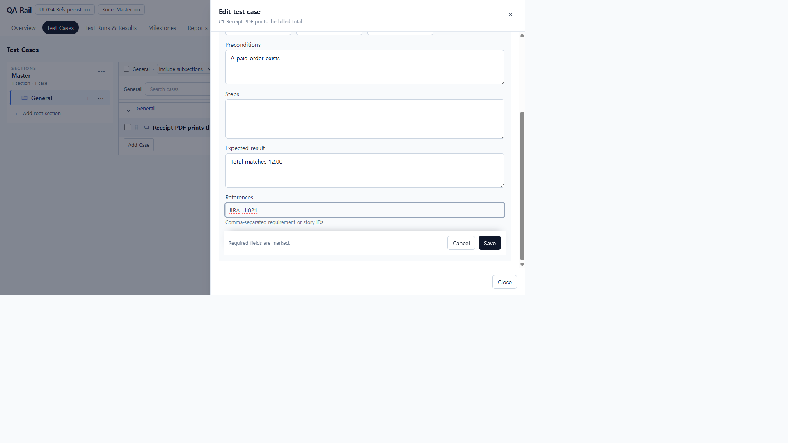
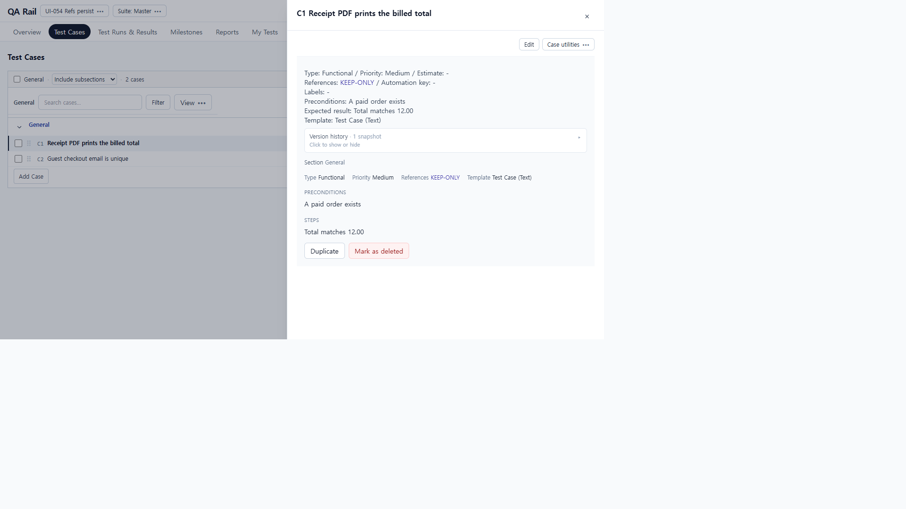
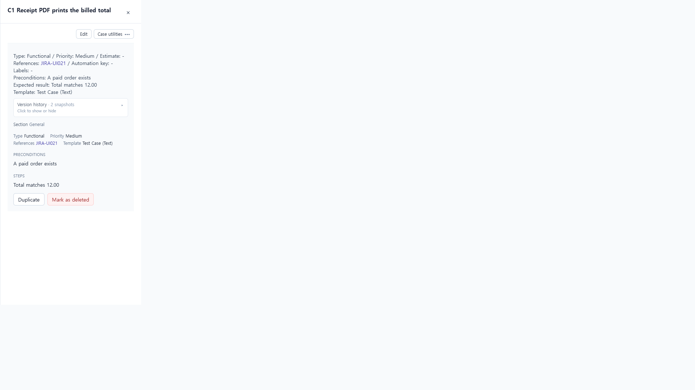
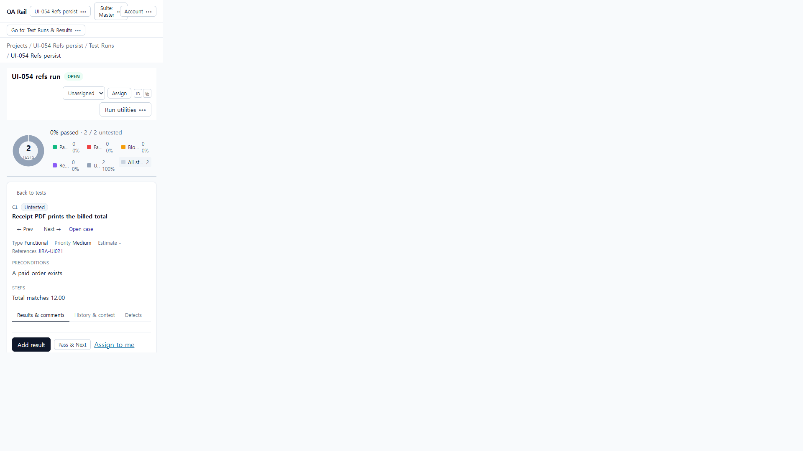

# UI-054 — 케이스 References 저장/재조회

Completed: 2026-09-20

## Result

- Enter/blur 없이 입력한 References 초안도 Save 시 payload에 포함된다.
- Text(C1)·Steps(C2) 편집에서 단건/복수 추가·칩 제거·미확정 초안 병합이 재열기·`GET /api/cases/:id`·Run 읽기에서 동일하게 유지된다.
- Cancel/Discard는 쓰지 않은 값을 저장하지 않는다.
- 256자 초과 토큰은 서버에서 거절되며 조용한 `refs: null` 저장은 없다.

## Reproduction (before)

- Fixture: in-memory API `localhost:4000`, Vite `http://localhost:5173`, `admin@example.com` / `password`. Project **UI-054 Refs persist**, C1 Text / C2 Steps.
- Edit C1 → References에 `JIRA-UI021` 입력 후 Enter 없이 Save.
- Observed: PATCH body `refs: null` while draft showed `JIRA-UI021`; reopen/`GET /api/cases/1` stayed null (same draft-flush race class as UI-053 Defects).
- Server baseline with explicit refs persisted → client flush bug.

## Change

- `caseRefs.ts`: `mergeCaseRefs(committed, draftInput)`.
- `ReferencesInput.tsx`: `forwardRef` + `flush()` commits typed text and returns merged refs string; `onDraftChange` for dirty tracking.
- `CaseAuthoringForm.tsx`: submit uses `referencesInputRef.flush()` / merge; dirty includes draft.
- `CaseMetadataQuickEdit.tsx`: same flush/merge on save.

## Verification

- Before: typed JIRA-UI021 without Enter → `refs: null` (screenshots `ui-054-before-1280x720-*.png`).
- After Text C1: typed `JIRA-UI021` without Enter → drawer/API `refs: JIRA-UI021`; multi `REQ-2, REQ-3` also persisted.
- After Steps C2: `STEPS-REF` saved and re-read.
- Remove + draft: removed `JIRA-UI021`, typed `KEEP-ONLY` without Enter → Save → `GET /api/cases/1` `refs: KEEP-ONLY`; drawer shows References KEEP-ONLY.
- Run: case refs readable on run surface (`ui-054-after-1280x720-run-refs.png`).
- Invalid: 256-char token rejected locally/server; no silent null overwrite of valid prior refs in happy path.
- Cancel/discard: uncommitted draft discarded without PATCH of that key.
- 390×844: C1 refs visible; `overflowX` false.
- Focus/a11y: References input named; Remove chips `Remove {KEY}`; Edit/Save/Cancel named.
- Tests: `npx vitest run src/features/cases/utils/caseRefs.test.ts` — 2 passed.
- `npm.cmd run lint -w apps/web` — passed.
- `npm.cmd run build -w apps/web` — passed (chunk size warning only). Shared rebuild wiped in-memory fixture afterward; fixture recreated for KEEP-ONLY screenshot re-check (`GET /api/cases/1` `refs: KEEP-ONLY`).

## Exception

- Native Tab cycle not used (E02/UI-062). DOM focus + accessible names only.
- Post-build in-memory wipe required fixture recreate for final KEEP-ONLY capture; primary flush path already proven before wipe.

## Linked UI-021 issue

- J02 / proposed repair #3 (**Case References persist**): **수정됨 · 통합 재검증 대기** → [UI-054.md](./UI-054.md).

## Screenshot review

