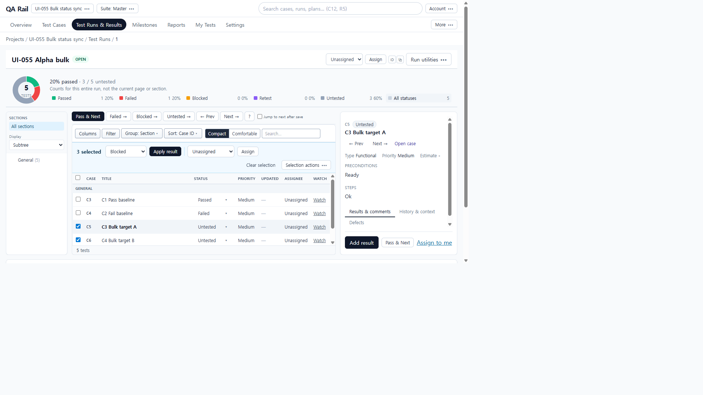
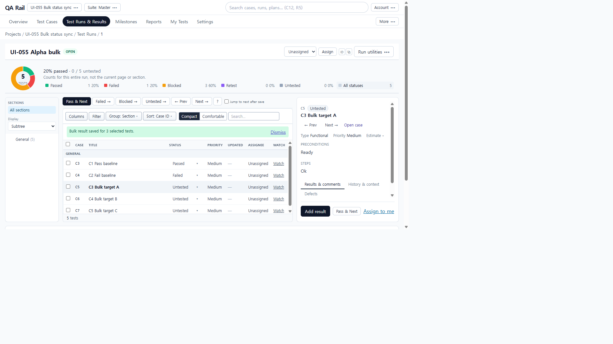
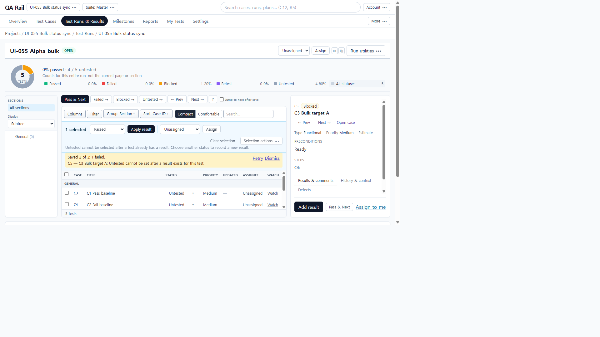
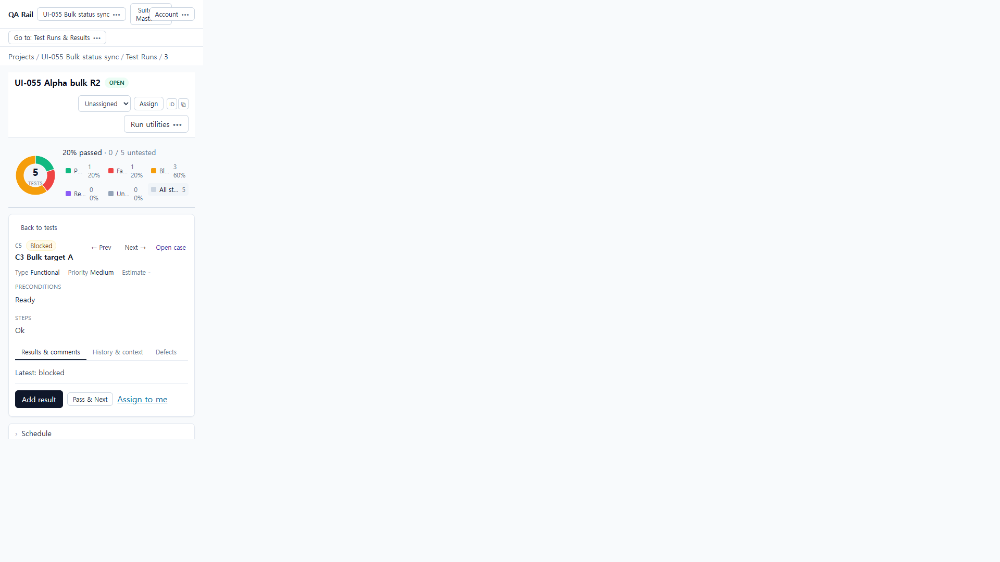

# UI-055 — bulk 결과 후 상태 동기화

Completed: 2026-09-20

## Result

- Bulk Apply 직후 reload 없이 목록 STATUS·선택 헤더 칩·Latest·run-wide 집계가 저장값과 일치한다.
- 비선택 행은 그대로다.
- 부분 실패 시 성공 대상은 반영되고 실패 대상만 선택·Retry로 남는다.
- Untested 필터 시 Blocked 행이 목록에서 사라진다.

## Reproduction (before)

- Fixture: in-memory API `localhost:4000`, Vite `http://localhost:5173`, project **UI-055 Bulk status sync**, run R1 with C1 Passed / C2 Failed / C3–C5 Untested.
- Select C5–C7, Result status Blocked, Apply result.
- Observed: toast “Bulk result saved for 3 selected tests.” and stats Blocked 3/5 updated; **list STATUS stayed Untested**; detail header stayed Untested; Latest already showed blocked (results query refreshed).
- Cause: `useRunBulkActions` invalidated `instances` but not `instances-grouped`, while the run table uses grouped instances for STATUS/header.

## Change

- `runBulkCacheKeys.ts`: shared query keys including `instances-grouped`.
- `useRunBulkActions.ts`: onSuccess invalidates detail, instances, **instances-grouped**, list (+ overview/reports/activity/test-results as before).

## Verification

- Before (R1): after Apply, toast/stats OK; C5–C7 list STATUS Untested; header Untested (`ui-055-before-1280x720-stale-after-apply.png`).
- After (R2): C5–C7 list STATUS Blocked; header Blocked; Latest blocked; C3 Passed / C4 Failed unchanged (`ui-055-after-1280x720-synced.png`).
- Partial (R2 earlier seed): Apply Untested on C5(blocked)+C6+C7 → “Saved 2 of 3; 1 failed”, Retry, only C5 selected; C5 remains Blocked; no duplicate results for successes.
- Status filter Untested: C5 disappears; General (4); `status=untested` in URL.
- 390×844: Blocked header + Latest blocked; `innerWidth` 390, `overflowX` false / `scrollWidth` 390.
- a11y: Apply result, Retry failed bulk results, Status for C*, Result status named.
- Tests: `runBulkCacheKeys.test.ts` + `runBulkSelectionScope.test.ts` — 9 passed.
- `npm.cmd run lint -w apps/web` — passed.
- `npm.cmd run build -w apps/web` — passed (chunk warning only). Shared rebuild wipes in-memory fixture afterward.

## Exception

- Native Tab cycle not used (E02/UI-062).
- Page/section paging with bulk across pages not re-run in this fixture (single page of 5).

## Linked UI-021 issue

- J07 / proposed repair #10 (**Run list status after bulk apply**): **수정됨 · 통합 재검증 대기** → [UI-055.md](./UI-055.md).

## Screenshot review

