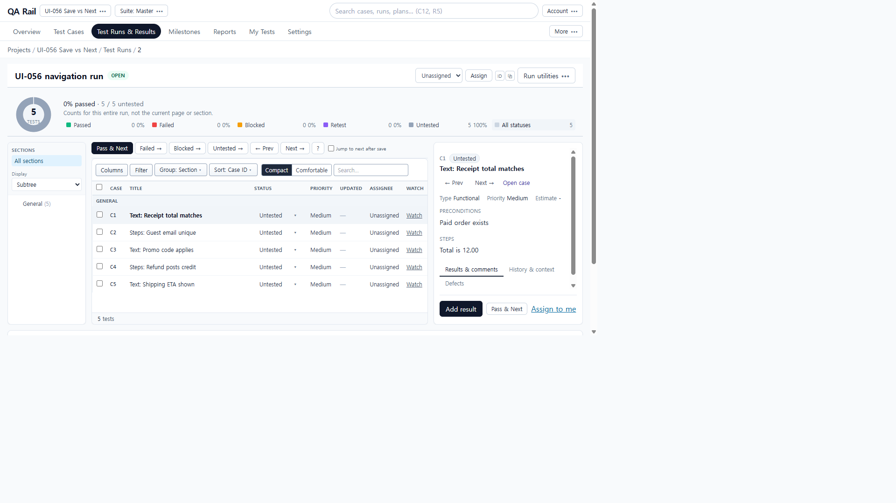
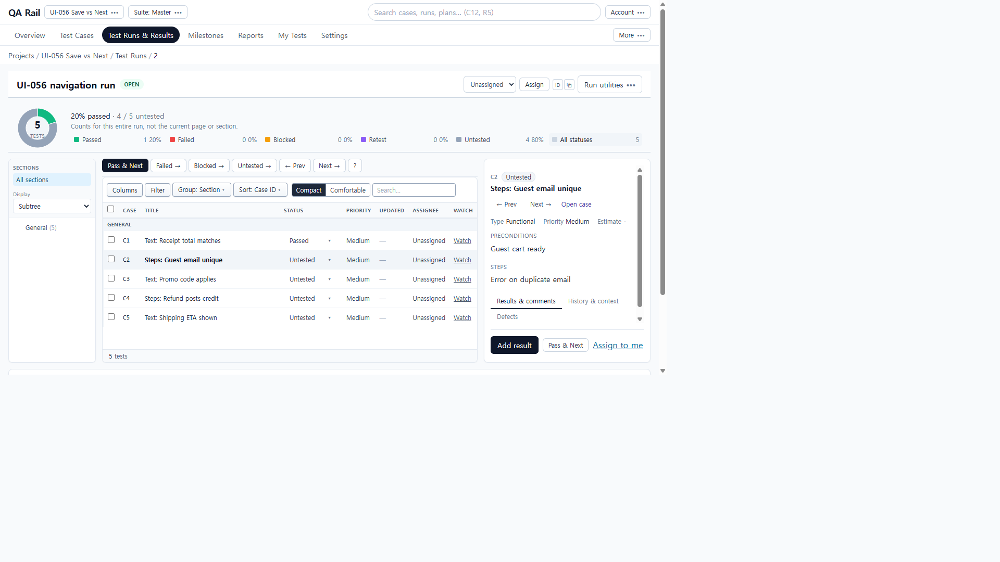
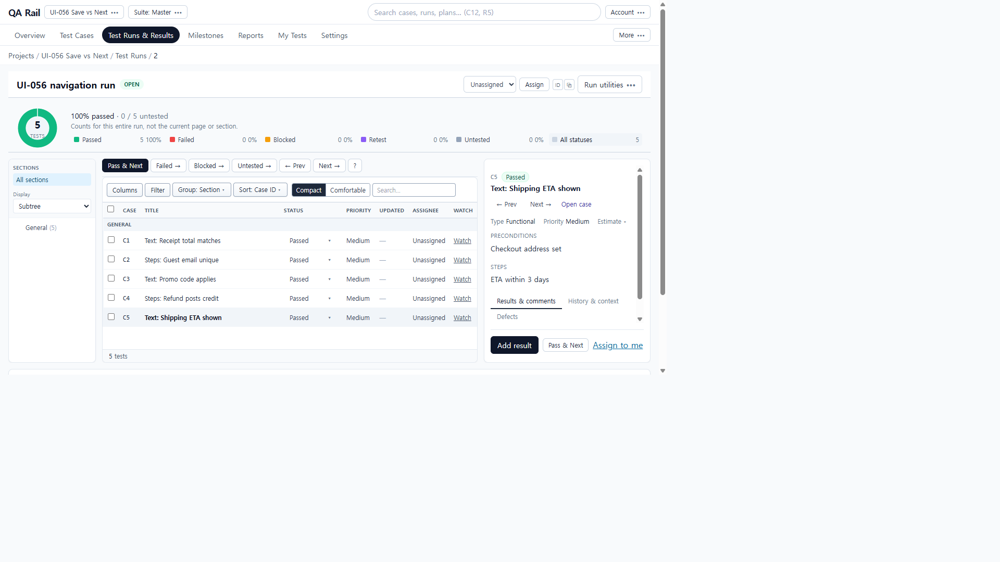
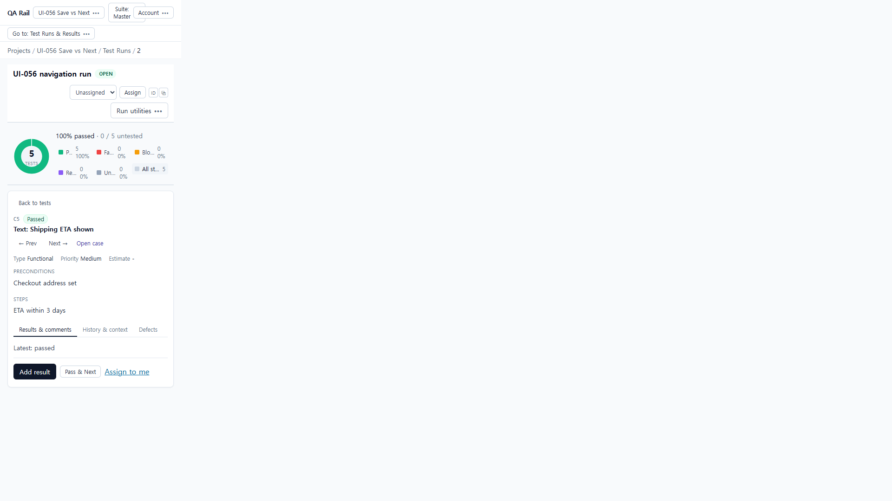

# UI-056 — 저장과 명시적 다음 이동

Completed: 2026-09-20

## Result

- **Add Result**는 Jump 체크 여부와 관계없이 현재 testId에 머문다 (UI-051/UX-002 계약).
- **Save & Next** / **Pass & Next**만 현재 필터·정렬의 다음 테스트로 이동한다.
- 오해를 주던 **Jump to next after save** 체크박스를 제거했다 (실제로는 Add Result를 전진시키지 않음).
- Save & Next가 다이얼로그 열린 동안 `selectInstance`가 막혀 전진하지 않던 버그를 `force: true`로 수정.
- 마지막 테스트에서 Pass & Next / Save & Next는 순환하지 않는다.

## Reproduction / judgment correction

- Fixture: project **UI-056 Save vs Next**, run R2, five distinct instruction cases (C1–C5).
- Before: toolbar showed **Jump to next after save** (default checked). Add Result on C1 with Jump checked stayed on `testId=6` — **correct stay**, not a product failure.
- UI-021 had marked that stay as a Jump failure; corrected to match UI-051 (**Add Result stays**).
- Separate bug: Save & Next saved but URL stayed because `selectInstance` refused updates while the dialog was open.

## Change

- Removed Jump checkbox + localStorage prefs from `RunExecutionToolbar` / `RunDetailPage` / `runExecutionPrefs`.
- `resultSaveShouldAdvance`: documents Add Result stay vs Save & Next advance.
- `handlePassAndNext` uses `nextUnwrappedVisibleTestId` (no wrap).
- Advance path calls `selectInstance(next, { force: true })` so Save & Next can change selection before the dialog closes.

## Verification

- Add Result + Jump checked: stayed `testId=6`, Latest passed (`ui-056-before-1280x720-jump-checkbox.png`).
- After: Jump label gone (`ui-056-after-1280x720-no-jump.png`).
- Pass & Next C2→C3: `testId=7` → `8`, instructions changed.
- Save & Next C4→C5: `testId=9` → `10`, heading “Shipping ETA shown”.
- Last Pass & Next on C5: stayed `testId=10` (no wrap to C1); all five Passed.
- 390×844: no Jump; `overflowX` false / `scrollWidth` 390.
- a11y: Add Result, More save actions, Save & Next, Pass & Next named.
- Tests: `resultSaveAdvanceIntent` + `runSelectedTestState` + `resultEntryDialogModel` — 21 passed.
- `npm.cmd run lint -w apps/web` / `build -w apps/web` — passed.

## Exception

- Native Tab cycle not used (E02/UI-062).
- Required custom-field empty submit not re-injected (no required result field on fixture); attachment partial no-advance covered by prior UI-037/031 evidence and lifecycle `advanced: false` on failure.
- UI-021 Jump expectation corrected in proposed repair #2 note below.

## Linked UI-021 issue

- Proposed repair #2 / UX-002 Jump observation: **판정 보정 + Save & Next 전진 수정 · 통합 재검증 대기** → [UI-056.md](./UI-056.md).

## Screenshot review

