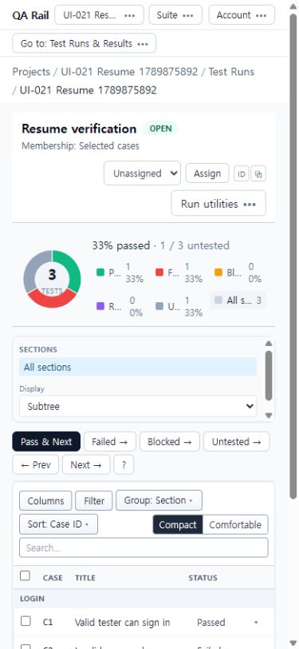
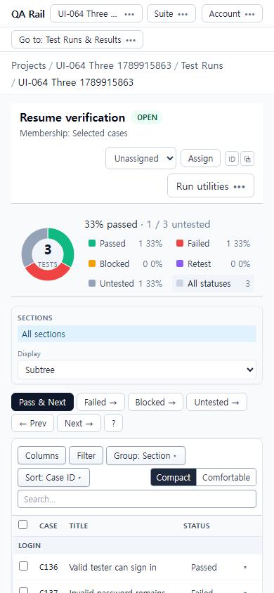
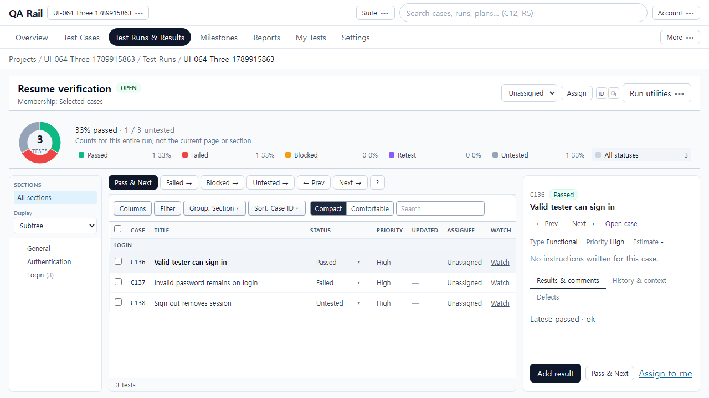

# UI-064 — 좁은 화면 상태 범례 가독성 복구

Status: **complete**, 2026-09-20.

## 재현과 원인

- [UI-021 최신 재검증](./UI-021.md) `UI-021-F01`, 3건 fixture (Passed/Failed/Untested 각 1).
- 390×844, 100%, scrollY=0, 상세 닫힘에서 상태명이 `P…` / `All s…`처럼 생략. 접근성 이름은 정상이었으나 보이는 텍스트만으로 판독 불가.
- 원인: `RunStatusOverview.tsx`가 80px 차트 옆에서 `grid-cols-3` + 라벨 `truncate`를 사용해 버튼 폭 ~73px에서 말줄임.

## 변경

- `apps/web/src/features/runs/components/RunStatusOverview.tsx`
  - 기본(좁은 폭) 범례를 `grid-cols-2`, `sm:grid-cols-3`, `lg:grid-cols-6`으로 조정.
  - 상태명 `truncate` 제거, 건수·비율은 `shrink-0`로 유지해 이름 전체와 수치를 함께 읽게 함.
  - 차트 옆 수평 배치를 유지해 통계 영역 높이가 세로 목록처럼 커지지 않게 함.

## 기준 화면 — 수정 전

[1280px before](./ui-064-before-1280x720.png) (동일 3건 데이터; 데스크톱은 상세 자동 선택 가능).

## 수정 후 화면

추가: [1440 after](./ui-064-after-1440x1000.png), [390 59건](./ui-064-after-390x844-59.png), [1280 59건](./ui-064-after-1280x720-59.png).

## 검증

- Live: `python docs/ux-evidence/_ui064-verify.py` → [`ui-064-live-verify.json`](./ui-064-live-verify.json) **allOk true**
  - 3건·59건(43/2/2/3/9) fixture, 390×844 / 1280×720 / 1440×1000
  - 여섯 상태명 전부 비가림·비말줄임, `overflowX` 없음
  - 390 상세 닫힘 첫 테스트 행 viewport 내 (top≈791)
  - 실키 Enter로 Failed 필터, Space로 All statuses 복귀
  - C3 Untested → Blocked 저장 후 범례 Blocked 1 / Untested 0으로 갱신
- `npx vitest run src/features/runs/utils/runStatusOverview.test.ts` — 4 passed
- `npm.cmd run lint -w apps/web` / `npm.cmd run build -w apps/web` — pass

## 제한

- before 390/1280은 UI-021-F01 캡처를 `ui-064-before-*`로 복사·연결. after는 이번 실행 fixture.
- E01 첨부 bytes / E03 사람 관찰은 이 단위 범위 밖.
- helper 테스트만으로 말줄임 통과를 주장하지 않음; 폭 검사는 live JSON의 `legend` 측정값.
