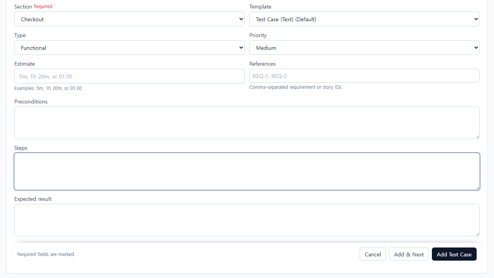
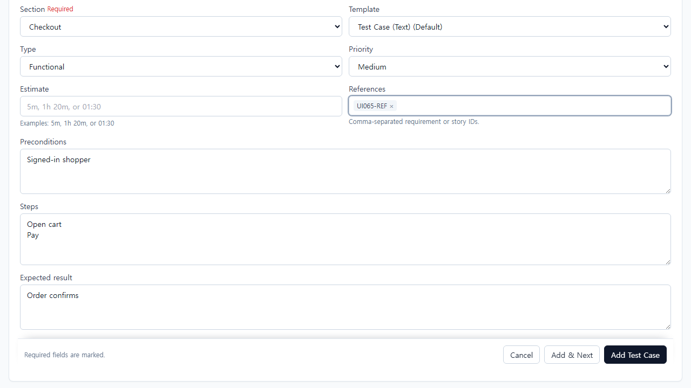
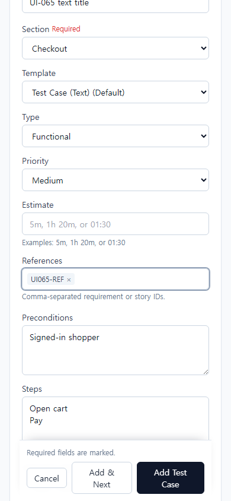

# UI-065 — 생성 중 Section 변경에서 초안 보존

Status: **complete**, 2026-09-20.

## 재현과 원인

- 근거: [CASE_AUTHORING_FLOW_REVIEW](./CASE_AUTHORING_FLOW_REVIEW_2026-09-20.md) CA-F01.
- Before: Add Case에서 Title/Preconditions/Steps/Expected 입력 후 Section Login→Checkout 시 값이 빈 문자열로 초기화 (`ui-065-before-repro.json` cleared=true).
- 원인: `AddCasePage` `valueKey`가 `add:${selectedSectionId}:${formKey}`라 Section 변경마다 `CaseAuthoringForm` 초기화 effect가 실행됨.

## 변경

- `caseAuthoringValueKey.ts`: add identity는 `add:${formKey}`만 사용. edit는 `edit:${caseId}:${lockVersion}`.
- `AddCasePage.tsx`: 위 helper로 valueKey 연결. Section은 URL 목적지 값으로만 유지.
- `CaseAuthoringForm.tsx`: Section 변경을 dirty로 감지(`baselineSectionId`). valueKey/reset 의존성에 sectionId를 넣지 않음.
- 회귀: `caseAuthoringValueKey.test.ts`.

## 화면

### Before (Section 변경 후 초안 소실)

[390 before](./ui-065-before-390x844-section-cleared.png) · [1280 draft before change](./ui-065-before-1280x720-draft.png)

### After (Checkout으로 바꿔도 초안 유지)

추가: [steps 유지](./ui-065-after-1280x720-steps-preserved.png), [Add & Next 비유출](./ui-065-after-1280x720-add-next-clear.png), [Run 지침](./ui-065-after-1280x720-run-instructions.png).

## 검증

- Live: `python docs/ux-evidence/_ui065-verify.py` + `_ui065-run-check.py` → [`ui-065-live-verify.json`](./ui-065-live-verify.json) **allOk true**
  - Text·Steps: Section A→B→A→B에서 Title/지침/Template 유지
  - 최종 B 저장만 Checkout에 1건, Login에 없음; 재열기·Run에서 동일 지침
  - Title 필수 오류·강제 500 저장 실패 후에도 초안 유지
  - Edit에서 Section만 변경 시 Discard 확인(dirty)
  - Add & Next 성공 후 빈 초안(이전 지침 비유출)
  - 390 `overflowX` 없음; Section 포커스 후 목적지 변경 시 초안 유지
- `npx vitest run …caseAuthoringValueKey.test.ts …caseAuthoringDraft.test.ts` — 5 passed
- `npm.cmd run lint -w apps/web` / `build -w apps/web` — pass

## 제한

- 기본 fixture에 필수 custom 필드 없음 → “필수 custom 입력 후 유지”는 N/A(필드 부재). Title 필수로 오류 후 유지 검증.
- 이탈 보호 전반은 UI-066, 부분 Steps 실패 복구는 UI-068 범위.
