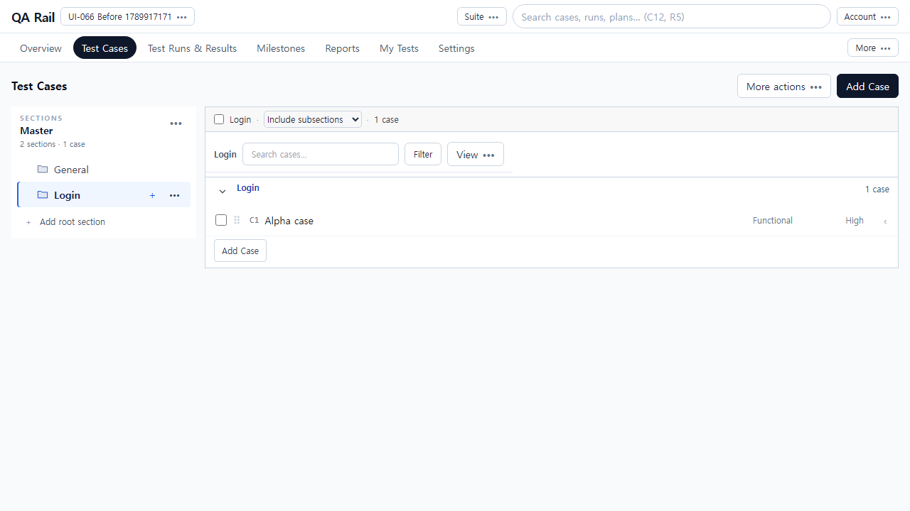
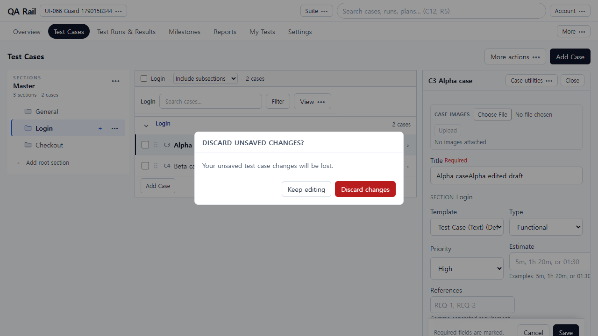
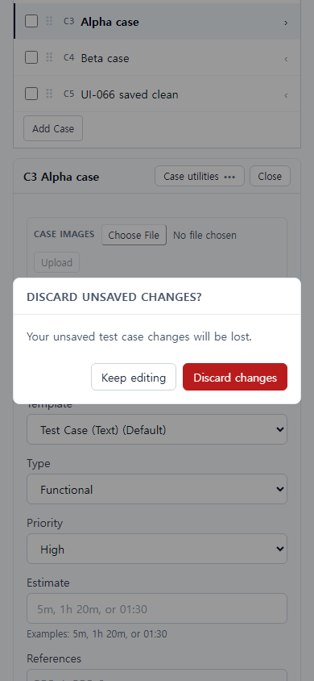

# UI-066 — 작성·편집 이탈 경로에 공통 초안 보호

Status: **complete**, 2026-09-23.

## 재현과 원인

- 근거: [CASE_AUTHORING_FLOW_REVIEW](../CASE_AUTHORING_FLOW_REVIEW_2026-09-20.md) CA-F02.
- Before: 패널 Edit에서 제목 변경 후 Close가 확인 없이 닫힘 (`ui-066-before-repro.json` closedWithoutConfirm=true). 초안 제목은 사라지고 목록만 남음.
- 원인: `CaseDetailBody` dirty 상태가 상위 Close/`setPanelCase`에 전달되지 않음. 섹션·필터·스위트 전환·상단 링크·브라우저 뒤로가기도 같은 초안을 바로 폐기할 수 있었음.

## 변경

- `unsavedDraftGuard.ts`: dirty면 confirm, 저장 중이면 대상 유지, 깨끗한 폼/저장 성공은 경고 없음. 패널 Close/다른 행은 edit 이탈 경로.
- `useUnsavedDraftGuard` + `CaseDraftGuardProvider`: 공통 ConfirmDialog(Keep editing / Discard changes). 같은 출처 링크 클릭과 새로고침/탭 종료 경고. 뒤로가기는 sentinel 후 Discard 한 번만 이동.
- `useExpandedCase` / `TestCaseWorkspace` / `AddCasePage`: Close·Cancel·다른 행·섹션/필터/스위트·저장 보기 전환을 `requestLeave`에 연결. 저장 성공 전에 dirty를 해제.
- `ConfirmDialog`: 기존 공통 모달 포커스/Tab trap, 초기 포커스는 Keep editing. IME 조합 중 Escape는 닫지 않음.

## 화면

### Before (Close가 확인 없이 패널을 닫음)

[1280 dirty before Close](./ui-066-before-1280x720-panel-dirty.png) · [390 before closed](./ui-066-before-390x844-panel-closed-no-dialog.png)

### After (Close에서 초안 확인)

추가: [Add Cancel](./ui-066-after-1280x720-add-cancel-dialog.png).

## 검증

- Live: `python docs/ux-evidence/_ui066-verify.py` → [`ui-066-live-verify.json`](./ui-066-live-verify.json) **allOk true**
  - 패널 Close 확인 → Keep editing은 초안/edit 유지, Escape도 Keep
  - Tab이 Keep↔Discard를 순환한 뒤 Enter Discard는 패널을 한 번만 닫음
  - 읽기 Close·저장 성공 후 이동은 경고 없음
  - 다른 행·Checkout 섹션·Add Cancel·상단 Test Runs 링크·브라우저 뒤로가기에서 확인
  - 제목 IME 중 Escape는 초안 유지
  - 390 대화상자, `overflowX` 없음
- `npx vitest run src/features/cases/utils/unsavedDraftGuard.test.ts src/shared/ui/modalFocus.test.ts src/features/cases/utils/caseAuthoringValueKey.test.ts src/features/cases/utils/caseAuthoringDraft.test.ts` — 19 passed
- `npm.cmd run lint -w apps/web` / `build -w apps/web` — pass

## 제한

- Fixture: in-memory API `localhost:4000`, Vite `localhost:5173`, `admin@example.com`. 프로젝트 UI-066 Guard, 섹션 Login/Checkout, C3 Alpha / C4 Beta.
- 새로고침/탭 종료 경고는 브라우저 `beforeunload` 핸들러 등록으로 확인. Chromium이 native prompt를 숨기는 경우는 핸들러 `preventDefault`로 대체 기록.
- 부분 성공 때 이미 저장된 항목 안내는 UI-068. 목록 복귀 문맥은 UI-072.
