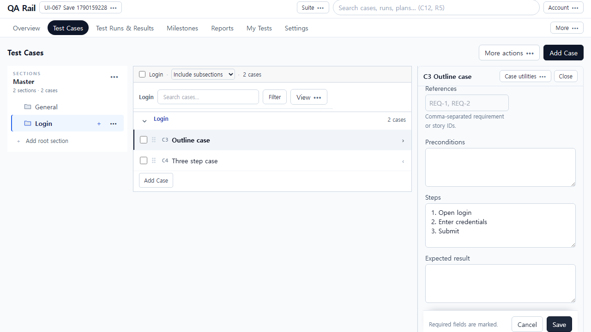
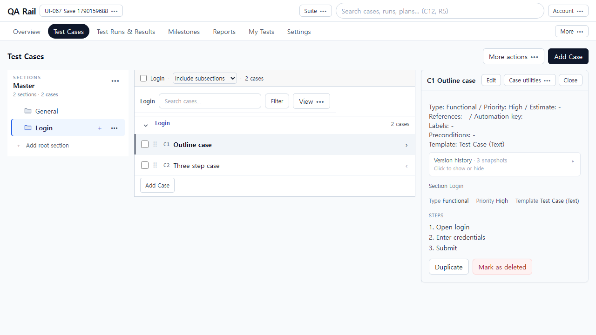
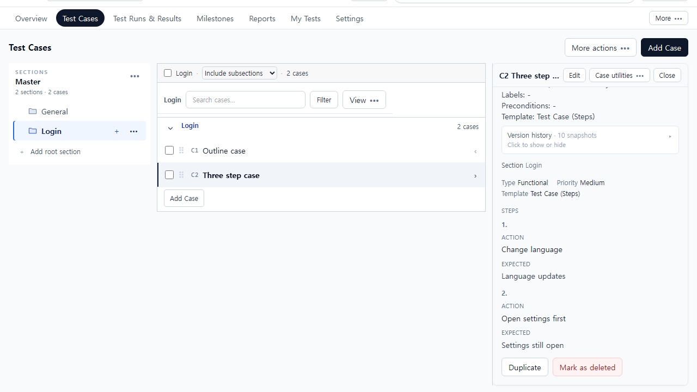
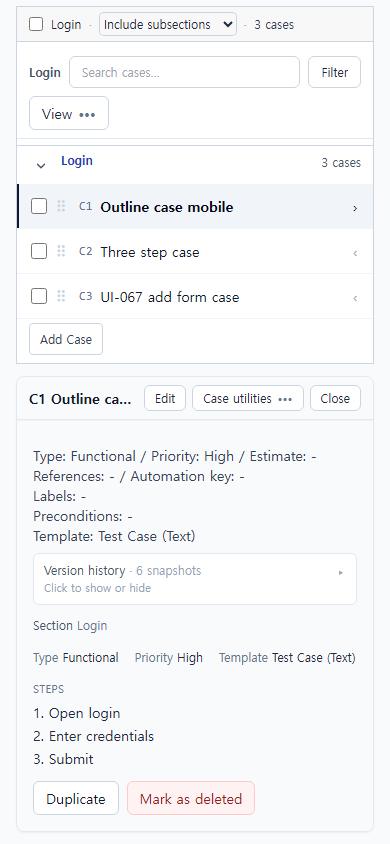

# UI-067 — 본문과 Steps 저장 완료 후 화면을 한 번에 갱신한다

Status: **complete**, 2026-09-23.

## 재현과 원인

- 근거: [CASE_AUTHORING_FLOW_REVIEW](./CASE_AUTHORING_FLOW_REVIEW_2026-09-20.md) CA-F03.
- Before: 패널 Save 직후 서버에는 Steps가 있으나 편집칸이 비거나, 지침은 저장됐어도 패널이 읽기 모드로 돌아가지 않음 (`ui-067-before-1280x720-still-edit.png`, 이전 live `stillEdit: true`).
- 원인 1: 본문 PATCH 성공 직후 query invalidate가 Steps sync보다 먼저 돌아 편집칸/`lockVersion` 초기화가 빈 지침을 보여 줌.
- 원인 2: 성공 저장 후 `setPanelCase(..., "view")`가 저장 중 leave guard(`block-saving`)에 막혀 URL이 `panelMode=edit`에 남음.

## 변경

- `caseAuthoringSaveBoundary.ts`: 본문+Steps가 모두 끝난 뒤에만 refresh. 뒤늦은 A 응답은 ignore-stale.
- `persistCaseAuthoring.ts`: 패널/전체 폼이 같은 `persistAndRefresh` / `createAndRefresh` 경계를 사용.
- `CaseDetailBody.tsx` / `AddCasePage.tsx`: 본문만으로 초안 초기화·완료 이동하지 않음. Steps 경고는 폼 baseline을 지우지 않음.
- `ExpandableCaseDetail.tsx`: 저장 중 localSteps 리셋 금지. Save는 통합 persist만 호출.
- `unsavedDraftGuard.ts` + `useExpandedCase`: 성공 저장은 `skipGuard`로 읽기 모드 전환. 초안 Close/다른 행 보호는 유지.

## 화면

### Before (Save 후에도 편집 모드)

### After (읽기 미리보기와 API가 같은 지침)

## 검증

- Live: `python docs/ux-evidence/_ui067-verify.py` → [`ui-067-live-verify.json`](./ui-067-live-verify.json) **allOk true**
  - Text 지침 Save: Enter로 제출, Saving 표시, 새로고침 없이 읽기 패널에 Open login/Enter credentials, API·버전·재열기 편집칸 일치, Discard 대화상자 없음
  - Steps 템플릿: 1번 수정, 2번 위로, 3번 삭제 후 Save → 미리보기/API `Change language`, `Open settings first` 2건
  - 전체 Add Test Case 후 목록 패널에 Open catalog
  - 390 제목 키보드 수정 후 Enter Save, 읽기 복귀, overflowX 없음
- `npx vitest run src/features/cases/utils/caseAuthoringSaveBoundary.test.ts src/features/cases/utils/persistCaseAuthoring.test.ts src/features/cases/utils/unsavedDraftGuard.test.ts src/features/cases/utils/caseAuthoringValueKey.test.ts` — 21 passed
- `npm.cmd run lint -w apps/web` / `build -w apps/web` — pass

## 제한

- Fixture: in-memory API `localhost:4000`, Vite `localhost:5173`, `admin@example.com`. 프로젝트 UI-067 Save, 섹션 Login, C1 Outline / C2 Three step (Steps 템플릿).
- Saving 버튼 `disabled` 관측은 요청이 짧아 live에서 간헐적으로 놓침. 폼은 `isSubmitting`으로 Save를 비활성화함.
- 부분 실패 표시·Retry는 UI-068. 목록 검색/필터 복귀는 UI-072.
