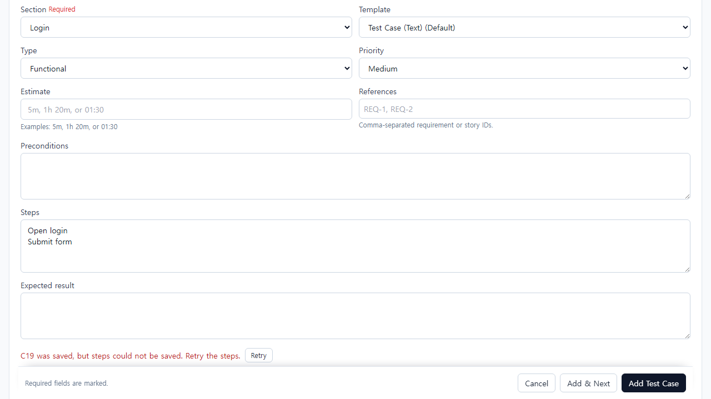
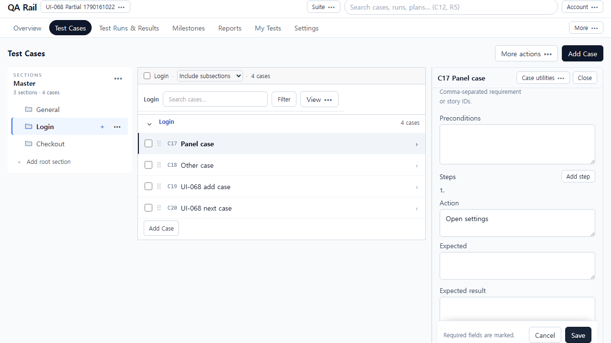
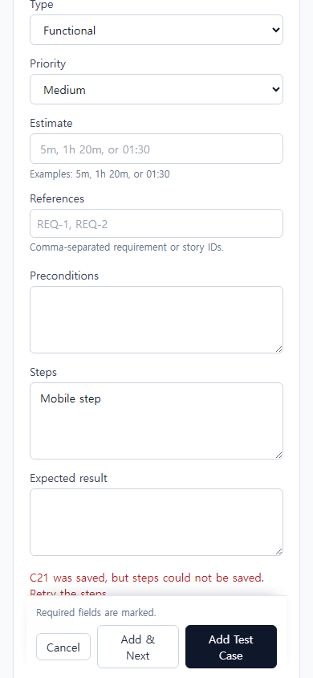

# UI-068 — 생성·수정의 부분 실패를 구분하고 실패한 작업만 재시도한다

Status: **complete**, 2026-09-23.

## 재현과 원인

- 근거: [CASE_AUTHORING_FLOW_REVIEW](./CASE_AUTHORING_FLOW_REVIEW_2026-09-20.md) CA-F04.
- Before: Steps 실패가 `stepsWarning`으로만 돌아오고 일반 Add는 목록으로 이동·Add & Next는 폼 초기화할 수 있었음. 패널 Steps 실패도 초안·Retry 상태가 남지 않음.
- 원인: create/update가 warning만 반환하고 성공 ID·남은 draft·실패 종류를 한 작업 상태로 보관하지 않음. 재시도 시 새 케이스를 다시 만들 수 있었음.

## 변경

- `authoringPersistOutcome.ts`: body / steps-first / steps-middle / move / conflict 구분, 요약 문장, leave 안내, resume 병합.
- `syncCaseInstructionSteps.ts`: 중간 실패 시 저장된 step ID·남은 draft를 반환. `createCaseStep`은 새 step id를 돌려줌.
- `createCaseFromAuthoring.ts` / `updateCaseFromAuthoring.ts` / `persistCaseAuthoring.ts`: resume로 본문·이동·남은 Steps만 재시도. 실패 시 refresh 보류.
- `AddCasePage.tsx` / `CaseDetailBody.tsx` / `CaseAuthoringForm.tsx`: 부분 실패는 이동·초기화 없음, Retry 노출, dirty 유지. Discard는 이미 저장된 케이스와 버릴 초안을 구분.
- `CaseDraftGuardProvider` / `useUnsavedDraftGuard`: leave hint로 부분 성공 안내.

## 화면

### After (Add에서 Steps 실패 + Retry)

## 검증

- Live: `python docs/ux-evidence/_ui068-verify.py` → [`ui-068-live-verify.json`](./ui-068-live-verify.json) **allOk true**
  - Add Steps 실패: 폼 유지, Retry, 같은 제목 케이스 1건만, Retry 후 API에 지침 저장
  - Add & Next 실패: 초안 유지·초기화 없음
  - 패널 Steps 실패: edit 유지, Discard에 already saved, Retry 후 읽기 복귀
  - 409 conflict / bulk-move 실패 메시지·폼 유지
  - A 실패 후 B로 전환 시 A 오류/초안 혼입 없음
  - 390 Enter 제출·Retry, overflowX 없음
- `npx vitest run` authoringPersistOutcome / syncCaseInstructionSteps / createCaseFromAuthoring / persistCaseAuthoring / unsavedDraftGuard / caseAuthoringSaveBoundary — 27 passed
- `npm.cmd run lint -w apps/web` / `build -w apps/web` — pass

## 제한

- Fixture: in-memory API `localhost:4000`, Vite `localhost:5173`, `admin@example.com`. 프로젝트 UI-068 Partial, 섹션 Login/Checkout.
- Steps/이동 실패는 Playwright route 주입. 실제 네트워크 오류와 동일 계약으로 처리.
- 첨부 부분 실패·Retry는 UI-071. 목록 검색/필터 복귀는 UI-072.
