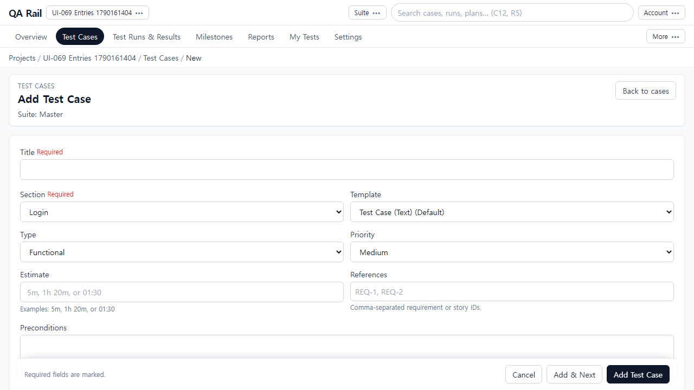
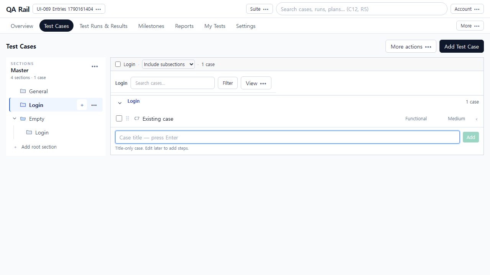
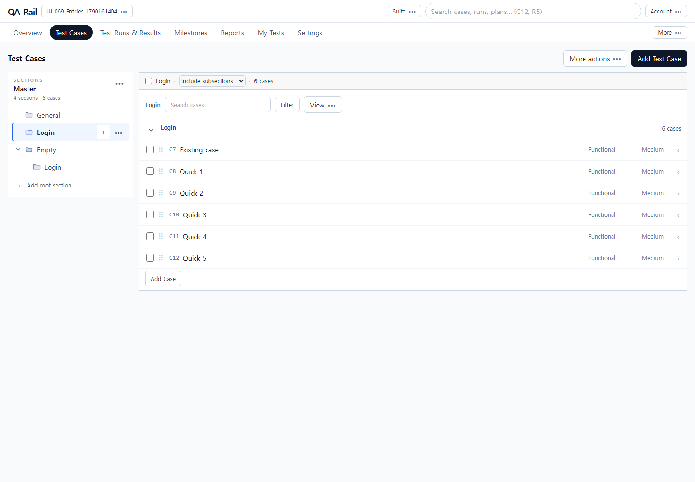
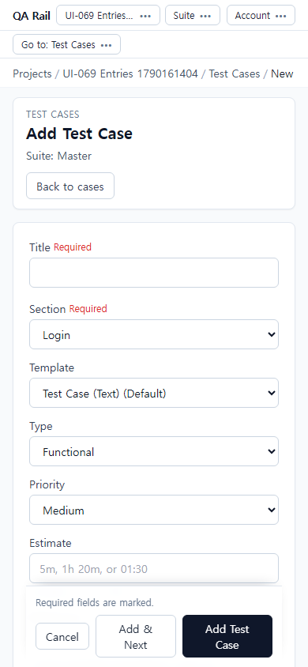
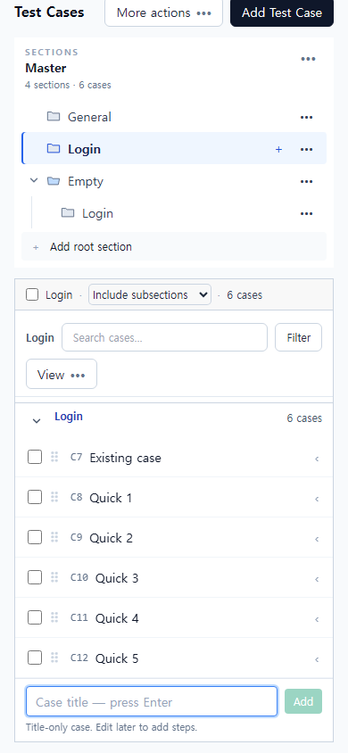

# UI-069 — 전체 작성과 섹션별 빠른 추가의 진입점을 구분한다

Status: **complete**, 2026-09-23.

## 재현과 원인

- 근거: [CASE_AUTHORING_FLOW_REVIEW](../CASE_AUTHORING_FLOW_REVIEW_2026-09-20.md) CA-U01.
- Before: 상단 주요 버튼이 **Add Case**라 제목 전용 outline만 열리고, 전체 작성 **Add Test Case**는 More actions 안에만 있어 발견이 어려웠음.
- 원인: `CaseRepositoryContentHeader` primary가 `onAddCase`(outline)에 연결되고, 전체 폼 href는 overflow에만 노출됨.

## 변경

- `caseAuthoringEntryPoints.ts`: 상단 `Add Test Case`=전체 폼, 섹션 `Add Case`=제목 outline, overflow 중복 금지.
- `CaseRepositoryContentHeader`: primary를 suite/section을 담은 `/cases/new` 링크로 변경. More actions에서 동일 항목 제거.
- `TestCaseWorkspace`: 헤더 outline 연결 제거. 섹션 끝 Add Case·트리 `+`·단축키 C는 제목 outline 유지.

## 화면

### After (상단 → 전체 작성 폼)

## 검증

- Live: `python docs/ux-evidence/_ui069-verify.py` → [`ui-069-live-verify.json`](./ui-069-live-verify.json) **allOk true**
  - 상단 Add Test Case → `/cases/new` + suite/section, Title 필드
  - More actions에 Add Test Case 없음
  - 섹션 Add Case → outline에 제목 5개 Enter 연속, 포커스 유지, 목록 이탈 없음
  - 빈 섹션·동명 nested Login·트리 + 모두 제목 outline
  - 1440 주요 CTA 1개, 390 전체 폼/outline, overflowX 없음
- `npx vitest run` caseAuthoringEntryPoints / caseListRowPresentation / caseRoute — 13 passed
- `npm.cmd run lint -w apps/web` / `build -w apps/web` — pass

## 제한

- Fixture: in-memory API `localhost:4000`, Vite `localhost:5173`, `admin@example.com`. 프로젝트 UI-069 Entries, 섹션 Login/Empty/nested Login.
- 읽기 전용(archived)은 primary 비활성으로만 확인. 별도 viewer 계정 주입 없음.
- 패널/목록 문맥 복귀는 UI-072.
