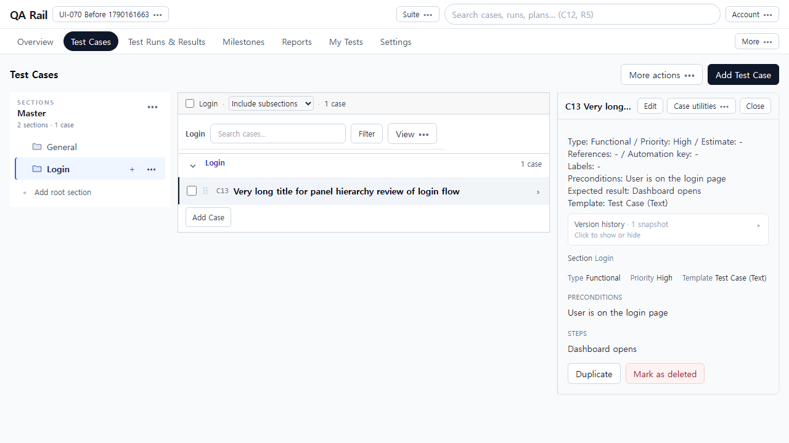
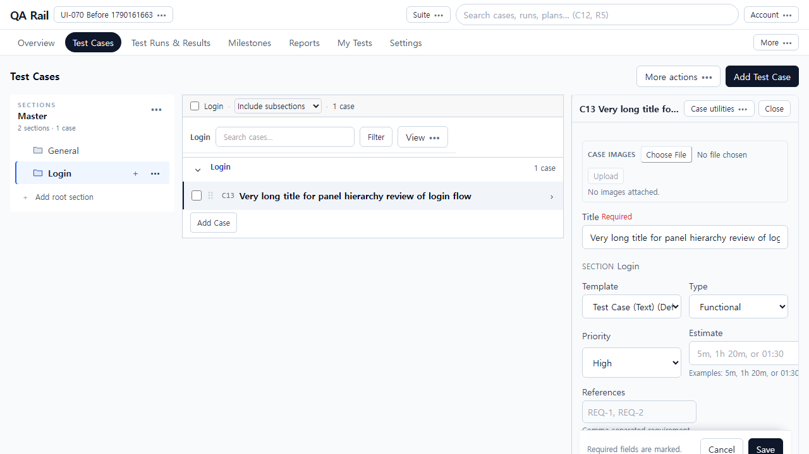
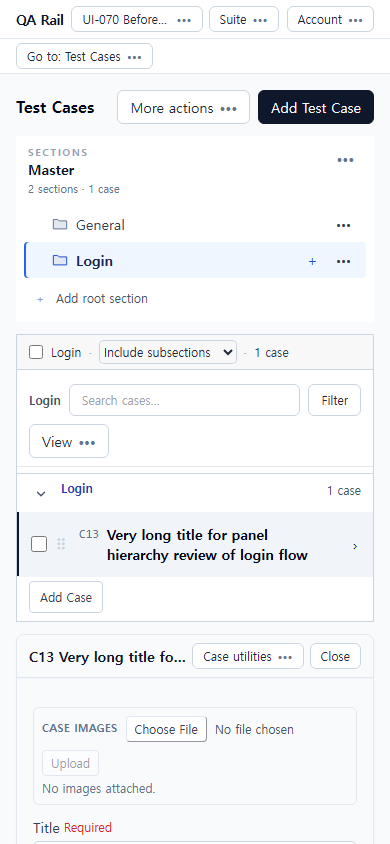
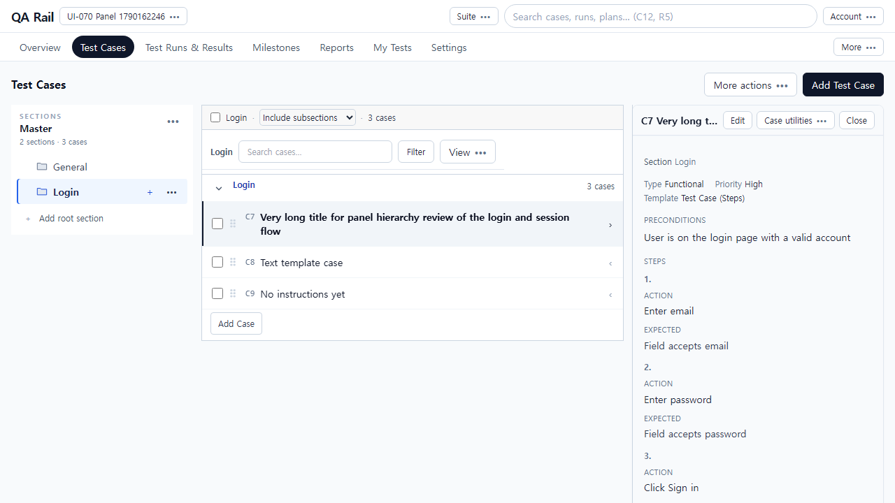
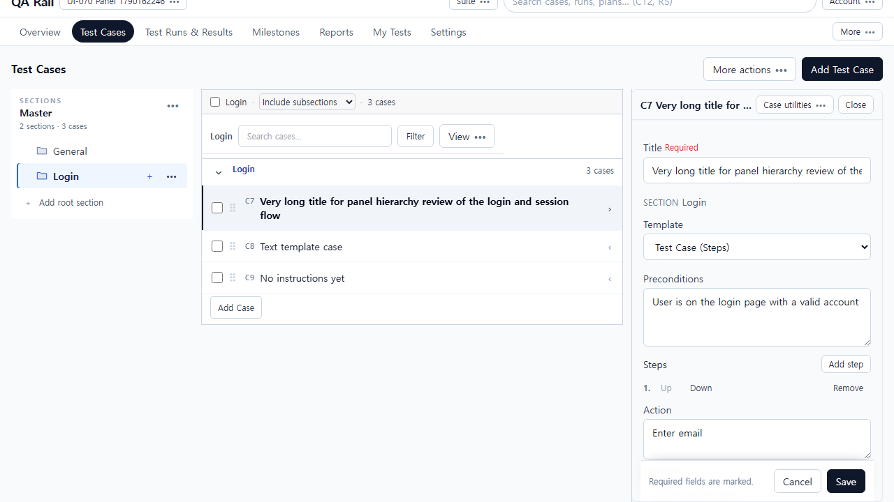
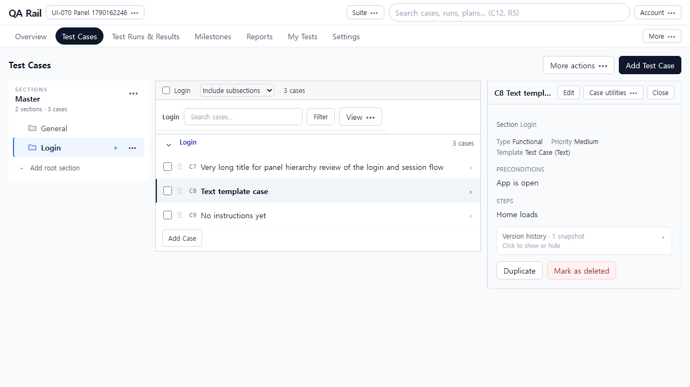
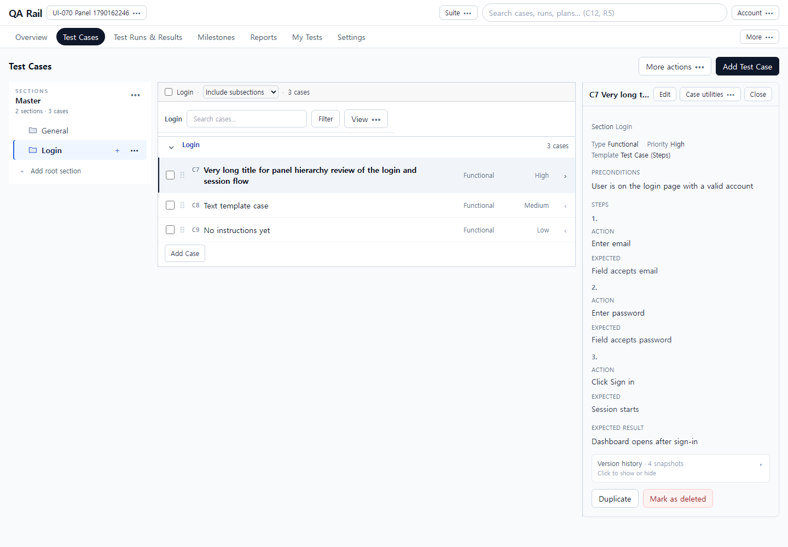
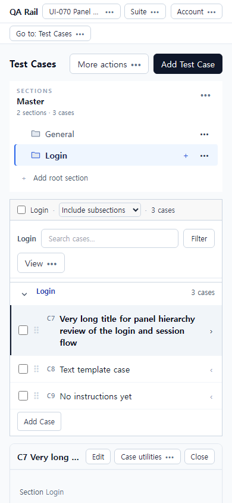
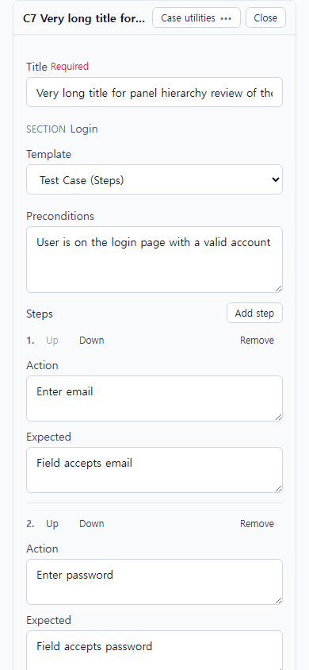

# UI-070 — 케이스 읽기·편집 패널의 중복 정보와 행동 계층을 정리한다

Status: **complete**, 2026-09-23.

## 재현과 원인

- 근거: [CASE_AUTHORING_FLOW_REVIEW](../CASE_AUTHORING_FLOW_REVIEW_2026-09-20.md) CA-U02.
- Before: 읽기 패널에서 Type/Priority/Template/Preconditions가 프리앰블과 `CaseInstructionReadView`에 각각 한 번씩 나와 두 번 보였음. 편집에서는 Case images가 작성 폼·지침보다 위에 있었음.
- Before 캡처/수치: [`ui-070-before-repro.json`](./ui-070-before-repro.json) — Type/Priority/Template/Preconditions 각 2회, `editImagesBeforeInstructions` true.
  - 
  - 
  - 

## 변경

- `caseDetailPresentation.ts`: 읽기 섹션 순서·싱글톤 라벨·패널 필드 스택/편집 밴드 계약.
- `ExpandableCaseDetail`: 읽기 중복 프리앰블·커스텀필드 블록 제거. ID/제목(헤더) → `CaseInstructionReadView`(메타→지침) → 첨부 → Version history → 보조 행동. 편집은 폼 후 Case images.
- `CaseAuthoringForm` `stackFields`: 패널에서 1열, 제목/목적지·템플릿 → 지침 → Type/Priority 등 선택 메타.
- `CaseInstructionReadView`: `data-case-meta-summary` / `data-case-instructions` 표시.
- `CaseDetailSidePanel`: 열기/편집 시 패널로 스크롤·포커스(닫으면 기존 행 복귀 유지).

## 화면

### After

## 검증

- Live: `python docs/ux-evidence/_ui070-verify.py` → [`ui-070-live-verify.json`](./ui-070-live-verify.json) **allOk true**
  - 읽기 라벨 1회, 메타→지침→첨부→버전 순서, 3-step Action/Expected
  - 편집: 폼→Case images, destination→지침→optional meta, 단일 열
  - 360px 패널 controlsFitPane, 1440/390 overflowX 없음, 390 포커스·닫기 후 행 복귀
- `npx vitest run` caseDetailPresentation — 3 passed
- `npm.cmd run lint -w apps/web` / `build -w apps/web` — pass

## 제한

- Fixture: in-memory API `localhost:4000`, Vite `localhost:5173`, `admin@example.com`. Steps/Text/빈 지침 케이스.
- 신규 작성 첨부 staging은 UI-071. 목록 문맥 복귀는 UI-072.
- 10-step·초장문 제목은 동일 구조로 포함되나 live는 3-step·긴 제목 한 건으로 확인.
