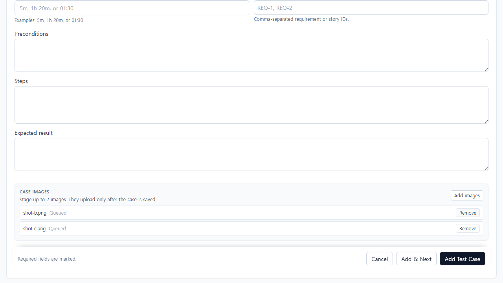
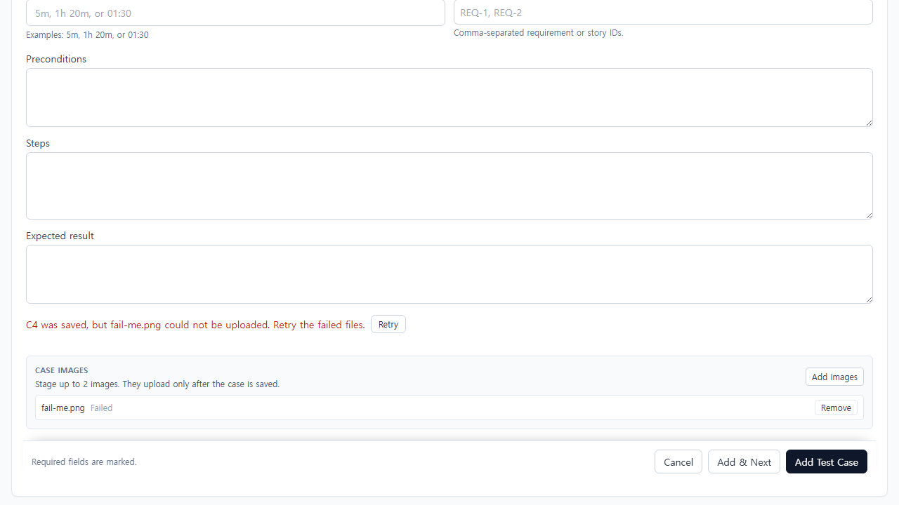
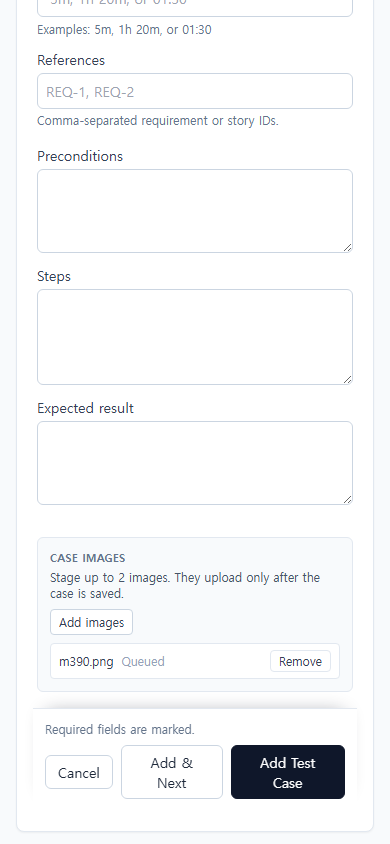

# UI-071 — 신규 작성에서도 첨부를 준비하고 기존 저장 경로에 연결한다

Status: **complete**, 2026-09-23.

## 재현과 원인

- 근거: [CASE_AUTHORING_FLOW_REVIEW](../CASE_AUTHORING_FLOW_REVIEW_2026-09-20.md) CA-U03.
- Before: Add Test Case 전체 폼에 첨부 진입점이 없어, 케이스를 만든 뒤 다시 편집(`CaseAttachmentControls`)해야 이미지를 올릴 수 있었음.
- 원인: 첨부가 caseId 이후 API(`presign` → PUT → `POST …/attachments`)에만 묶여 있고, 생성 폼은 본문/지침만 저장함.

## 변경

- `caseAuthoringAttachmentStaging.ts`: 이미지 전용·최대 2·10MB 검증, staging/제거, caseId+본문+Steps 성공 후에만 업로드 게이트, 실패 메시지·재시도 계획(성공 파일 제외).
- `CaseAttachmentStagingPanel.tsx`: 저장 전 서버 호출 없는 스테이징 UI.
- `CaseAuthoringForm.tsx`: `beforeActions` 슬롯(액션 바 위).
- `AddCasePage.tsx`: Add에서만 staging. 본문+Steps 성공 후 `uploadCaseAttachmentViaPresign`으로 해당 caseId에만 업로드. 부분 실패 시 케이스/성공 파일 유지·Retry·Add & Next 차단. Discard는 미업로드 이미지 안내. 아카이브 시 staging 비활성.
- 실패 회귀: staging 유틸 테스트 + leave 문구(첨부 pending).

## 화면

### After (스테이징)

## 검증

- Live: `python docs/ux-evidence/_ui071-verify.py` → [`ui-071-live-verify.json`](./ui-071-live-verify.json) **allOk true**
  - staging 노출·최대 2·개별 제거
  - 저장 후 presign이 **생성된 caseId**로만 호출(메모리 환경은 Playwright가 presign/PUT mock; 등록 POST는 in-memory 계약)
  - 첨부 실패: 케이스 유지, 실패 메시지+Retry, Add & Next로 폼 초기화/이탈 없음, Discard에 already saved / images 안내
  - Retry 후 두 번째 업로드 시도·성공 경로
  - 390 overflowX 없음
- `npx vitest run` caseAuthoringAttachmentStaging / authoringPersistOutcome — 9 passed
- `npm.cmd run lint -w apps/web` / `build -w apps/web` — pass

## 제한

- Fixture: in-memory API `localhost:4000`, Vite `localhost:5173`, `admin@example.com`.
- 업로드 성공/실패 경로는 controlled/mock 응답으로 복구 UI를 검증함. **실제 외부 저장소 bytes 왕복·재열기 다운로드는 UI-021/E01**에서 별도 필수.
- 편집 경로 첨부는 기존 `CaseAttachmentControls` 유지. 전용 첨부 관리 화면 없음.
