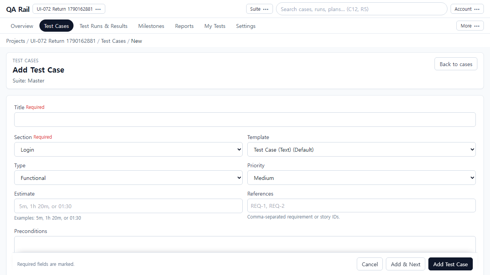
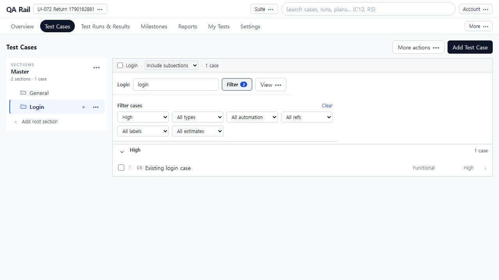
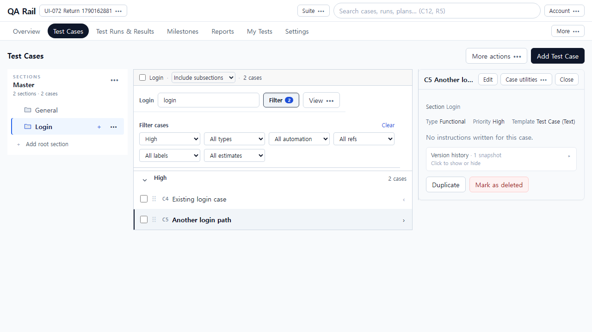
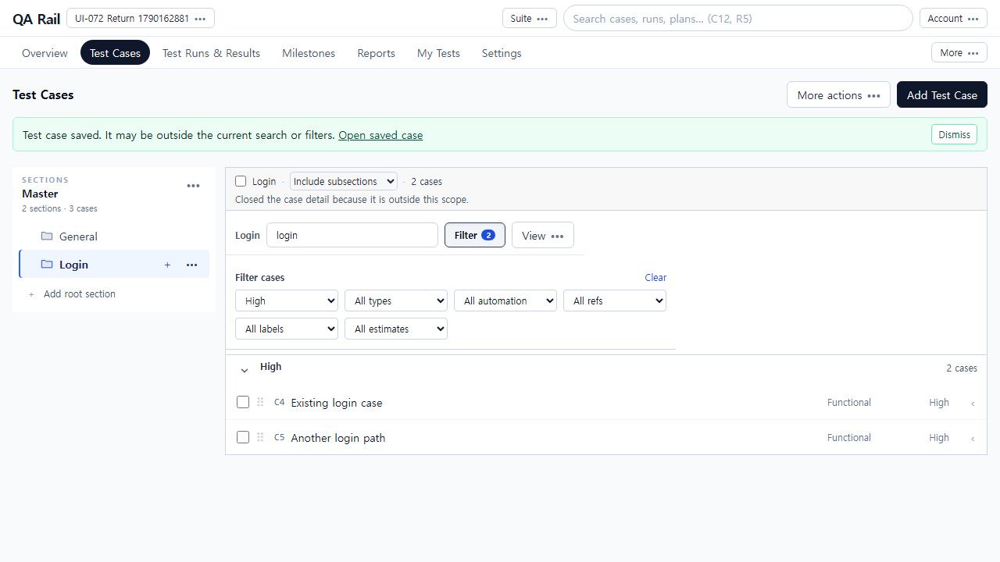
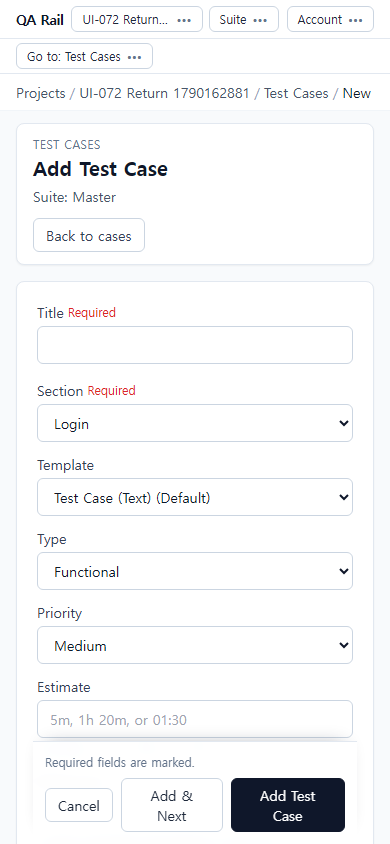
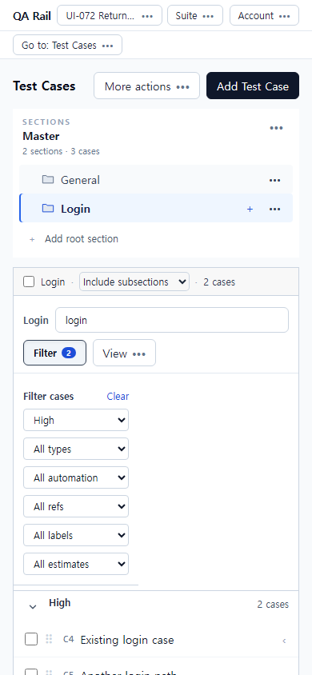

# UI-072 — 전체 작성·편집 후 목록의 검색·범위·보기 문맥을 복원한다

Status: **complete**, 2026-09-23.

## 재현과 원인

- 근거: [CASE_AUTHORING_FLOW_REVIEW](../CASE_AUTHORING_FLOW_REVIEW_2026-09-20.md) CA-U04.
- Before: `AddCasePage.goToList`가 새 `URLSearchParams`에 suite/section/panelCase만 넣어 검색·필터·scope·groupBy·display를 버림.
- 회귀: `caseListReturnContext.test.ts`가 suite/section/case-only 경로가 `q`/`priority`를 잃는 것을 고정하고, allowlist·forgery 거부를 검증.

## 변경

- `caseListReturnContext.ts`: allowlisted `return` 페이로드 캡처/복원, 필터 밖 저장 시 `savedNotice`+`savedCaseId`(패널이 숨은 케이스에서 닫혀도 안내 유지).
- `buildAddCasePath` / `buildEditCasePath` / `buildCaseDetailPath`: 목록 `listParams`로 return 전달. 기존 return은 재캡처하지 않고 보존.
- `TestCaseWorkspace`: Add Test Case href에 현재 목록 query 포함. 필터 밖 저장 배너 + Open saved case.
- `AddCasePage.goToList`: return 복원. `CaseDetailPage` Back to cases도 return 사용.
- `CaseDetailSidePanel` Open full page에 목록 문맥 전달.

## 화면

### After

## 검증

- Live: `python docs/ux-evidence/_ui072-verify.py` → [`ui-072-live-verify.json`](./ui-072-live-verify.json) **allOk true**
  - Add Test Case에 `return` (q/priority/scope/groupBy/display)
  - Cancel / Save / 브라우저 Back 후 동일 문맥
  - 필터 밖 생성: 필터 유지 + savedNotice 배너/Open saved case
  - 390 복원, overflowX 없음
- `npx vitest run` caseListReturnContext / caseRoute — pass
- `npm.cmd run lint -w apps/web` / `build -w apps/web` — pass

## 제한

- Fixture: in-memory API `localhost:4000`, Vite `localhost:5173`, `admin@example.com`.
- density는 localStorage(기존)라 URL return 대상이 아님.
- 신규 첨부 staging은 UI-071. UI-066 초안 보호와 Back은 기존 requestLeave 경로 유지.
