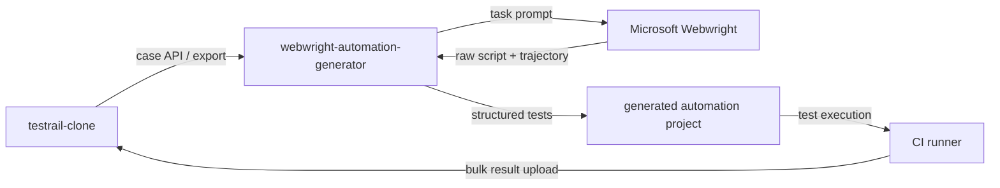

# Webwright Automation Generator Architecture

Last aligned: 2026-05-30

## System Context



`testrail-clone`은 자동화 코드의 저장소가 아니다. generator가 생성한 별도 자동화 프로젝트가 코드를 소유하고, 실행 결과만 API로 `testrail-clone`에 업로드한다.

## Components

```text
webwright-automation-generator/
  src/
    cli/
      main.py
      commands/
        init.py
        fetch.py
        generate.py
        sync.py
        verify.py
        upload.py
    integrations/
      testrail_clone_client.py
      webwright_runner.py
    pipeline/
      build_task.py
      extract_actions.py
      normalize_flow.py
      generate_code.py
      update_project.py
      verify_generated.py
    model/
      case.py
      action.py
      flow.py
      mapping.py
      artifacts.py
    reporters/
      testrail_clone_reporter_template.py
    templates/
      python-playwright/
      typescript-playwright/
```

## Pipeline

### 1. Case Input

입력은 세 가지를 지원한다.

| 입력 | 용도 |
|------|------|
| `testrail-clone` API | 실제 프로젝트 연동 |
| exported JSON/CSV | offline generation |
| markdown/task file | 실험 또는 PoC |

정규화된 internal case model:

```json
{
  "caseId": "101",
  "automationKey": "checkout.saved_card",
  "title": "Checkout with saved card",
  "mission": "Verify checkout",
  "goals": ["Complete payment with saved card"],
  "aiInput": "Use saved Visa card",
  "aiExpectedOutput": "Order confirmation is visible",
  "steps": [
    { "order": 1, "content": "Log in", "expectedResult": "Dashboard opens" }
  ]
}
```

### 2. Task Prompt Build

`build_task.py`는 case model을 Webwright task prompt로 바꾼다.

```text
Mission
Goals
Preconditions
Steps
Expected result
Safety constraints
Evidence requirements
Machine-readable final judgment request
```

### 3. Raw Webwright Run

`webwright_runner.py`는 pinned Webwright checkout을 실행한다.

출력:

- `final_script.py`
- `trajectory.json`
- screenshots
- `plan.md`
- stdout/stderr
- execution metadata

### 4. Action Extraction

`extract_actions.py`는 raw script와 trajectory를 결합해 의미 단위 행동을 만든다.

```json
[
  { "order": 1, "type": "goto", "target": "/login" },
  { "order": 2, "type": "fill", "target": "email", "valueRef": "users.standard.email" },
  { "order": 3, "type": "fill", "target": "password", "valueRef": "users.standard.password" },
  { "order": 4, "type": "click", "target": "login.submit" },
  { "order": 5, "type": "assertText", "target": "dashboard.heading", "value": "Dashboard" }
]
```

Extraction sources:

- Playwright calls in raw script
- URL changes
- screenshot OCR/vision summary if available
- Webwright trajectory observations
- known selectors from project registry

### 5. Normalization

`normalize_flow.py` maps low-level actions to reusable domain actions.

```text
fill email + fill password + click submit
→ login(as="standard_user")

goto /checkout + click saved card + click pay
→ checkout.pay_with_saved_card(card="visa")
```

Normalized DSL example:

```json
{
  "version": 1,
  "flow": "checkout.saved_card",
  "caseId": "101",
  "automationKey": "checkout.saved_card",
  "steps": [
    { "action": "login", "as": "standard_user" },
    { "action": "checkout.open" },
    { "action": "checkout.payWithSavedCard", "card": "visa" },
    { "action": "assertText", "target": "confirmation", "text": "Order confirmation" }
  ]
}
```

### 6. Code Generation

`generate_code.py` renders normalized flow into project code.

Python example:

```python
from flows.auth import login_as
from flows.checkout import pay_with_saved_card
from pages.confirmation_page import ConfirmationPage


def test_checkout_saved_card(ctx):
    login_as(ctx, "standard_user")
    pay_with_saved_card(ctx, "visa")
    ConfirmationPage(ctx.page).expect_order_confirmation()
```

### 7. Verification

`verify_generated.py` runs generated code without LLM.

Promotion criteria:

- test passes twice in a fresh browser
- no secret appears in generated files
- automationKey is stable
- selectors map to page object or selector registry
- result reporter can produce valid bulk upload payload

## Generated Project Architecture

```text
generated-project/
  tests/               # thin test files per case/flow
  flows/               # reusable domain workflows
  pages/               # page object / component object layer
  assertions/          # reusable assertions
  data/                # test data refs, not raw secrets
  reporters/           # testrail-clone result upload
  config/              # base URL, project ID, env mapping
  artifacts/
    raw/               # short-lived Webwright raw outputs
    normalized/        # action lists and DSL
  testrail.config.yaml
  testrail.mapping.yaml
```

Layering rules:

- `tests/` should be thin orchestration only.
- `flows/` owns business actions.
- `pages/` owns selectors and UI mechanics.
- `data/` references environment-provided secrets by name, not value.
- `reporters/` is the only layer that knows `testrail-clone` upload endpoints.

## Update Strategy

Generator updates an existing project conservatively.

1. Read `testrail.mapping.yaml`.
2. Locate current test/flow/page files.
3. Compare latest case model with stored normalized flow.
4. Regenerate only affected flow/test sections.
5. Preserve user-edited code outside generated blocks.
6. Emit a review summary.

Generated blocks may use markers:

```python
# generator:begin flow=checkout.saved_card version=1
...
# generator:end
```

Manual code outside markers must not be overwritten.

## Storage Ownership

| Data | Owner |
|------|-------|
| TestCase / TestRun / TestResult | `testrail-clone` |
| generated test code | generated automation project |
| raw Webwright artifacts | generated project or temporary artifact storage |
| normalized DSL | generated project, optionally linked from `testrail-clone` metadata |
| result history | `testrail-clone` |

## Security

- Webwright runs in a disposable workspace.
- LLM keys live in generator/generation CI, not in `testrail-clone`.
- Generated code must reference secrets by env var names.
- Raw artifacts are redacted before sharing.
- Network allowlist should restrict generation runs to staging/test hosts.
- Production write actions require explicit per-project allowlist.
